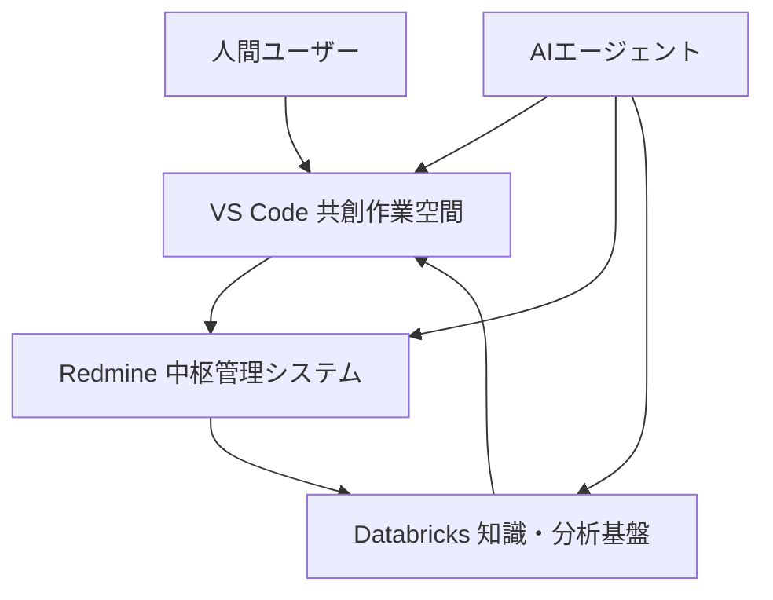
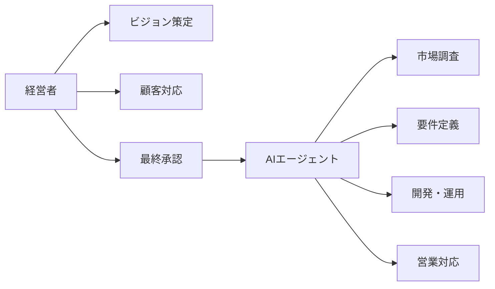
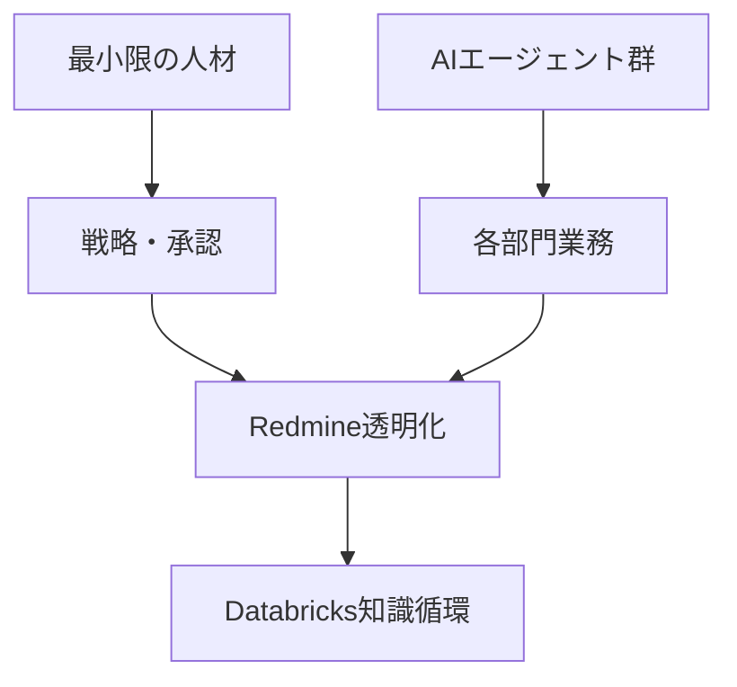
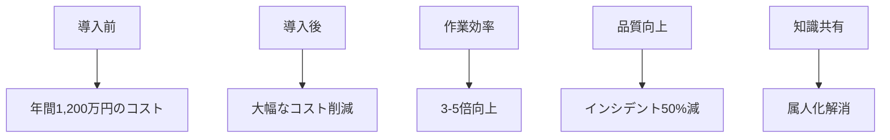
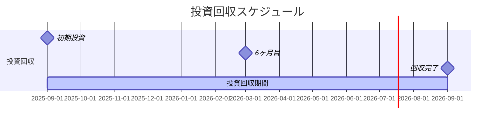
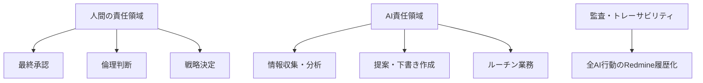
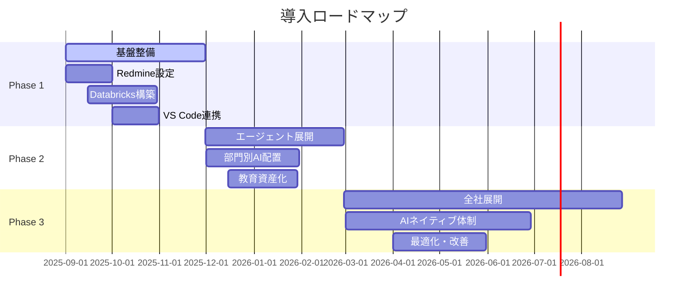
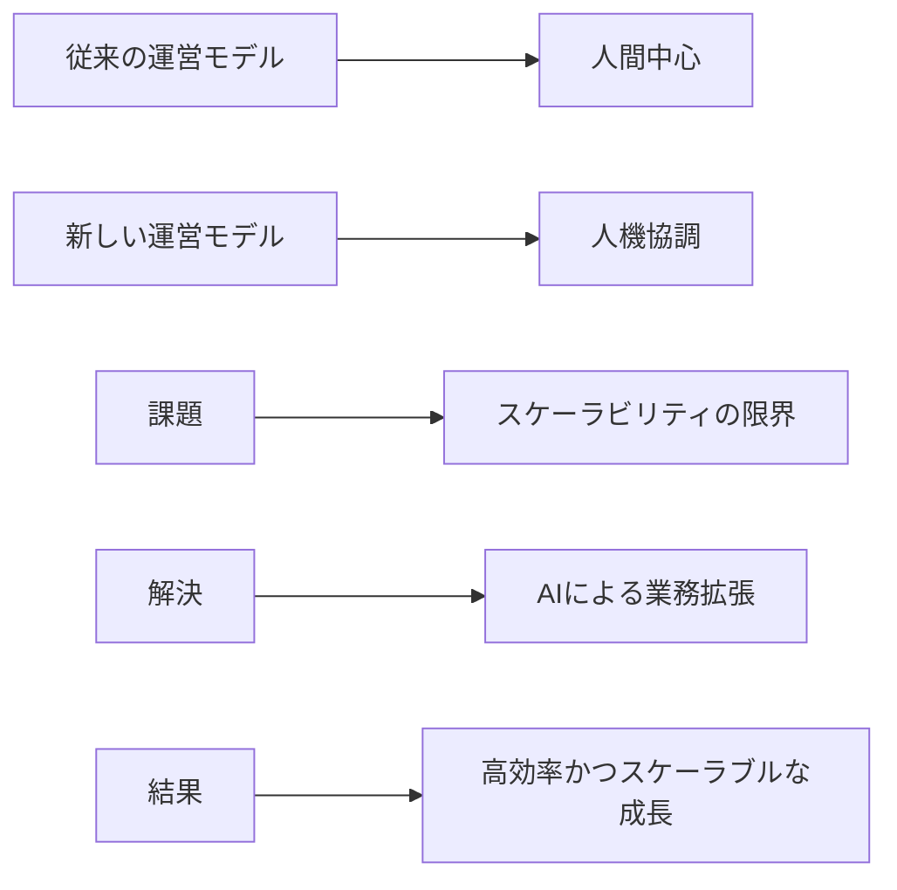

# 企画書: ソロプレナー／AIネイティブ企業基盤システム構想

---

## 📋 文書情報

| 項目           | 内容                                                     |
| -------------- | -------------------------------------------------------- |
| **文書名**     | ソロプレナー／AIネイティブ企業基盤システム構想（企画書） |
| **作成日**     | 2025年9月7日                                             |
| **更新日**     | 2025年9月7日                                             |
| **バージョン** | 1.1                                                      |
| **作成者**     | システム開発チーム                                       |

---

## 🎯 1. 背景と目的

近年、AI技術の進化により、従来の「人間中心のプロジェクト管理」から「AIエージェントを活用した業務運営」への転換が求められています。本企画は、**ソロプレナー（個人事業主）** や **AIネイティブ企業** が最小限の人員で最大限の生産性を発揮するための基盤システムを構築することを目的としています。

### 🌟 基本理念

- **スケーラビリティ**: 個人でも「1人で数十人規模の会社のように動ける」仕組みを提供
- **統合管理**: AIエージェントを部門ごとの「チームメンバー」として統合管理
- **役割分担**: 人間はビジョン・承認・倫理判断を担い、AIは実務を遂行

---

## 🏗️ 2. システム概要

### 📦 2.1 構成要素

| コンポーネント | 役割             | 主要機能                                       |
| -------------- | ---------------- | ---------------------------------------------- |
| **Redmine**    | 中枢管理システム | タスク／チケット管理、履歴と承認の一元化       |
| **Databricks** | 知識・分析基盤   | 過去資産の検索・分析、AIエージェントの知識源   |
| **VS Code**    | 共創作業空間     | ドキュメント／コード作成の共同インターフェース |

### ✨ 2.2 特徴

- 🔄 **統合アーキテクチャ**: 「作業文脈（VS Code）」＋「知識・分析（Databricks）」＋「管理・教育資産（Redmine）」の統合
- 🤝 **ハイブリッドチーム**: 人間とAIのハイブリッドチームを効率的に管理
- 🛡️ **ガバナンス強化**: 透明性・ガバナンス・教育資産化を同時に実現

---

## 💼 3. 活用シナリオ

### 👤 3.1 ソロプレナー

| 役割           | 担当者         | 主な業務                                 |
| -------------- | -------------- | ---------------------------------------- |
| **戦略・判断** | 人間（経営者） | ビジョン策定／顧客対応／最終承認         |
| **実務・実行** | AIエージェント | 市場調査、要件定義、開発、運用、営業対応 |

> **効果**: 個人が「ワンマン企業」を構築可能

### 🏢 3.2 AIネイティブ企業

- 🎯 **効率化**: 人材を最小限に抑えつつ、エージェントが各部門を担当
- 👁️ **透明性**: Redmineを通じた全タスクの透明化
- 🔄 **知識循環**: Databricksで知識循環を継続的に推進

---

## 📈 4. 導入効果

### 🎯 効果の全体像

| 対象                 | 具体的効果                                           |
| -------------------- | ---------------------------------------------------- |
| **ソロプレナー**     | 🚀 組織並みの事業遂行能力を個人が獲得                 |
| **AIネイティブ企業** | ⚡ 少人数で大規模業務を遂行可能                       |
| **共通効果**         | 📊 品質とスピードの両立、属人化防止、ナレッジの資産化 |

### 📊 定量的効果（想定）

- 📉 **コスト削減**: レビュー工数削減、インシデント対応短縮
- 📈 **生産性向上**: 作業効率3-5倍向上
- 🛡️ **品質向上**: インシデント50%減少

---

## 💰 5. 投資対効果（ROI）

### 💹 ROI分析

| 項目           | 金額（年間） | 備考                 |
| -------------- | ------------ | -------------------- |
| **コスト削減** | 800万円      | レビュー工数削減     |
| **効率向上**   | 400万円      | インシデント対応短縮 |
| **合計便益**   | 1,200万円    | 保守的見積もり       |

### ⏱️ 投資回収

> **投資回収期間**: 約1年以内に回収可能

---

## ⚠️ 6. 留意点とリスク

### 🛡️ ガバナンス体制

### 🔍 主要リスクと対策

| リスク分類             | 具体的リスク   | 対策                                 |
| ---------------------- | -------------- | ------------------------------------ |
| **品質リスク**         | 誤情報リスク   | ✅ 出典必須、人間による最終確認       |
| **運用リスク**         | 過自動化リスク | ✅ 段階的自動化、重要判断は人間が関与 |
| **セキュリティリスク** | 情報漏洩リスク | ✅ アクセス制御、監査ログ、暗号化     |

### 📋 責任分界点

- **人間**: 最終承認・倫理判断・戦略決定
- **AI**: 提案・情報収集・ルーチン業務
- **システム**: 全操作の履歴化・監査

---

## 🗓️ 7. 導入ロードマップ

### 📅 詳細スケジュール

| フェーズ    | 期間      | 主要成果物                                   |
| ----------- | --------- | -------------------------------------------- |
| **第1段階** | 1〜3か月  | 基盤整備（Redmine・Databricks・VS Code連携） |
| **第2段階** | 3〜6か月  | 部門ごとのAIエージェント展開、教育資産化     |
| **第3段階** | 6〜12か月 | 全社的なAIネイティブ体制へ移行               |

---

## 🎯 8. 結論

### 🌟 プロジェクトのビジョン

本企画は、Redmine・Databricks・VS Codeを統合し、**「人間の最小限の判断＋AIエージェントの最大限の実行力」** を両立する新しい事業運営モデルです。

### 🎯 期待される成果

| 成果領域             | 具体的効果                     |
| -------------------- | ------------------------------ |
| **効率性**           | ⚡ 業務効率3-5倍向上            |
| **スケーラビリティ** | 📈 少人数で大規模業務を実現     |
| **品質**             | 🛡️ 一貫した品質管理とガバナンス |
| **知識資産**         | 📚 組織知識の体系化と活用       |

### 💡 競争優位性

- **先進性**: AIネイティブな運営体制の確立
- **柔軟性**: ソロプレナーから企業まで対応
- **持続性**: 知識の蓄積と継続的改善

> **結論**: ソロプレナーやAIネイティブ企業において、**高効率かつスケーラブルな成長基盤** として活用可能な革新的システムです。
