# 要件定義書: ソロプレナー／AIネイティブ企業基盤システム

---

## 📋 文書情報

| 項目       | 内容                                                     |
| ---------- | -------------------------------------------------------- |
| **文書名** | ソロプレナー／AIネイティブ企業基盤システム（要件定義書） |
| **版数**   | 0.10（ドラフト改訂）                                     |
| **作成日** | 2025-09-07                                               |
| **更新日** | 2025-09-07                                               |
| **作成者** | システム開発チーム                                       |

---

## 📝 1. 要約（Executive Summary）

本システムは、Redmine（中枢管理）、Databricks（知識・分析）、VS Code（共創作業）を統合し、AIエージェントを部門横断の「実務担当」として活用する運営基盤を提供します。人間はビジョン・承認・倫理判断を担い、AIが実務を遂行する人機協調モデルを標準化します。

```mermaid
graph TD
    A[人間] --> B[戦略・承認・倫理判断]
    C[AIエージェント] --> D[実務・分析・提案]
    E[統合基盤] --> F[Redmine + Databricks + VS Code]
    
    B --> E
    D --> E
    F --> G[人機協調による高効率運営]
```

---

## 🎯 2. 背景・目的・ゴール

### 📊 背景
企画書§1に基づき、人間中心運営からAIエージェント活用型への転換ニーズが高まっています。

### 🎯 目的
企画書§1, §2に基づき、個人/少人数でも数十人規模の生産性を実現し、透明性・ガバナンス・教育資産化を両立します。

### 🏆 成果目標
企画書§4, §5を踏まえた定量的目標：

```mermaid
graph LR
    A[現状] --> B[改善目標]
    C[属人的業務] --> D[少人数での大規模業務遂行]
    E[手動レビュー] --> F[レビュー/インシデント対応工数削減]
    G[散在する知識] --> H[すべてのAI行動の監査可能性]
```

| 目標領域             | 具体的目標                          | 測定指標         |
| -------------------- | ----------------------------------- | ---------------- |
| **スケーラビリティ** | 少人数での大規模業務遂行            | 生産性3-5倍向上  |
| **効率性**           | レビュー/インシデント対応の工数削減 | ROI: 1年以内回収 |
| **透明性**           | すべてのAI行動の監査可能性          | 完全履歴管理100% |

---

## 🔍 3. スコープ

### ✅ 対象範囲（Must）

```mermaid
graph TD
    A[システム統合] --> B[Redmine + Databricks + VS Code]
    C[AI機能] --> D[業務実行 + HITL承認 + 完全履歴化]
    E[主要機能] --> F[タスク/チケット管理]
    E --> G[ナレッジ検索・分析]
    E --> H[共創作業支援]
    E --> I[監査・ガバナンス]
```

- 🔗 **統合基盤**: Redmine, Databricks, VS Code の統合基盤
- 🤖 **AI機能**: AIエージェントの業務実行、HITL（Human-in-the-Loop）承認、完全履歴化
- 📊 **コア機能**: タスク/チケット、ナレッジ検索・分析、共創作業、監査・ガバナンス

### ❌ 対象外（Out of Scope / 将来検討）

- 🧠 自社LLMの学習・ファインチューニング環境の構築
- 🤖 物理的なRPA/デバイス制御領域
- 💼 ERP/会計などの広範囲業務パッケージの導入（連携は本要件に含む）

---

## 👥 4. 利用者・権限

### 🎭 役割定義

```mermaid
graph TD
    A[経営者/プロダクトオーナー] --> B[承認者権限]
    C[作業者] --> D[人間実行者]
    E[AIエージェント] --> F[仮想作業者]
    G[システム管理者] --> H[運用管理者]
    
    B --> I[戦略決定・最終承認]
    D --> J[実務・レビュー]
    F --> K[自動実行・提案]
    H --> L[システム運用・監査]
```

| 役割                          | 主な責務           | 特徴       |
| ----------------------------- | ------------------ | ---------- |
| **経営者/プロダクトオーナー** | 戦略決定、最終承認 | 承認者     |
| **作業者（人間）**            | 実務執行、レビュー | 実行者     |
| **AIエージェント**            | 自動実行、提案作成 | 仮想作業者 |
| **システム管理者**            | 運用、監査         | 管理者     |

### 🔐 権限レベル

| 権限レベル      | 対象者         | 主な権限                                   |
| --------------- | -------------- | ------------------------------------------ |
| **Admin**       | システム管理者 | 全設定・監査ログ・権限管理                 |
| **Approver**    | 経営者・承認者 | 重要操作の承認/却下、監査閲覧              |
| **Contributor** | 作業者         | タスク実行/ドキュメント更新                |
| **Agent**       | AIエージェント | 許可範囲内の自動実行（必須承認の手前まで） |

---

## 📋 5. ユースケース

### 📝 ユースケース一覧

| UC番号    | ユースケース名       | 概要                                                                                                                                  | 主要アクター                                     |
| --------- | -------------------- | ------------------------------------------------------------------------------------------------------------------------------------- | ------------------------------------------------ |
| **UC-01** | 戦略実行管理         | 経営者がビジョン/目標をRedmineに登録 → AIがDatabricksで過去事例分析・WBS最適化・リスク評価 → VS Codeで人機協調レビュー → 承認後に実行 | 経営者、AIエージェント（Databricks実行）         |
| **UC-02** | 市場調査・分析       | 市場調査依頼 → AIがDatabricksで既存資産を検索/分析・レポート生成 → VS Codeで人機協調レビュー → 承認後に配布                           | 作業者、AIエージェント（Databricks実行）         |
| **UC-03** | 課題解決サポート     | バグ/課題受付 → AIが再現/原因推定/修正案を作成 → 人間がレビュー承認 → 自動PR/ドキュメント反映                                         | 作業者、AIエージェント（Databricks実行）         |
| **UC-04** | 監査・ガバナンス     | すべてのAI行動ログをRedmineに集約し、後追い監査/教育資産化                                                                            | システム管理者                                   |
| **UC-05** | ナレッジ検索・活用   | VS Code内でCopilot Agentがナレッジ検索を実行 → 結果を引用してコード/文書作成支援                                                      | 作業者、Copilot Agent（VS Code軽量実行）         |
| **UC-06** | 品質管理・レビュー   | コード/文書作成完了 → AI品質チェック実行 → 結果をRedmineに報告 → 承認プロセス開始                                                     | 作業者、AIエージェント（Databricks実行）         |
| **UC-07** | プロジェクト進捗管理 | 定期的な進捗確認 → AIが各タスクの状況分析 → 遅延リスク検出 → 対策提案と承認依頼                                                       | 経営者、AIエージェント（Databricks実行）         |
| **UC-08** | 教育・学習支援       | 新規技術調査依頼 → AIが関連資料収集・要約作成 → 学習計画提案 → 承認後に実施                                                           | 作業者、AIエージェント（Databricks実行）         |
| **UC-09** | 外部連携・統合       | 外部システムとの連携要求 → AIが仕様調査・統合計画作成 → 技術検証 → 実装承認                                                           | 作業者、AIエージェント（Databricks実行）         |
| **UC-10** | セキュリティ監査     | セキュリティチェック → AIが脆弱性スキャン・リスク評価 → 対策提案 → 承認後に実施                                                       | システム管理者、AIエージェント（Databricks実行） |

### 🔄 ユースケースフロー

> **💡 操作主体の表記について**  
> シーケンス図において、VS Codeへの操作主体を明確にするため以下の表記を使用します：
> - **(AI自動)**: AIエージェントによる自動操作
> - **(手動)**: 作業者による手動操作
> - **表記なし**: システム間の自動連携
>
> **🏗️ システム役割分担**  
> - **Databricks**: AIエージェントの主要実行環境。AIによる分析・データ処理・文書生成を集約実行
> - **VS Code**: 人間とAIの共同編集・レビュー・承認のためのワークスペース
> - **GitHub Copilot**: VS Code拡張機能として、Databricksの分析結果・知識ベースを活用したコーディング・文書作成支援を提供
> - **Redmine**: プロジェクト管理・承認フロー・履歴管理の中枢
>
> **🔗 GitHub Copilot ⇔ Databricks連携**  
> GitHub CopilotはDatabricksのAIエージェント機能・データ処理分析機能にAPIリクエストを送信し、以下の高度な支援を実現：
> - **過去事例検索**: Databricksの知識ベース・ベクトル検索結果を活用したコード提案
> - **技術動向分析**: Databricksで蓄積された業界データに基づくベストプラクティス提示
> - **品質評価**: Databricksの品質基準・コンプライアンス要件と照合したリアルタイムチェック
> - **学習支援**: Databricksの教育資産・過去の学習データを活用した個別最適化された学習プラン提案

#### UC-01: 戦略実行管理
```mermaid
sequenceDiagram
    participant E as 経営者
    participant R as Redmine
    
    box VS Code開発環境
        participant V as VS Code
        participant C as GitHub Copilot
    end
    
    box Databricks実行環境
        participant A as AIエージェント機能
        participant D as データ処理・分析機能
    end
    
    E->>R: ビジョン/目標登録
    R->>A: タスク分解依頼
    A->>D: 過去プロジェクト・成功事例のベクトル検索
    A->>D: 類似目標・戦略パターンの分析
    A->>D: リソース要件・期間見積もりの算出
    A->>D: リスクファクター・依存関係の抽出
    A->>A: (AI自動) WBS構造・タスク階層の最適化生成
    A->>A: (AI自動) 実行可能性・優先度の評価・スコアリング
    A->>V: (AI自動) 分析結果・計画書を共同編集用ワークスペースに配置
    A->>R: (AI自動) 作成した計画書の承認依頼（相関ID付き）
    R->>E: 承認通知
    E->>V: (手動) 計画書レビュー・修正
    E->>C: (手動) 計画書改善提案依頼
    C->>A: (AI自動) 過去事例・ベストプラクティス検索リクエスト
    A->>D: 成功事例・業界動向データ検索
    D->>A: 関連データ・分析結果返却
    A->>C: 検索結果・推奨パターン返却
    C->>V: 過去事例・ベストプラクティスに基づく修正提案
    alt 修正が必要
        E->>V: (手動) 計画書修正・コメント追加
        C->>V: (AI自動) 修正内容の文書整合性チェック・提案
        V->>A: (AI自動) 修正内容をDatabricksに反映
        A->>A: (AI自動) 修正を踏まえた再分析・調整
        A->>V: (AI自動) 更新版計画書を共同編集用ワークスペースに配置
        A->>R: (AI自動) 修正版の再承認依頼
        R->>E: 再承認通知
    else 承認
        E->>V: (手動) 最終承認コメント記載
        C->>V: (AI自動) 承認コメントのテンプレート提案
        V->>R: (AI自動) 承認済み計画書のメタデータ登録
    end
    E->>R: 承認完了
    R->>A: 実行開始指示
    A->>R: 実行状況報告
```

#### UC-02: 市場調査・分析
```mermaid
sequenceDiagram
    participant W as 作業者
    participant R as Redmine
    
    box VS Code開発環境
        participant V as VS Code
        participant C as GitHub Copilot
    end
    
    box Databricks実行環境
        participant A as AIエージェント機能
        participant D as データ処理・分析機能
    end
    
    W->>R: 市場調査依頼
    R->>A: 調査タスク割り当て
    A->>D: 既存資料検索
    A->>D: 市場データ分析
    A->>A: (AI自動) 調査レポート生成
    A->>V: (AI自動) レポートを共同編集用ワークスペースに配置
    A->>R: (AI自動) レビュー依頼
    R->>W: レビュー通知
    W->>V: (手動) レポートレビュー・修正
    W->>C: (手動) レポート改善・追加調査観点の提案依頼
    C->>V: 業界動向・競合分析観点の提案
    alt 修正が必要
        W->>V: (手動) レポート修正・追加調査要求
        C->>V: (AI自動) 修正内容の構成・論理性チェック
        V->>A: (AI自動) 修正要求をDatabricksに送信
        A->>D: (AI自動) 追加分析・データ補強
        A->>A: (AI自動) レポート更新版生成
        A->>V: (AI自動) 更新版レポートを共同編集用ワークスペースに配置
        A->>R: (AI自動) 修正版レビュー依頼
        R->>W: 再レビュー通知
    else 承認
        W->>V: (手動) 最終承認コメント記載
        V->>R: (AI自動) 承認済みレポートのメタデータ登録
    end
    W->>R: 承認完了
    R->>A: 最終版作成指示
    A->>V: (AI自動) 成果物公開
```

#### UC-03: 課題解決サポート
```mermaid
sequenceDiagram
    participant W as 作業者
    participant R as Redmine
    
    box VS Code開発環境
        participant V as VS Code
        participant C as GitHub Copilot
    end
    
    participant G as Git/CI
    
    box Databricks実行環境
        participant A as AIエージェント機能
        participant D as データ処理・分析機能
    end
    
    W->>R: バグ/課題報告
    R->>A: 課題分析依頼
    A->>D: 類似事例検索
    A->>A: (AI自動) 再現・原因分析
    A->>V: (AI自動) 分析結果・修正案を共同編集用ワークスペースに配置
    A->>R: (AI自動) レビュー依頼
    R->>W: レビュー通知
    W->>V: (手動) 分析結果・修正案レビュー
    W->>C: (手動) コード修正案の品質・最適化チェック依頼
    C->>A: (AI自動) 類似課題・修正パターン検索リクエスト
    A->>D: 過去の課題解決事例・コード品質基準検索
    D->>A: 関連事例・品質チェック結果返却
    A->>C: 修正パターン・ベストプラクティス返却
    C->>V: コードレビュー・改善提案・ベストプラクティス提示
    alt 修正案に課題がある
        W->>V: (手動) 修正案の改善要求・追加分析依頼
        C->>V: (AI自動) 改善要求の技術的妥当性チェック
        V->>A: (AI自動) 改善要求をDatabricksに送信
        A->>D: (AI自動) 追加分析・代替案検討
        A->>A: (AI自動) 改善版修正案生成
        A->>V: (AI自動) 更新版修正案を共同編集用ワークスペースに配置
        A->>R: (AI自動) 修正版レビュー依頼
        R->>W: 再レビュー通知
    else 承認
        W->>V: (手動) 修正案承認・実装指示コメント記載
        V->>R: (AI自動) 承認済み修正案のメタデータ登録
    end
    W->>R: 承認完了
    R->>A: 実装指示
    A->>V: (AI自動) コード修正
    A->>G: (AI自動) PR作成
    G->>R: CI結果通知
```

#### UC-04: 監査・ガバナンス
```mermaid
sequenceDiagram
    participant S as システム管理者
    participant R as Redmine
    
    box VS Code開発環境
        participant V as VS Code
        participant C as GitHub Copilot
    end
    
    box Databricks実行環境
        participant A as AIエージェント機能
        participant D as データ処理・分析機能
    end
    
    Note over A: 定期実行（日次/月次）
    A->>R: 全AI行動ログ収集
    A->>D: ログデータ分析・集約
    A->>D: パターン分析・異常検出
    A->>A: 監査レポート作成
    R->>S: 監査通知
    S->>R: 監査結果確認
    S->>V: (手動) 監査レポート詳細確認
    S->>C: (手動) 監査基準・コンプライアンス要件確認依頼
    C->>V: 業界標準・法規制に基づく監査観点提案
    alt 異常検出
        S->>R: 詳細調査指示
        A->>D: 詳細分析実行
        A->>R: 調査結果報告
        S->>V: (手動) 調査結果レビュー
        S->>C: (手動) 対策立案・予防策検討依頼
        C->>V: リスク軽減策・システム改善提案
        S->>R: 対策指示
    else 正常
        A->>D: 教育資産化処理
        A->>R: 資産登録完了
        S->>C: (手動) 監査結果の活用方法・改善観点確認依頼
        C->>V: ベストプラクティス・効率化提案
    end
```

#### UC-05: ナレッジ検索・活用
```mermaid
sequenceDiagram
    participant W as 作業者
    
    box VS Code開発環境
        participant V as VS Code
        participant C as GitHub Copilot
    end
    
    box Databricks実行環境
        participant A as AIエージェント機能
        participant D as データ処理・分析機能
    end
    
    participant R as Redmine
    
    W->>V: (手動) コード/文書作成開始
    W->>C: (手動) ナレッジ検索・コード提案要求
    C->>A: (AI自動) ナレッジ検索・関連事例検索リクエスト
    C->>V: 確認ダイアログ表示
    W->>V: (手動) 実行承認
    A->>D: Vector Search実行・関連ナレッジ検索
    D->>A: 検索結果・過去事例返却
    A->>C: 検索結果・推奨パターン返却（PIIマスキング済み）
    C->>V: (AI自動) 引用付きコード提案・ドキュメント改善案生成
    C->>W: 検索結果とコード提案・ベストプラクティス提示
    W->>V: (手動) 成果物作成・保存
    C->>A: (AI自動) コード品質・命名規則チェック要求
    A->>D: 品質基準・コーディング規約検索
    D->>A: 品質基準・チェック結果返却
    A->>C: 品質評価結果返却
    C->>V: (AI自動) コード品質・命名規則チェック結果表示
    V->>R: (AI自動) メタデータ・学習データ登録
```

#### UC-06: 品質管理・レビュー
```mermaid
sequenceDiagram
    participant W as 作業者
    participant R as Redmine
    participant G as Git/CI
    
    box VS Code開発環境
        participant V as VS Code
        participant C as GitHub Copilot
    end
    
    box Databricks実行環境
        participant A as AIエージェント機能
        participant D as データ処理・分析機能
    end
    
    W->>V: (手動) コード/文書作成完了
    C->>V: (AI自動) リアルタイム品質チェック・改善提案
    V->>A: (AI自動) 品質チェック実行
    A->>D: (AI自動) リント/テスト・文書チェック実行
    A->>V: (AI自動) チェック結果を共同編集用ワークスペースに配置
    A->>R: (AI自動) チェック結果報告
    R->>W: レビュー通知
    W->>V: (手動) チェック結果レビュー
    W->>C: (手動) 修正方針相談・コード改善提案依頼
    C->>V: 修正コード候補・最適化提案
    alt 修正必要
        W->>V: (手動) Copilot支援でコード修正
        C->>V: (AI自動) 修正内容の整合性チェック
        V->>A: (AI自動) 修正完了通知
        A->>D: (AI自動) 再チェック実行
        A->>V: (AI自動) 再チェック結果を共同編集用ワークスペースに配置
    else 承認
        W->>V: (手動) 最終承認
        C->>V: (AI自動) PR作成支援・コミットメッセージ提案
        V->>R: (AI自動) 承認完了通知
        R->>A: PR作成指示
        A->>G: (AI自動) PR作成・マージ
    end
```

#### UC-07: プロジェクト進捗管理
```mermaid
sequenceDiagram
    participant E as 経営者
    participant R as Redmine
    
    box VS Code開発環境
        participant V as VS Code
        participant C as GitHub Copilot
    end
    
    box Databricks実行環境
        participant A as AIエージェント機能
        participant D as データ処理・分析機能
    end
    
    Note over A: 定期実行（日次/週次）
    A->>R: タスク状況取得
    A->>D: 進捗データ分析
    A->>D: 過去プロジェクトとの比較
    A->>A: 遅延リスク検出
    A->>V: (AI自動) 進捗レポートを共同編集用ワークスペースに配置
    alt リスク検出
        A->>R: アラート作成
        R->>E: 緊急通知
        E->>V: (手動) 詳細状況確認
        E->>C: (手動) リスク対策・プロジェクト改善策相談
        C->>V: 過去事例に基づく対策案・スケジュール調整案提案
        A->>R: 対策提案作成
        R->>E: 対策承認依頼
        E->>R: 承認/修正指示
    else 正常
        A->>R: 定期レポート作成
        R->>E: 進捗通知
        E->>V: (手動) 進捗レポート確認（必要時）
        E->>C: (手動) 効率化・改善観点の提案依頼（必要時）
        C->>V: プロジェクト最適化・生産性向上提案
    end
```

#### UC-09: 外部連携・統合
```mermaid
sequenceDiagram
    participant W as 作業者
    participant R as Redmine
    participant E as 外部システム
    
    box VS Code開発環境
        participant V as VS Code
        participant C as GitHub Copilot
    end
    
    box Databricks実行環境
        participant A as AIエージェント機能
        participant D as データ処理・分析機能
    end
    
    W->>R: 外部連携要求
    R->>A: 連携タスク割り当て
    A->>D: 既存連携仕様検索
    A->>E: (AI自動) API仕様調査
    A->>A: (AI自動) 統合計画生成
    A->>V: (AI自動) 計画書を共同編集用ワークスペースに配置
    A->>R: (AI自動) 技術検証依頼
    R->>W: レビュー通知
    W->>V: (手動) 統合計画書レビュー
    W->>C: (手動) API統合パターン・セキュリティ観点の提案依頼
    C->>V: 統合アーキテクチャ・エラーハンドリングパターン提案
    alt 計画に課題がある
        W->>V: (手動) 計画修正・追加検証要求
        C->>V: (AI自動) 修正方針の技術的整合性チェック
        V->>A: (AI自動) 修正要求をDatabricksに送信
        A->>D: (AI自動) 追加検証・代替案検討
        A->>E: (AI自動) 追加API仕様調査
        A->>A: (AI自動) 改善版統合計画生成
        A->>V: (AI自動) 更新版計画書を共同編集用ワークスペースに配置
        A->>R: (AI自動) 修正版レビュー依頼
        R->>W: 再レビュー通知
    else 承認
        W->>V: (手動) 計画承認・実装指示コメント記載
        C->>V: (AI自動) 実装チェックリスト・テスト項目提案
        V->>R: (AI自動) 承認済み計画書のメタデータ登録
    end
    W->>R: 承認完了
    R->>A: 実装開始指示
    A->>V: (AI自動) 連携コード実装
    C->>V: (AI自動) 実装コードレビュー・最適化提案
    A->>E: (AI自動) 接続テスト実行
    E->>A: テスト結果返却
    A->>R: 実装完了報告
    R->>W: 受け入れテスト依頼
```

#### UC-08: 教育・学習支援
```mermaid
sequenceDiagram
    participant W as 作業者
    participant R as Redmine
    
    box VS Code開発環境
        participant V as VS Code
        participant C as GitHub Copilot
    end
    
    box Databricks実行環境
        participant A as AIエージェント機能
        participant D as データ処理・分析機能
    end
    
    W->>R: 新規技術調査・学習依頼
    R->>A: 学習タスク割り当て
    A->>D: (AI自動) 関連技術・資料検索
    A->>D: (AI自動) 技術動向・ベストプラクティス調査
    A->>A: (AI自動) 学習資料要約・学習計画生成
    A->>V: (AI自動) 学習計画書を共同編集用ワークスペースに配置
    A->>R: (AI自動) 学習計画レビュー依頼
    R->>W: 学習計画確認通知
    W->>V: (手動) 学習計画確認・レビュー
    W->>C: (手動) 学習効率・技術習得方法の相談
    C->>A: (AI自動) 過去の学習データ・効果的カリキュラム検索リクエスト
    A->>D: 学習履歴・習得パターン・効果測定データ検索
    D->>A: 個人最適化学習プラン・推奨パス返却
    A->>C: 学習効果データ・最適化提案返却
    C->>V: 段階的学習アプローチ・実践演習プラン提案
    alt 計画に追加・修正が必要
        W->>V: (手動) 学習計画修正・追加要望記載
        C->>V: (AI自動) 修正内容の学習効果・実現可能性チェック
        V->>A: (AI自動) 修正要求をDatabricksに送信
        A->>D: (AI自動) 追加調査・カリキュラム改善
        A->>A: (AI自動) 改善版学習計画生成
        A->>V: (AI自動) 更新版学習計画書を共同編集用ワークスペースに配置
        A->>R: (AI自動) 修正版レビュー依頼
        R->>W: 再レビュー通知
    else 承認
        W->>V: (手動) 学習計画承認・実施指示コメント記載
        C->>V: (AI自動) 学習進捗管理・理解度チェック方法提案
        V->>R: (AI自動) 承認済み学習計画のメタデータ登録
    end
    W->>R: 学習実施開始
    R->>A: 学習支援・進捗モニタリング指示
    A->>V: (AI自動) 学習資料・実践課題配置
    C->>V: (AI自動) インタラクティブ学習支援・コード実践サポート
    W->>V: (手動) 学習実施・課題取り組み
    A->>D: (AI自動) 学習進捗・理解度分析
    A->>R: 学習完了・習得度評価報告
    R->>W: 学習成果確認依頼
```

#### UC-10: セキュリティ監査
```mermaid
sequenceDiagram
    participant S as システム管理者
    participant R as Redmine
    
    box VS Code開発環境
        participant V as VS Code
        participant C as GitHub Copilot
    end
    
    box Databricks実行環境
        participant A as AIエージェント機能
        participant D as データ処理・分析機能
    end
    
    S->>R: セキュリティチェック依頼
    R->>A: 監査タスク割り当て
    A->>D: 脆弱性データベース検索
    A->>A: (AI自動) コードスキャン・リスク評価分析
    A->>V: (AI自動) 監査レポートを共同編集用ワークスペースに配置
    A->>R: 監査レポート作成
    R->>S: レビュー通知
    S->>V: (手動) 監査レポート詳細確認
    S->>C: (手動) セキュリティ対策・脆弱性修正方法相談
    C->>V: セキュリティベストプラクティス・修正パターン提案
    S->>R: 対策承認
    R->>A: 対策実施指示
    A->>V: (AI自動) セキュリティ修正実装
    C->>V: (AI自動) 修正コードのセキュリティ検証・追加改善提案
    A->>R: 実施完了報告
```

---

## ⚙️ 6. 機能要件（FR）

### 🏢 6.1 中枢管理（Redmine）

```mermaid
graph TD
    A[Redmine中枢管理] --> B[タスク/チケット管理]
    A --> C[ワークフロー/承認]
    A --> D[変更履歴管理]
    A --> E[API/Webhook連携]
    
    B --> B1[テンプレート・親子関係・SLA]
    C --> C1[差戻し・チェックリスト]
    D --> D1[操作主体明示・監査ログ]
    E --> E1[VS Code/Databricks連携]
```

| 要件ID     | 要件内容                                                                                  |
| ---------- | ----------------------------------------------------------------------------------------- |
| **FR-001** | 📋 タスク/チケット管理を提供する（テンプレート、親子/関連、カスタムフィールド、SLAを含む） |
| **FR-002** | 🔄 ワークフロー/承認を構成可能とし、差戻しとチェックリストをサポートする                   |
| **FR-003** | 📚 変更履歴を完全保存し、操作主体（人/AI）を明示する監査ログを提供する                     |
| **FR-004** | 🔌 VS Code/Databricks/エージェント実行イベントと双方向に連携するWebhook/APIを提供する      |

### 🤖 6.2 AIエージェント管理・実行

> **🏭 AIエージェント実行環境**  
> AIエージェントは主に**Databricks上**で実行されます。Databricksの豊富な計算リソースとデータ処理能力を活用し、複雑な分析・生成タスクを実行します。VS CodeのCopilot Agentなど、一部の軽量なAI機能は各システム上で動作しますが、重要な業務処理はDatabricksで集約実行されます。

```mermaid
graph TD
    A[AIエージェント管理] --> B[エージェント定義]
    A --> C[実行基盤]
    A --> D[HITL承認]
    A --> E[監査記録]
    
    B --> B1[部門/職能単位の役割定義]
    C --> C1[Databricks上でのプロンプト・RAG・ツール・ガードレール]
    D --> D1[重要操作の事前/事後承認]
    E --> E1[入出力・意思決定過程の記録]
```

| 要件ID     | 要件内容                                                                                            |
| ---------- | --------------------------------------------------------------------------------------------------- |
| **FR-005** | 👥 部門/職能単位のエージェント役割（プロファイル/権限）を定義できる                                  |
| **FR-006** | 🔧 Databricks上でプロンプトテンプレート、RAG参照、ツール実行、ガードレールから成る実行基盤を提供する |
| **FR-007** | ✋ 重要操作は事前/事後のHITL承認を必須化でき、リスク閾値で分岐できる                                 |
| **FR-008** | 📝 入出力・ファイル変更・意思決定過程をイベントとして記録する                                        |

### 🧠 6.3 知識・分析（Databricks）

```mermaid
graph TD
    A[知識・分析基盤] --> B[データ索引化]
    A --> C[検索・分析]
    A --> D[データ管理]
    
    B --> B1[ドキュメント/コード/ノートブックの索引化]
    C --> C1[セマンティック検索・類似提示・分析ジョブ]
    D --> D1[アクセス制御・バージョニング・ライフサイクル]
```

| 要件ID     | 要件内容                                                             |
| ---------- | -------------------------------------------------------------------- |
| **FR-009** | 📄 既存ドキュメント/コード/ノートブックをメタデータ化し索引化する     |
| **FR-010** | 🔍 セマンティック検索/類似提示/簡易分析ジョブを実行できる             |
| **FR-011** | 🔐 データのアクセス制御、バージョニング、ライフサイクル管理を提供する |

### 💻 6.4 共創作業（VS Code）

```mermaid
graph TD
    A[VS Code共創作業] --> B[ドラフト作成]
    A --> C[文脈共有]
    A --> D[品質管理]
    
    B --> B1[ドキュメント/コード作成・差分表示・PR]
    C --> C1[タスク連携・関連資料添付・テンプレート]
    D --> D1[リント/テスト/文書チェック・Redmine連携]
```

| 要件ID     | 要件内容                                                                     |
| ---------- | ---------------------------------------------------------------------------- |
| **FR-012** | ✏️ ドキュメント/コードのドラフト作成、差分表示、変更提案（PR）を行える        |
| **FR-013** | 🔗 タスク連携、関連資料の自動添付、テンプレート適用により作業文脈を共有できる |
| **FR-014** | ✅ リント/テスト/文書チェックを自動実行し、結果をRedmineへ連携する            |

### 🛡️ 6.5 ガバナンス/監査

| 要件ID     | 要件内容                                                                     |
| ---------- | ---------------------------------------------------------------------------- |
| **FR-015** | 📊 操作主体、根拠資料、承認者、時刻、成果物リンクを自動ひも付けして可視化する |
| **FR-016** | 🚨 承認必須範囲、機密区分、外部共有可否、モデル使用制限のポリシーを設定できる |
| **FR-017** | 📋 期間/案件別の監査証跡をPDF/CSVでエクスポートできる                         |

### 🔌 6.6 外部連携/拡張

| 要件ID     | 要件内容                                                            |
| ---------- | ------------------------------------------------------------------- |
| **FR-018** | 🌐 REST API/Webhook/イベント連携を提供する（イベントバスは将来検討） |
| **FR-019** | 🔗 Git/CI、メール/チャット通知、ドライブとの連携を行える             |

### 📁 6.7 データ（機能）

| 要件ID     | 要件内容                                                            |
| ---------- | ------------------------------------------------------------------- |
| **FR-020** | 🏷️ すべての成果物にタスクID/主体/時刻/出典のメタデータを自動付与する |

---

### 🔗 6.8 VS Code LM Tools × Azure Databricks 連携

本節は、VS Code の Language Model Tool API と Azure Databricks を統合し、GitHub Copilot Agent モードから社内ナレッジベースを検索・参照する要件を定義します。

```mermaid
graph TD
    A[VS Code] --> B[GitHub Copilot Agent]
    B --> C[LM Tools API]
    C --> D[Gateway API]
    D --> E[Azure Databricks]
    
    E --> F[ナレッジベース検索]
    F --> G[検索結果]
    G --> H[引用付き回答生成]
```

#### 🔍 6.8.1 ナレッジベース検索

| 要件ID     | 要件内容                                                                            |
| ---------- | ----------------------------------------------------------------------------------- |
| **FR-021** | 🤖 GitHub Copilot Agent モードから Azure Databricks のナレッジベースを検索できること |
| **FR-022** | 📋 検索結果はタイトル、要約、ソースURL、関連テキスト（抜粋）を含むこと               |
| **FR-023** | 📝 検索結果を根拠として、Copilot が引用元を明記した回答を生成できること              |
| **FR-024** | 🎯 明示的なLMツール呼び出しをサポートすること（ユーザーがツールを指定可能）          |
| **FR-025** | 🔄 Agentモードでの自動ツール選択に対応すること                                       |

#### 🔐 6.8.2 セキュリティ/運用

```mermaid
graph TD
    A[セキュリティ要件] --> B[読み取り専用アクセス]
    A --> C[監査ログ]
    A --> D[ユーザー同意]
    A --> E[権限管理]
    A --> F[レート制御]
    A --> G[キャッシュ機能]
    A --> H[PII保護]
```

| 要件ID     | 要件内容                                                                                |
| ---------- | --------------------------------------------------------------------------------------- |
| **FR-026** | 🔒 Databricks へのアクセスは検索専用（読み取りのみ）とし、作成/更新/削除は不可とすること |
| **FR-027** | 📊 ツール呼び出し・検索クエリ・返却結果を相関ID付きでアクセスログへ記録し監査できること  |
| **FR-028** | ✋ ツール実行時に確認ダイアログ（ユーザー同意）を表示できること                          |
| **FR-029** | 👥 組織管理者は許可された拡張/ツールの許可リストを管理できること                         |
| **FR-030** | ⏱️ レート制御（スロットリング）を提供すること                                            |
| **FR-031** | 💾 同一クエリのキャッシュ機能を提供すること（TTL指定可能）                               |
| **FR-032** | 🛡️ PII・秘匿情報を画面表示前にマスキングできること                                       |

#### 🌐 6.8.3 Databricks API 利用要件

```mermaid
graph TD
    A[Databricks API] --> B[Statement Execution]
    A --> C[Vector Search]
    A --> D[SQL Queries]
    A --> E[Genie]
    A --> F[Serving Endpoints]
    A --> G[Gateway API]
```

| 要件ID     | 要件内容                                                                                                                                                           |
| ---------- | ------------------------------------------------------------------------------------------------------------------------------------------------------------------ |
| **FR-033** | ⚡ ナレッジ検索は Databricks SQL Statement Execution API をハイブリッドモード（`wait_timeout=10s`, `on_wait_timeout=CONTINUE`）で実行すること                       |
| **FR-034** | 📁 25MiB超の結果は `disposition=EXTERNAL_LINKS` とし、SAS URL から取得する際は Authorization ヘッダーを送信しないこと                                               |
| **FR-035** | 🎯 Real-Time Serving Endpoints API によりモデル推論結果を取得できること                                                                                             |
| **FR-036** | 🔍 Vector Search の Indexes API を利用して類似検索を実行できること（Endpoints API はインデックスをホストする計算リソース管理に使用）                                |
| **FR-037** | 💾 SQL Queries API を利用し保存済みクエリを実行できること                                                                                                           |
| **FR-038** | 💬 Genie API を利用して会話形式のBIクエリを開始できること                                                                                                           |
| **FR-039** | 🔌 Gateway API は Databricks API リファレンスと同一のエンドポイント/機能対応（1対1）を提供すること                                                                  |
| **FR-040** | 📋 利用可能なクエリID・インデックス名・GenieスペースID・Serving Endpoint名はLM Tools側で定義し、当該定義に基づきGateway API経由で適切なDatabricks APIを呼び出すこと |
| **FR-041** | 🔄 Gateway API は認証情報の付与とリクエスト転送のみを行い、Databricks API のレスポンスを変更せずに返却すること                                                      |

---

## 🏗️ 7. 非機能要件（NFR／暫定・要合意）

### 🔧 7.1 信頼性/可用性

```mermaid
graph LR
    A[可用性99.5%] --> B[月間稼働率]
    C[DR目標] --> D[RTO≤4h]
    C --> E[RPO≤1h]
```

| 要件ID      | 要件内容                       | 目標値       |
| ----------- | ------------------------------ | ------------ |
| **NFR-001** | 📈 月間可用性は99.5%以上とする  | 社内利用想定 |
| **NFR-002** | 💾 DR目標はRTO≤4h、RPO≤1hとする | 災害復旧     |

### ⚡ 7.2 性能

```mermaid
graph TD
    A[性能要件] --> B[一般操作 p95≤1.5s]
    A --> C[検索処理 p95≤3s]
    A --> D[監査レポート≤5分]
    A --> E[LM Tools p95≤5s]
```

| 要件ID      | 要件内容                                               | 目標値       |
| ----------- | ------------------------------------------------------ | ------------ |
| **NFR-003** | ⚡ 一般操作のp95応答≤1.5sとする                         | 通常業務     |
| **NFR-004** | 🔍 検索処理のp95応答≤3sとする                           | ナレッジ検索 |
| **NFR-005** | 📊 監査レポート作成≤5分/1万イベントとする               | レポート生成 |
| **NFR-021** | 🤖 LM Tools経由のエンドツーエンド検索のp95応答≤5sとする | AI連携       |

### 🔐 7.3 セキュリティ/認証・認可

```mermaid
graph TD
    A[セキュリティ基盤] --> B[RBAC/ABAC]
    A --> C[SSO/OIDC]
    A --> D[監査ログ]
    A --> E[通信暗号化]
    A --> F[境界防御]
    A --> G[PII保護]
```

| 要件ID      | 要件内容                                             |
| ----------- | ---------------------------------------------------- |
| **NFR-006** | 🔐 RBAC/ABACにより最小権限を実装する                  |
| **NFR-007** | 🚪 SSO/OIDCによる認証連携を提供する                   |
| **NFR-008** | 🛡️ 監査ログの改ざん防止機構を備える                   |
| **NFR-016** | 🔒 すべての通信はTLS 1.2以上で暗号化する              |
| **NFR-017** | 🚧 WAFとIP許可リスト/制限により境界防御を実装する     |
| **NFR-023** | 🤫 個人情報を含みうるログ項目はハッシュ化して保存する |

### 📈 7.4 スケーラビリティ

```mermaid
graph LR
    A[現在] --> B[50ユーザー]
    C[将来] --> D[500ユーザー]
    E[AI] --> F[10→100エージェント]
    G[同時接続] --> H[100ユーザー]
```

| 要件ID      | 要件内容                                                   |
| ----------- | ---------------------------------------------------------- |
| **NFR-009** | 📊 ユーザー数50→500、エージェント10→100への段階拡張に耐える |
| **NFR-021** | 🔄 LM Tools利用時に同時接続100ユーザーまで処理可能とする    |

### 👁️ 7.5 可観測性

| 要件ID      | 要件内容                                                           |
| ----------- | ------------------------------------------------------------------ |
| **NFR-010** | 🔍 追跡ID、集中ログ/メトリクス/トレース、しきい値アラートを提供する |
| **NFR-019** | 📊 システム監視/アラートを提供する（主要メトリクスの閾値通知）      |

### 🔧 7.6 保守性

| 要件ID      | 要件内容                                                                    |
| ----------- | --------------------------------------------------------------------------- |
| **NFR-011** | 📝 構成管理（IaC化想定）、ドキュメント整備、バージョン互換ポリシーを維持する |
| **NFR-018** | ⚡ 管理者の設定変更は即時（もしくは数分以内）に反映される                    |

### 🔄 7.7 互換性

| 要件ID      | 要件内容                                          |
| ----------- | ------------------------------------------------- |
| **NFR-012** | 🔗 Redmine/Databricks/VS Codeの各LTS互換を維持する |

### 📋 7.8 コンプライアンス/データ管理

| 要件ID      | 要件内容                                                                    |
| ----------- | --------------------------------------------------------------------------- |
| **NFR-013** | 🏷️ データ分類（機密/内部/公開）を定義し強制する                              |
| **NFR-014** | 📅 監査ログの保全期間を1〜3年で運用設計し、アーカイブ/削除ポリシーを定義する |
| **NFR-015** | 🛡️ PII/秘密情報のマスキング/匿名化と持ち出し制御を実施する                   |

### 🔄 7.9 回復性

| 要件ID      | 要件内容                                                     |
| ----------- | ------------------------------------------------------------ |
| **NFR-020** | 🔧 障害時の自動復旧機構（自己回復/再起動/リトライ）を実装する |

### ✅ 7.10 受け入れ基準（抜粋）

```mermaid
graph TD
    A[受け入れ基準] --> B[HITL承認]
    A --> C[AI活動記録]
    A --> D[知識検索]
    A --> E[アクセス制御]
    A --> F[エンドツーエンド]
    
    B --> B1[AB-01: 重要操作の承認制御]
    C --> C1[AB-02: AI実行イベント100%記録]
    D --> D1[AB-03/07/08: 検索・引用機能]
    E --> E1[AB-05/14: 権限・セキュリティ]
    F --> F1[AB-06/13: 性能・統合動作]
```

| 基準ID    | 受け入れ基準                                                                                                                         | 対応要件               |
| --------- | ------------------------------------------------------------------------------------------------------------------------------------ | ---------------------- |
| **AB-01** | ✋ HITLにより重要操作が承認なしに実行不可である                                                                                       | FR-007                 |
| **AB-02** | 📊 AI実行イベントがRedmineに100%記録される                                                                                            | FR-003, FR-008         |
| **AB-03** | 📚 既存資産参照の根拠提示が可能である                                                                                                 | FR-010                 |
| **AB-04** | 📝 VS Codeのドラフトが差分/PRとして可視化される                                                                                       | FR-014                 |
| **AB-05** | 🔐 ロールごとのアクセス制御が期待通りに機能する                                                                                       | NFR-006                |
| **AB-06** | 🔄 代表ユースケース（UC-01〜04）がエンドツーエンドで動作する                                                                          | FR全般                 |
| **AB-07** | 🤖 VS Code（Copilot Agent）からDatabricksを検索でき、結果にタイトル/要約/URL/抜粋が含まれる                                           | FR-021, FR-022         |
| **AB-08** | 📝 回答に引用元が自動付与される                                                                                                       | FR-023                 |
| **AB-09** | 🎯 明示ツール呼び出し/自動選択が機能し、実行前確認ダイアログが表示される                                                              | FR-024, FR-025, FR-028 |
| **AB-10** | 🔒 アクセスが読み取り専用である                                                                                                       | FR-026                 |
| **AB-11** | ⚡ Statement Execution API ハイブリッドモードと 25MiB超の `EXTERNAL_LINKS` 取得が動作し、SAS取得時にAuthorizationヘッダーを送信しない | FR-033, FR-034         |
| **AB-12** | 🔌 Vector Search/SQL Queries/Genie/Serving Endpoints が所定のID/名前で呼び出せる                                                      | FR-035〜FR-040         |
| **AB-13** | ⚡ LM Tools経由の検索p95≤5s、同時接続100でSLOを満たす                                                                                 | NFR-021                |
| **AB-14** | 🚧 WAF/IP制限により未許可元からのアクセスが遮断される                                                                                 | NFR-017                |
| **AB-15** | 🛡️ ログでPIIがハッシュ化されて保存される                                                                                              | NFR-023                |

---

## 🚀 8. 導入/移行計画（企画書§7に準拠）

```mermaid
gantt
    title 導入/移行計画
    dateFormat  YYYY-MM-DD
    section 第1段階
    基盤整備             :phase1, 2025-09-01, 90d
    Redmine/Databricks   :2025-09-01, 60d
    VS Code連携          :2025-10-01, 45d
    監査ログ基盤         :2025-09-15, 60d
    
    section 第2段階
    エージェント展開     :phase2, after phase1, 90d
    部門別エージェント   :2025-12-01, 60d
    教育資産化           :2025-12-15, 45d
    品質ゲート導入       :2026-01-01, 30d
    
    section 第3段階
    全社展開             :phase3, after phase2, 180d
    AIネイティブ運営定着 :2026-03-01, 120d
    SLO最適化            :2026-04-01, 60d
    自動レポーティング   :2026-05-01, 30d
```

### 📅 段階別詳細

| 段階        | 期間      | 主要成果物                   | 重要マイルストーン                            |
| ----------- | --------- | ---------------------------- | --------------------------------------------- |
| **第1段階** | 1〜3か月  | 基盤整備と最小統合           | Redmine/Databricks/VS Code 連携、監査ログ基盤 |
| **第2段階** | 3〜6か月  | 部門別エージェント展開       | テンプレート/教育資産化、品質ゲート導入       |
| **第3段階** | 6〜12か月 | 全社的AIネイティブ運営の定着 | SLO最適化、自動レポーティング                 |

---

## ⚠️ 9. リスクと対応（企画書§6に準拠）

### 🎯 リスク管理戦略

```mermaid
graph TD
    A[リスク分類] --> B[誤情報リスク]
    A --> C[過自動化リスク]
    A --> D[情報漏洩リスク]
    
    B --> B1[出典必須/RAG活用/レビュー強化]
    C --> C1[HITL/段階的自動化/影響度で承認レベル調整]
    D --> D1[分離環境/権限最小化/マスキング/監査]
```

| リスク分類             | 具体的リスク     | 対応策                                     | 責任者             |
| ---------------------- | ---------------- | ------------------------------------------ | ------------------ |
| **品質リスク**         | 🚨 誤情報リスク   | ✅ 出典必須/RAG活用/レビュー強化            | 品質管理者         |
| **運用リスク**         | ⚡ 過自動化リスク | ✅ HITL/段階的自動化/影響度で承認レベル調整 | 運用管理者         |
| **セキュリティリスク** | 🔒 情報漏洩リスク | ✅ 分離環境/権限最小化/マスキング/監査      | セキュリティ管理者 |

---

## 📋 10. 制約・前提

### 🔧 技術的制約

```mermaid
graph TD
    A[技術制約] --> B[既存ツールAPI範囲]
    A --> C[SSO基盤要件]
    A --> D[予算・リソース制約]
    
    B --> B1[Redmine/Databricks/VS Code準拠]
    C --> C1[OIDC利用可能性]
    D --> D1[段階的拡張前提]
```

| 制約分類     | 具体的制約                                                           | 対応方針                        |
| ------------ | -------------------------------------------------------------------- | ------------------------------- |
| **API制約**  | 🔌 既存ツール（Redmine/Databricks/VS Code）のAPI/プラグイン範囲に準拠 | 標準API活用、カスタム開発最小化 |
| **認証基盤** | 🚪 SSO基盤/OIDCが利用可能であること                                   | 利用不可の場合は代替案検討      |
| **リソース** | 💰 予算/リソースは段階的拡張前提                                      | フェーズド実装、ROI重視         |

### 📊 前提条件

- ✅ **基盤環境**: クラウドインフラストラクチャが利用可能
- ✅ **認証**: 組織内SSO/OIDC基盤が構築済み
- ✅ **ネットワーク**: セキュアなネットワーク環境が提供される
- ✅ **運用体制**: 管理・運用チームが組織される

---

## 💰 11. コスト/ROI（企画書§5参照）

### 💹 投資対効果の概要

```mermaid
graph LR
    A[初期投資] --> B[システム構築費]
    C[運用コスト] --> D[月次ランニング費]
    E[期待効果] --> F[年間1,200万円便益]
    G[回収期間] --> H[約1年以内]
```

| 項目                | 内容                     | 備考                     |
| ------------------- | ------------------------ | ------------------------ |
| **初期/運用コスト** | 💰 システム構築・運用費用 | 詳細は別紙管理           |
| **便益仮説**        | 📈 年間1,200万円相当      | 保守的見積もり           |
| **回収期間**        | ⏱️ 約1年以内              | トレーサビリティのみ保持 |

> **注記**: 具体的なコスト試算は別紙で管理し、本書ではトレーサビリティのみ保持

---

## 🔄 12. 変更管理

### 📝 変更管理プロセス

```mermaid
graph TD
    A[変更要求] --> B[Redmineチケット作成]
    B --> C[影響範囲分析]
    C --> D[承認プロセス]
    D --> E[変更実装]
    E --> F[版数更新]
    F --> G[変更履歴記録]
```

- 📋 **管理方針**: 本書の変更はRedmineチケットで管理し、版数/変更履歴を残す
- ✅ **受け入れ基準**: 各段階のリリース計画と紐付け、段階ごとに合意
- 🔍 **承認プロセス**: 影響範囲に応じた承認者設定

---

## 🔗 13. トレーサビリティ

### 📊 企画書→要件対応表（抜粋）

```mermaid
graph LR
    A[企画書] --> B[要件定義]
    B --> C[設計書]
    
    A1[§1 背景と目的] --> B1[本書§2]
    A2[§2 システム概要] --> B2[本書§6]
    A3[§3 活用シナリオ] --> B3[本書§5/§7.10]
    A4[§4 導入効果] --> B4[本書§2/§11]
    A5[§5 ROI] --> B5[本書§11]
    A6[§6 留意点とリスク] --> B6[本書§9]
    A7[§7 ロードマップ] --> B7[本書§8]
```

| 企画書章節            | 対応要件定義章節 | 対応内容                   |
| --------------------- | ---------------- | -------------------------- |
| **§1 背景と目的**     | 本書§2           | 背景・目的・ゴールの詳細化 |
| **§2 システム概要**   | 本書§6           | 機能要件への展開           |
| **§3 活用シナリオ**   | 本書§5/§7.10     | ユースケース・受け入れ基準 |
| **§4 導入効果**       | 本書§2/§11       | 成果目標・ROI              |
| **§5 ROI**            | 本書§11          | 投資対効果                 |
| **§6 留意点とリスク** | 本書§9           | リスク管理戦略             |
| **§7 ロードマップ**   | 本書§8           | 導入/移行計画              |

---

## 9. リスクと対応（企画書§6に準拠）

- 誤情報リスク → 出典必須/RAG活用/レビュー強化。
- 過自動化リスク → HITL/段階的自動化/影響度で承認レベル調整。
- 情報漏洩リスク → 分離環境/権限最小化/マスキング/監査。

---

## 10. 制約・前提

- 既存ツール（Redmine/Databricks/VS Code）のAPI/プラグイン範囲に準拠。
- SSO基盤/OIDCが利用可能であること（なければ代替案検討）。
- 予算/リソースは段階的拡張前提（ROIは再見積もりのうえ最終決定）。

---

## 11. コスト/ROI（企画書§5参照）

- 初期/運用コスト、便益仮説、回収期間の試算を別紙で管理（本書ではトレーサビリティのみ保持）。

---

## 12. 変更管理

- 本書の変更はRedmineチケットで管理し、版数/変更履歴を残す。
- 受け入れ基準は各段階のリリース計画と紐付け、段階ごとに合意。

---

## 13. トレーサビリティ

- 企画書→要件対応表（抜粋）
  - §1 背景と目的 → 本書§2
  - §2 システム概要 → 本書§6
  - §3 活用シナリオ → 本書§5/§7.10
  - §4 導入効果 → 本書§2/§11
  - §5 ROI → 本書§11
  - §6 留意点とリスク → 本書§9
  - §7 ロードマップ → 本書§8

---

## ❓ 14. 未決事項（要合意）

### 🔧 技術的未決事項

```mermaid
graph TD
    A[未決事項] --> B[非機能数値目標]
    A --> C[使用モデル/プロバイダ]
    A --> D[認可モデル詳細]
    A --> E[バージョン/環境方針]
    
    B --> B1[SLO/保持期間等の最終値]
    C --> C1[データ取扱ポリシー]
    D --> D1[RBAC/ABACの具体設計]
    E --> E1[LTS/更新周期]
```

| 分類             | 未決事項                 | 検討事項            | 決定期限      |
| ---------------- | ------------------------ | ------------------- | ------------- |
| **性能**         | 🎯 非機能数値目標の最終値 | SLO/保持期間等      | 第1段階開始前 |
| **AI/ML**        | 🤖 使用モデル/プロバイダ  | データ取扱ポリシー  | 第2段階開始前 |
| **セキュリティ** | 🔐 認可モデル詳細         | RBAC/ABACの具体設計 | 第1段階中     |
| **運用**         | 🔄 バージョン/環境方針    | LTS/更新周期        | 第1段階中     |

### 💡 検討アクション

- ✅ **ステークホルダー合意**: 非機能要件の数値目標確定
- ✅ **技術検証**: モデル/プロバイダの実証実験
- ✅ **設計詳細化**: セキュリティ・運用の具体化

---

## ✅ 15. 承認

### 📝 承認プロセス

```mermaid
graph LR
    A[要件定義完了] --> B[レビュー]
    B --> C[承認]
    C --> D[設計フェーズ開始]
```

| 役割         | 担当者             | 署名                 | 日付       |
| ------------ | ------------------ | -------------------- | ---------- |
| **作成**     | システム開発チーム | ____________________ | __________ |
| **レビュー** | 技術責任者         | ____________________ | __________ |
| **承認**     | プロジェクト責任者 | ____________________ | __________ |

### 📋 承認基準

- ✅ **完全性**: 全機能要件・非機能要件が定義されている
- ✅ **一貫性**: 企画書との整合性が保たれている
- ✅ **実現可能性**: 技術的・予算的に実現可能である
- ✅ **測定可能性**: 受け入れ基準が明確に定義されている

---

## 📚 付録

### 📖 A. 用語集

| 用語         | 定義                                                    |
| ------------ | ------------------------------------------------------- |
| **HITL**     | Human-in-the-Loop: 人間が意思決定ループに参加する仕組み |
| **RAG**      | Retrieval-Augmented Generation: 検索拡張生成            |
| **RBAC**     | Role-Based Access Control: ロールベースアクセス制御     |
| **ABAC**     | Attribute-Based Access Control: 属性ベースアクセス制御  |
| **SLO**      | Service Level Objective: サービスレベル目標             |
| **LM Tools** | Language Model Tools: VS Code言語モデルツールAPI        |
