# 要件定義書: ソロプレナー／AIネイティブ企業基盤システム

---

## 📋 文書情報

| 項目         | 内容                                                     |
| ------------ | -------------------------------------------------------- |
| **文書名**   | ソロプレナー／AIネイティブ企業基盤システム（要件定義書） |
| **版数**     | 0.10（ドラフト改訂）                                     |
| **作成日**   | 2025-09-07                                               |
| **更新日**   | 2025-09-07                                               |
| **作成者**   | システム開発チーム                                       |
| **参照資料** | docs/01000_企画/01100_企画書.md（2025-09-07 v1.1）       |

---

## 📝 1. 要約（Executive Summary）

本システムは、Redmine（中枢管理）、Databricks（知識・分析）、VS Code（共創作業）を統合し、AIエージェントを部門横断の「実務担当」として活用する運営基盤を提供します。人間はビジョン・承認・倫理判断を担い、AIが実務を遂行する人機協調モデルを標準化します。

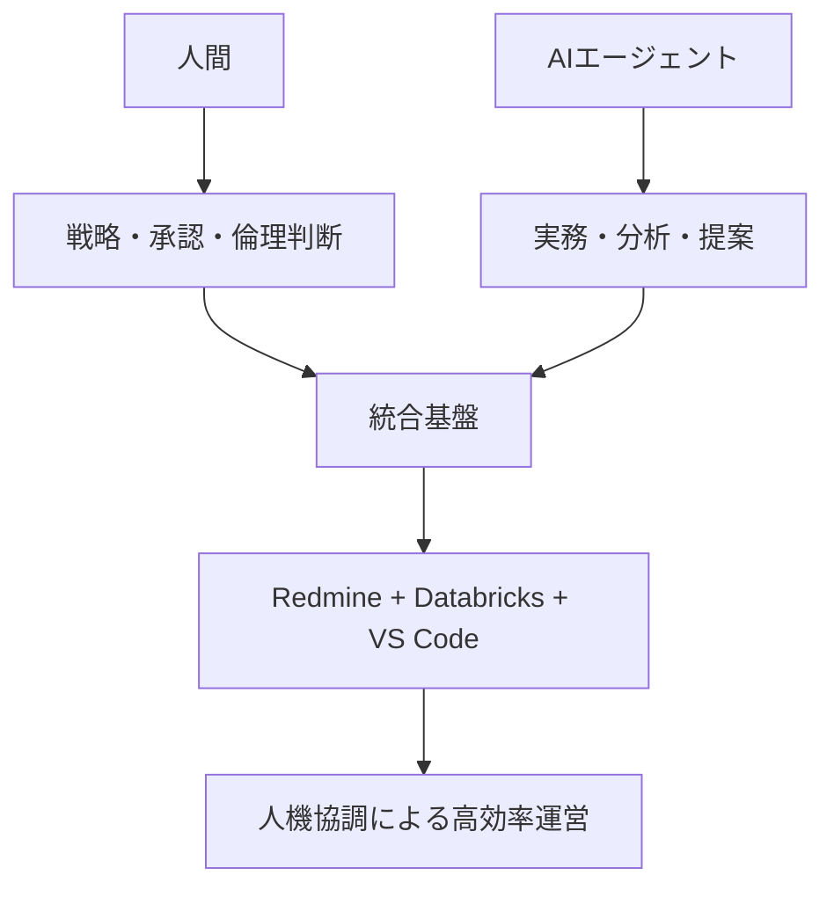

---

## 🎯 2. 背景・目的・ゴール

### 📊 背景
企画書§1に基づき、人間中心運営からAIエージェント活用型への転換ニーズが高まっています。

### 🎯 目的
企画書§1, §2に基づき、個人/少人数でも数十人規模の生産性を実現し、透明性・ガバナンス・教育資産化を両立します。

### 🏆 成果目標
企画書§4, §5を踏まえた定量的目標：

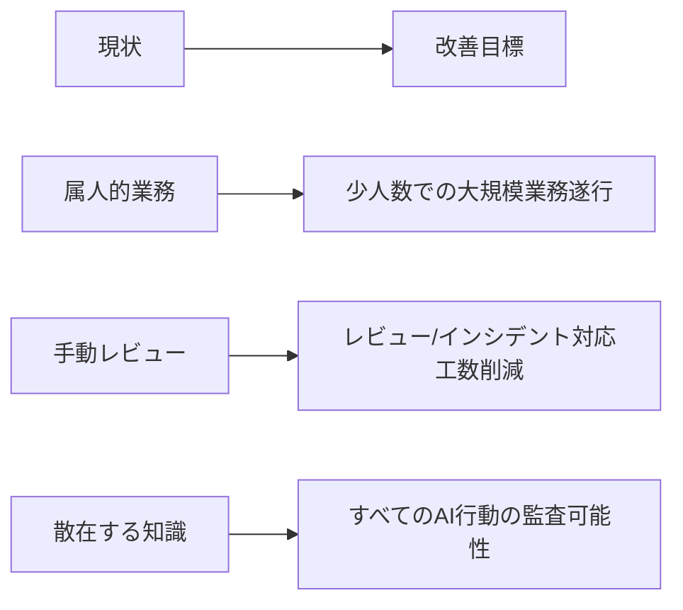

| 目標領域             | 具体的目標                          | 測定指標         |
| -------------------- | ----------------------------------- | ---------------- |
| **スケーラビリティ** | 少人数での大規模業務遂行            | 生産性3-5倍向上  |
| **効率性**           | レビュー/インシデント対応の工数削減 | ROI: 1年以内回収 |
| **透明性**           | すべてのAI行動の監査可能性          | 完全履歴管理100% |

---

## 🔍 3. スコープ

### ✅ 対象範囲（Must）

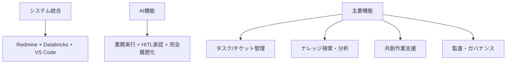

- 🔗 **統合基盤**: Redmine, Databricks, VS Code の統合基盤
- 🤖 **AI機能**: AIエージェントの業務実行、HITL（Human-in-the-Loop）承認、完全履歴化
- 📊 **コア機能**: タスク/チケット、ナレッジ検索・分析、共創作業、監査・ガバナンス

### ❌ 対象外（Out of Scope / 将来検討）

- 🧠 自社LLMの学習・ファインチューニング環境の構築
- 🤖 物理的なRPA/デバイス制御領域
- 💼 ERP/会計などの広範囲業務パッケージの導入（連携は本要件に含む）

---

## 👥 4. 利用者・権限

### 🎭 役割定義

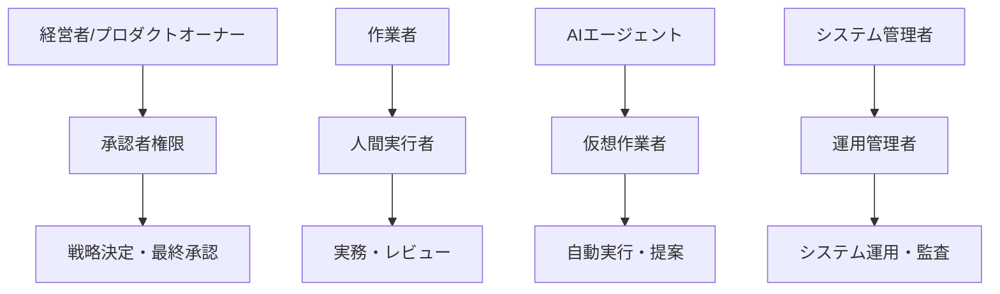

| 役割                          | 主な責務           | 特徴       |
| ----------------------------- | ------------------ | ---------- |
| **経営者/プロダクトオーナー** | 戦略決定、最終承認 | 承認者     |
| **作業者（人間）**            | 実務執行、レビュー | 実行者     |
| **AIエージェント**            | 自動実行、提案作成 | 仮想作業者 |
| **システム管理者**            | 運用、監査         | 管理者     |

### 🔐 権限レベル

| 権限レベル      | 対象者         | 主な権限                                   |
| --------------- | -------------- | ------------------------------------------ |
| **Admin**       | システム管理者 | 全設定・監査ログ・権限管理                 |
| **Approver**    | 経営者・承認者 | 重要操作の承認/却下、監査閲覧              |
| **Contributor** | 作業者         | タスク実行/ドキュメント更新                |
| **Agent**       | AIエージェント | 許可範囲内の自動実行（必須承認の手前まで） |

---

## 📋 5. ユースケース（要約）

### 🔄 主要ユースケースフロー

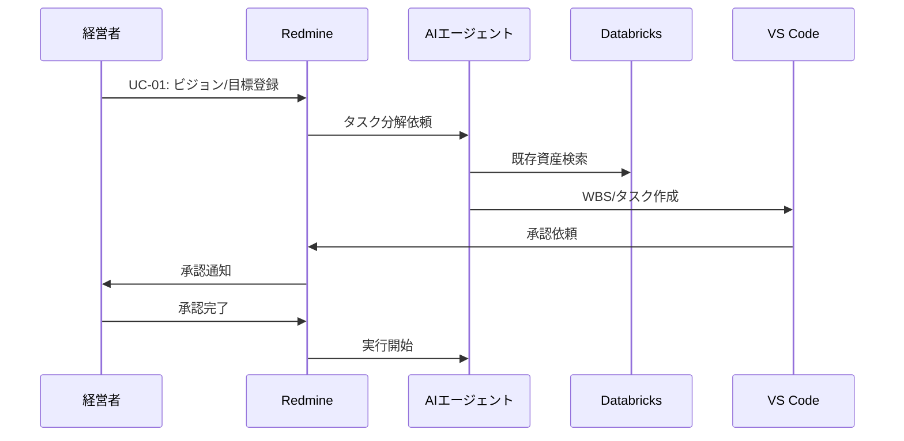

### 📝 ユースケース一覧

| UC番号    | ユースケース名   | 概要                                                                                           |
| --------- | ---------------- | ---------------------------------------------------------------------------------------------- |
| **UC-01** | 戦略実行管理     | 経営者がビジョン/目標をRedmineに登録 → AIがWBS/タスク分解 → 承認後に実行                       |
| **UC-02** | 市場調査・分析   | 市場調査依頼 → AIがDatabricksから既存資産を検索/分析し、ドラフトをVS Codeに作成 → 承認後に配布 |
| **UC-03** | 課題解決サポート | バグ/課題受付 → AIが再現/原因推定/修正案を作成 → 人間がレビュー承認 → 自動PR/ドキュメント反映  |
| **UC-04** | 監査・ガバナンス | すべてのAI行動ログをRedmineに集約し、後追い監査/教育資産化                                     |

---

## ⚙️ 6. 機能要件（FR）

### 🏢 6.1 中枢管理（Redmine）

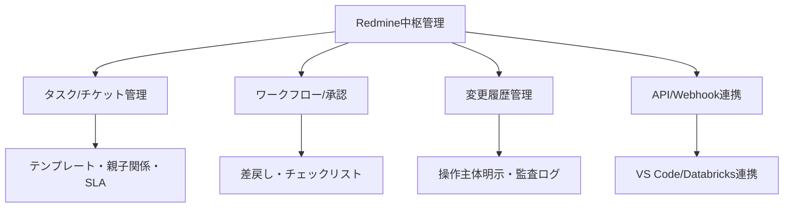

| 要件ID     | 要件内容                                                                                  |
| ---------- | ----------------------------------------------------------------------------------------- |
| **FR-001** | 📋 タスク/チケット管理を提供する（テンプレート、親子/関連、カスタムフィールド、SLAを含む） |
| **FR-002** | 🔄 ワークフロー/承認を構成可能とし、差戻しとチェックリストをサポートする                   |
| **FR-003** | 📚 変更履歴を完全保存し、操作主体（人/AI）を明示する監査ログを提供する                     |
| **FR-004** | 🔌 VS Code/Databricks/エージェント実行イベントと双方向に連携するWebhook/APIを提供する      |

### 🤖 6.2 AIエージェント管理・実行

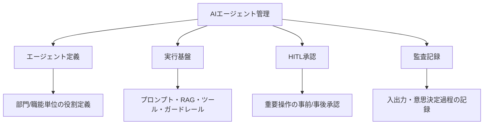

| 要件ID     | 要件内容                                                                              |
| ---------- | ------------------------------------------------------------------------------------- |
| **FR-005** | 👥 部門/職能単位のエージェント役割（プロファイル/権限）を定義できる                    |
| **FR-006** | 🔧 プロンプトテンプレート、RAG参照、ツール実行、ガードレールから成る実行基盤を提供する |
| **FR-007** | ✋ 重要操作は事前/事後のHITL承認を必須化でき、リスク閾値で分岐できる                   |
| **FR-008** | 📝 入出力・ファイル変更・意思決定過程をイベントとして記録する                          |

### 🧠 6.3 知識・分析（Databricks）

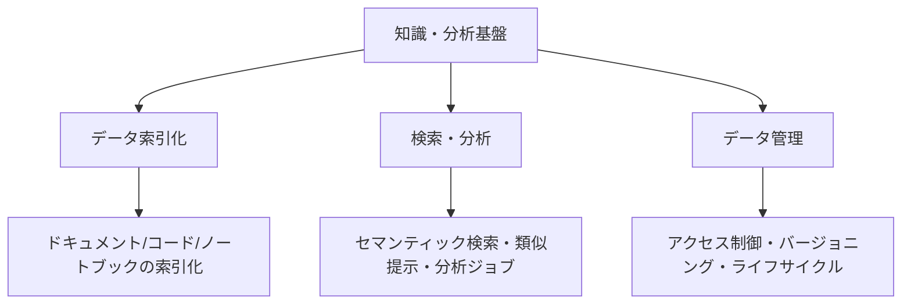

| 要件ID     | 要件内容                                                             |
| ---------- | -------------------------------------------------------------------- |
| **FR-009** | 📄 既存ドキュメント/コード/ノートブックをメタデータ化し索引化する     |
| **FR-010** | 🔍 セマンティック検索/類似提示/簡易分析ジョブを実行できる             |
| **FR-011** | 🔐 データのアクセス制御、バージョニング、ライフサイクル管理を提供する |

### 💻 6.4 共創作業（VS Code）

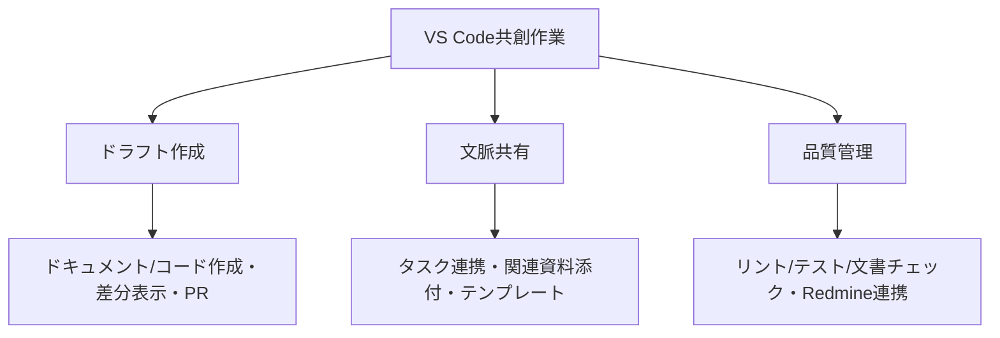

| 要件ID     | 要件内容                                                                     |
| ---------- | ---------------------------------------------------------------------------- |
| **FR-012** | ✏️ ドキュメント/コードのドラフト作成、差分表示、変更提案（PR）を行える        |
| **FR-013** | 🔗 タスク連携、関連資料の自動添付、テンプレート適用により作業文脈を共有できる |
| **FR-014** | ✅ リント/テスト/文書チェックを自動実行し、結果をRedmineへ連携する            |

### 🛡️ 6.5 ガバナンス/監査

| 要件ID     | 要件内容                                                                     |
| ---------- | ---------------------------------------------------------------------------- |
| **FR-015** | 📊 操作主体、根拠資料、承認者、時刻、成果物リンクを自動ひも付けして可視化する |
| **FR-016** | 🚨 承認必須範囲、機密区分、外部共有可否、モデル使用制限のポリシーを設定できる |
| **FR-017** | 📋 期間/案件別の監査証跡をPDF/CSVでエクスポートできる                         |

### 🔌 6.6 外部連携/拡張

| 要件ID     | 要件内容                                                            |
| ---------- | ------------------------------------------------------------------- |
| **FR-018** | 🌐 REST API/Webhook/イベント連携を提供する（イベントバスは将来検討） |
| **FR-019** | 🔗 Git/CI、メール/チャット通知、ドライブとの連携を行える             |

### 📁 6.7 データ（機能）

| 要件ID     | 要件内容                                                            |
| ---------- | ------------------------------------------------------------------- |
| **FR-020** | 🏷️ すべての成果物にタスクID/主体/時刻/出典のメタデータを自動付与する |

---

### 🔗 6.8 VS Code LM Tools × Azure Databricks 連携

本節は、VS Code の Language Model Tool API と Azure Databricks を統合し、GitHub Copilot Agent モードから社内ナレッジベースを検索・参照する要件を定義します。

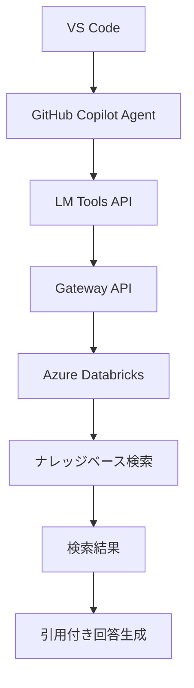

#### 🔍 6.8.1 ナレッジベース検索

| 要件ID     | 要件内容                                                                            |
| ---------- | ----------------------------------------------------------------------------------- |
| **FR-021** | 🤖 GitHub Copilot Agent モードから Azure Databricks のナレッジベースを検索できること |
| **FR-022** | 📋 検索結果はタイトル、要約、ソースURL、関連テキスト（抜粋）を含むこと               |
| **FR-023** | 📝 検索結果を根拠として、Copilot が引用元を明記した回答を生成できること              |
| **FR-024** | 🎯 明示的なLMツール呼び出しをサポートすること（ユーザーがツールを指定可能）          |
| **FR-025** | 🔄 Agentモードでの自動ツール選択に対応すること                                       |

#### 🔐 6.8.2 セキュリティ/運用

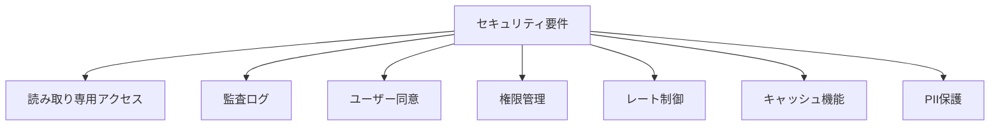

| 要件ID     | 要件内容                                                                                |
| ---------- | --------------------------------------------------------------------------------------- |
| **FR-026** | 🔒 Databricks へのアクセスは検索専用（読み取りのみ）とし、作成/更新/削除は不可とすること |
| **FR-027** | 📊 ツール呼び出し・検索クエリ・返却結果を相関ID付きでアクセスログへ記録し監査できること  |
| **FR-028** | ✋ ツール実行時に確認ダイアログ（ユーザー同意）を表示できること                          |
| **FR-029** | 👥 組織管理者は許可された拡張/ツールの許可リストを管理できること                         |
| **FR-030** | ⏱️ レート制御（スロットリング）を提供すること                                            |
| **FR-031** | 💾 同一クエリのキャッシュ機能を提供すること（TTL指定可能）                               |
| **FR-032** | 🛡️ PII・秘匿情報を画面表示前にマスキングできること                                       |

#### 🌐 6.8.3 Databricks API 利用要件

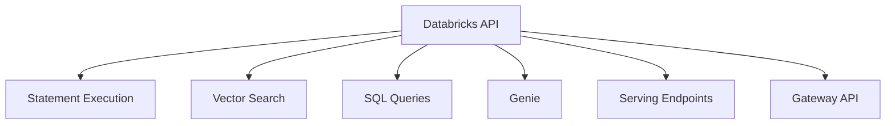

| 要件ID     | 要件内容                                                                                                                                                           |
| ---------- | ------------------------------------------------------------------------------------------------------------------------------------------------------------------ |
| **FR-033** | ⚡ ナレッジ検索は Databricks SQL Statement Execution API をハイブリッドモード（`wait_timeout=10s`, `on_wait_timeout=CONTINUE`）で実行すること                       |
| **FR-034** | 📁 25MiB超の結果は `disposition=EXTERNAL_LINKS` とし、SAS URL から取得する際は Authorization ヘッダーを送信しないこと                                               |
| **FR-035** | 🎯 Real-Time Serving Endpoints API によりモデル推論結果を取得できること                                                                                             |
| **FR-036** | 🔍 Vector Search の Indexes API を利用して類似検索を実行できること（Endpoints API はインデックスをホストする計算リソース管理に使用）                                |
| **FR-037** | 💾 SQL Queries API を利用し保存済みクエリを実行できること                                                                                                           |
| **FR-038** | 💬 Genie API を利用して会話形式のBIクエリを開始できること                                                                                                           |
| **FR-039** | 🔌 Gateway API は Databricks API リファレンスと同一のエンドポイント/機能対応（1対1）を提供すること                                                                  |
| **FR-040** | 📋 利用可能なクエリID・インデックス名・GenieスペースID・Serving Endpoint名はLM Tools側で定義し、当該定義に基づきGateway API経由で適切なDatabricks APIを呼び出すこと |
| **FR-041** | 🔄 Gateway API は認証情報の付与とリクエスト転送のみを行い、Databricks API のレスポンスを変更せずに返却すること                                                      |

---

## 🏗️ 7. 非機能要件（NFR／暫定・要合意）

### 🔧 7.1 信頼性/可用性

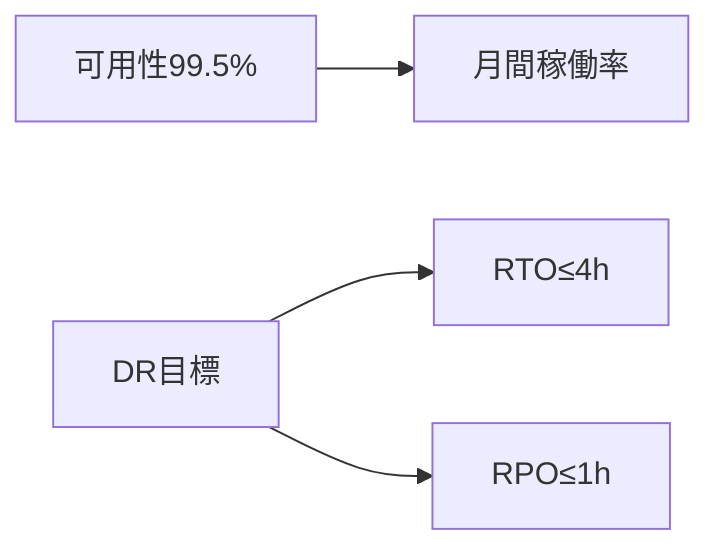

| 要件ID      | 要件内容                       | 目標値       |
| ----------- | ------------------------------ | ------------ |
| **NFR-001** | 📈 月間可用性は99.5%以上とする  | 社内利用想定 |
| **NFR-002** | 💾 DR目標はRTO≤4h、RPO≤1hとする | 災害復旧     |

### ⚡ 7.2 性能

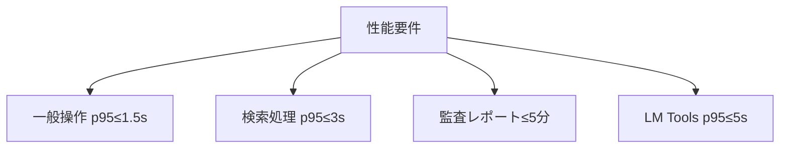

| 要件ID      | 要件内容                                               | 目標値       |
| ----------- | ------------------------------------------------------ | ------------ |
| **NFR-003** | ⚡ 一般操作のp95応答≤1.5sとする                         | 通常業務     |
| **NFR-004** | 🔍 検索処理のp95応答≤3sとする                           | ナレッジ検索 |
| **NFR-005** | 📊 監査レポート作成≤5分/1万イベントとする               | レポート生成 |
| **NFR-021** | 🤖 LM Tools経由のエンドツーエンド検索のp95応答≤5sとする | AI連携       |

### 🔐 7.3 セキュリティ/認証・認可

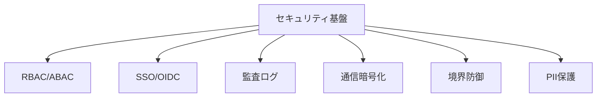

| 要件ID      | 要件内容                                             |
| ----------- | ---------------------------------------------------- |
| **NFR-006** | 🔐 RBAC/ABACにより最小権限を実装する                  |
| **NFR-007** | 🚪 SSO/OIDCによる認証連携を提供する                   |
| **NFR-008** | 🛡️ 監査ログの改ざん防止機構を備える                   |
| **NFR-016** | 🔒 すべての通信はTLS 1.2以上で暗号化する              |
| **NFR-017** | 🚧 WAFとIP許可リスト/制限により境界防御を実装する     |
| **NFR-023** | 🤫 個人情報を含みうるログ項目はハッシュ化して保存する |

### 📈 7.4 スケーラビリティ

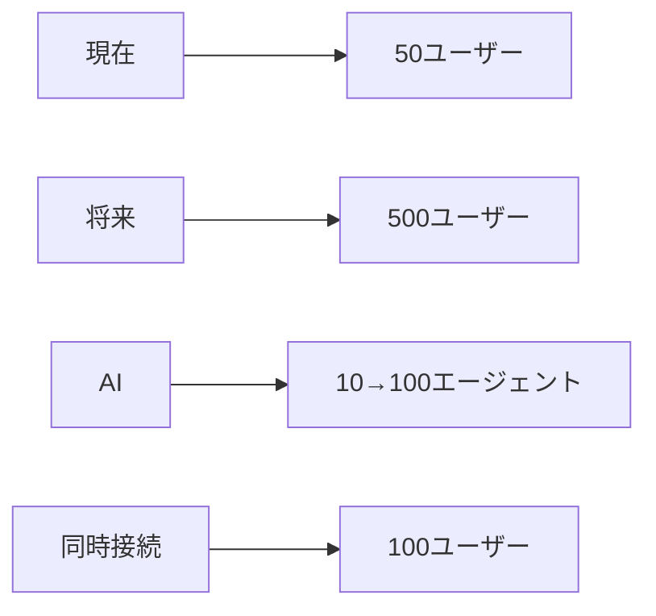

| 要件ID      | 要件内容                                                   |
| ----------- | ---------------------------------------------------------- |
| **NFR-009** | 📊 ユーザー数50→500、エージェント10→100への段階拡張に耐える |
| **NFR-021** | 🔄 LM Tools利用時に同時接続100ユーザーまで処理可能とする    |

### 👁️ 7.5 可観測性

| 要件ID      | 要件内容                                                           |
| ----------- | ------------------------------------------------------------------ |
| **NFR-010** | 🔍 追跡ID、集中ログ/メトリクス/トレース、しきい値アラートを提供する |
| **NFR-019** | 📊 システム監視/アラートを提供する（主要メトリクスの閾値通知）      |

### 🔧 7.6 保守性

| 要件ID      | 要件内容                                                                    |
| ----------- | --------------------------------------------------------------------------- |
| **NFR-011** | 📝 構成管理（IaC化想定）、ドキュメント整備、バージョン互換ポリシーを維持する |
| **NFR-018** | ⚡ 管理者の設定変更は即時（もしくは数分以内）に反映される                    |

### 🔄 7.7 互換性

| 要件ID      | 要件内容                                          |
| ----------- | ------------------------------------------------- |
| **NFR-012** | 🔗 Redmine/Databricks/VS Codeの各LTS互換を維持する |

### 📋 7.8 コンプライアンス/データ管理

| 要件ID      | 要件内容                                                                    |
| ----------- | --------------------------------------------------------------------------- |
| **NFR-013** | 🏷️ データ分類（機密/内部/公開）を定義し強制する                              |
| **NFR-014** | 📅 監査ログの保全期間を1〜3年で運用設計し、アーカイブ/削除ポリシーを定義する |
| **NFR-015** | 🛡️ PII/秘密情報のマスキング/匿名化と持ち出し制御を実施する                   |

### 🔄 7.9 回復性

| 要件ID      | 要件内容                                                     |
| ----------- | ------------------------------------------------------------ |
| **NFR-020** | 🔧 障害時の自動復旧機構（自己回復/再起動/リトライ）を実装する |

### ✅ 7.10 受け入れ基準（抜粋）

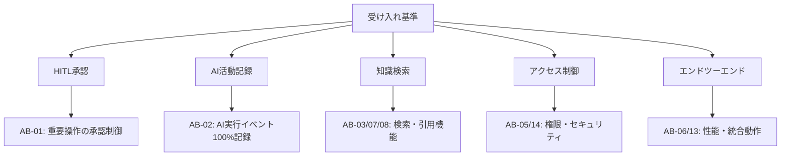

| 基準ID    | 受け入れ基準                                                                                                                         | 対応要件               |
| --------- | ------------------------------------------------------------------------------------------------------------------------------------ | ---------------------- |
| **AB-01** | ✋ HITLにより重要操作が承認なしに実行不可である                                                                                       | FR-007                 |
| **AB-02** | 📊 AI実行イベントがRedmineに100%記録される                                                                                            | FR-003, FR-008         |
| **AB-03** | 📚 既存資産参照の根拠提示が可能である                                                                                                 | FR-010                 |
| **AB-04** | 📝 VS Codeのドラフトが差分/PRとして可視化される                                                                                       | FR-014                 |
| **AB-05** | 🔐 ロールごとのアクセス制御が期待通りに機能する                                                                                       | NFR-006                |
| **AB-06** | 🔄 代表ユースケース（UC-01〜04）がエンドツーエンドで動作する                                                                          | FR全般                 |
| **AB-07** | 🤖 VS Code（Copilot Agent）からDatabricksを検索でき、結果にタイトル/要約/URL/抜粋が含まれる                                           | FR-021, FR-022         |
| **AB-08** | 📝 回答に引用元が自動付与される                                                                                                       | FR-023                 |
| **AB-09** | 🎯 明示ツール呼び出し/自動選択が機能し、実行前確認ダイアログが表示される                                                              | FR-024, FR-025, FR-028 |
| **AB-10** | 🔒 アクセスが読み取り専用である                                                                                                       | FR-026                 |
| **AB-11** | ⚡ Statement Execution API ハイブリッドモードと 25MiB超の `EXTERNAL_LINKS` 取得が動作し、SAS取得時にAuthorizationヘッダーを送信しない | FR-033, FR-034         |
| **AB-12** | 🔌 Vector Search/SQL Queries/Genie/Serving Endpoints が所定のID/名前で呼び出せる                                                      | FR-035〜FR-040         |
| **AB-13** | ⚡ LM Tools経由の検索p95≤5s、同時接続100でSLOを満たす                                                                                 | NFR-021                |
| **AB-14** | 🚧 WAF/IP制限により未許可元からのアクセスが遮断される                                                                                 | NFR-017                |
| **AB-15** | 🛡️ ログでPIIがハッシュ化されて保存される                                                                                              | NFR-023                |

---

## 🚀 8. 導入/移行計画（企画書§7に準拠）

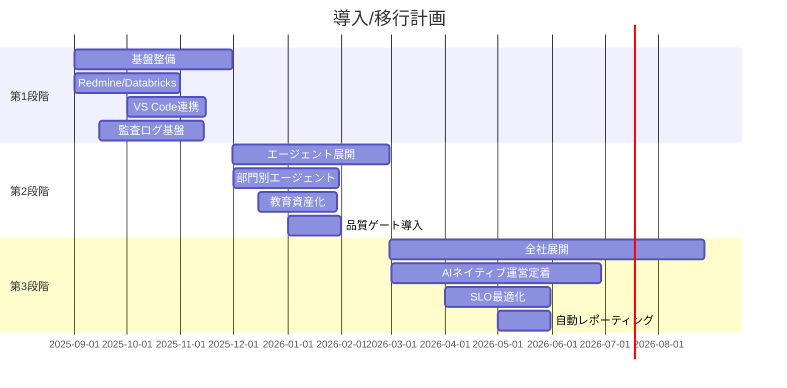

### 📅 段階別詳細

| 段階        | 期間      | 主要成果物                   | 重要マイルストーン                            |
| ----------- | --------- | ---------------------------- | --------------------------------------------- |
| **第1段階** | 1〜3か月  | 基盤整備と最小統合           | Redmine/Databricks/VS Code 連携、監査ログ基盤 |
| **第2段階** | 3〜6か月  | 部門別エージェント展開       | テンプレート/教育資産化、品質ゲート導入       |
| **第3段階** | 6〜12か月 | 全社的AIネイティブ運営の定着 | SLO最適化、自動レポーティング                 |

---

## ⚠️ 9. リスクと対応（企画書§6に準拠）

### 🎯 リスク管理戦略

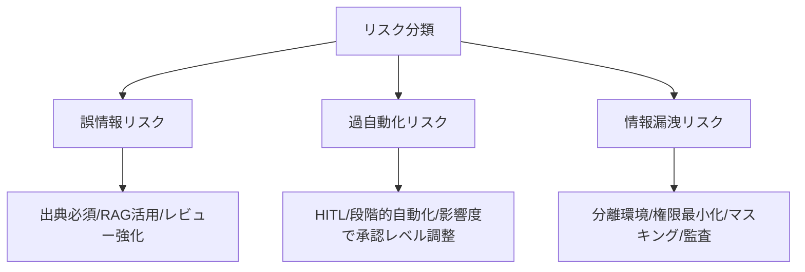

| リスク分類             | 具体的リスク     | 対応策                                     | 責任者             |
| ---------------------- | ---------------- | ------------------------------------------ | ------------------ |
| **品質リスク**         | 🚨 誤情報リスク   | ✅ 出典必須/RAG活用/レビュー強化            | 品質管理者         |
| **運用リスク**         | ⚡ 過自動化リスク | ✅ HITL/段階的自動化/影響度で承認レベル調整 | 運用管理者         |
| **セキュリティリスク** | 🔒 情報漏洩リスク | ✅ 分離環境/権限最小化/マスキング/監査      | セキュリティ管理者 |

---

## 📋 10. 制約・前提

### 🔧 技術的制約

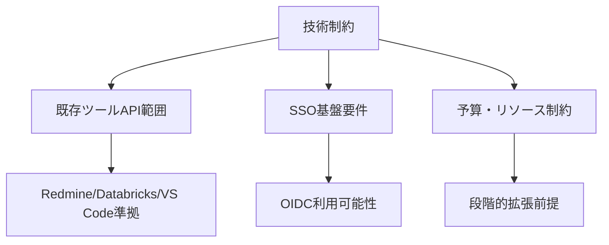

| 制約分類     | 具体的制約                                                           | 対応方針                        |
| ------------ | -------------------------------------------------------------------- | ------------------------------- |
| **API制約**  | 🔌 既存ツール（Redmine/Databricks/VS Code）のAPI/プラグイン範囲に準拠 | 標準API活用、カスタム開発最小化 |
| **認証基盤** | 🚪 SSO基盤/OIDCが利用可能であること                                   | 利用不可の場合は代替案検討      |
| **リソース** | 💰 予算/リソースは段階的拡張前提                                      | フェーズド実装、ROI重視         |

### 📊 前提条件

- ✅ **基盤環境**: クラウドインフラストラクチャが利用可能
- ✅ **認証**: 組織内SSO/OIDC基盤が構築済み
- ✅ **ネットワーク**: セキュアなネットワーク環境が提供される
- ✅ **運用体制**: 管理・運用チームが組織される

---

## 💰 11. コスト/ROI（企画書§5参照）

### 💹 投資対効果の概要

```mermaid
graph LR
    A[初期投資] --> B[システム構築費]
    C[運用コスト] --> D[月次ランニング費]
    E[期待効果] --> F[年間1,200万円便益]
    G[回収期間] --> H[約1年以内]
```

| 項目                | 内容                     | 備考                     |
| ------------------- | ------------------------ | ------------------------ |
| **初期/運用コスト** | 💰 システム構築・運用費用 | 詳細は別紙管理           |
| **便益仮説**        | 📈 年間1,200万円相当      | 保守的見積もり           |
| **回収期間**        | ⏱️ 約1年以内              | トレーサビリティのみ保持 |

> **注記**: 具体的なコスト試算は別紙で管理し、本書ではトレーサビリティのみ保持

---

## 🔄 12. 変更管理

### 📝 変更管理プロセス

```mermaid
graph TD
    A[変更要求] --> B[Redmineチケット作成]
    B --> C[影響範囲分析]
    C --> D[承認プロセス]
    D --> E[変更実装]
    E --> F[版数更新]
    F --> G[変更履歴記録]
```

- 📋 **管理方針**: 本書の変更はRedmineチケットで管理し、版数/変更履歴を残す
- ✅ **受け入れ基準**: 各段階のリリース計画と紐付け、段階ごとに合意
- 🔍 **承認プロセス**: 影響範囲に応じた承認者設定

---

## 🔗 13. トレーサビリティ

### 📊 企画書→要件対応表（抜粋）

```mermaid
graph LR
    A[企画書] --> B[要件定義]
    B --> C[設計書]
    
    A1[§1 背景と目的] --> B1[本書§2]
    A2[§2 システム概要] --> B2[本書§6]
    A3[§3 活用シナリオ] --> B3[本書§5/§7.10]
    A4[§4 導入効果] --> B4[本書§2/§11]
    A5[§5 ROI] --> B5[本書§11]
    A6[§6 留意点とリスク] --> B6[本書§9]
    A7[§7 ロードマップ] --> B7[本書§8]
```

| 企画書章節            | 対応要件定義章節 | 対応内容                   |
| --------------------- | ---------------- | -------------------------- |
| **§1 背景と目的**     | 本書§2           | 背景・目的・ゴールの詳細化 |
| **§2 システム概要**   | 本書§6           | 機能要件への展開           |
| **§3 活用シナリオ**   | 本書§5/§7.10     | ユースケース・受け入れ基準 |
| **§4 導入効果**       | 本書§2/§11       | 成果目標・ROI              |
| **§5 ROI**            | 本書§11          | 投資対効果                 |
| **§6 留意点とリスク** | 本書§9           | リスク管理戦略             |
| **§7 ロードマップ**   | 本書§8           | 導入/移行計画              |

---

## 9. リスクと対応（企画書§6に準拠）

- 誤情報リスク → 出典必須/RAG活用/レビュー強化。
- 過自動化リスク → HITL/段階的自動化/影響度で承認レベル調整。
- 情報漏洩リスク → 分離環境/権限最小化/マスキング/監査。

---

## 10. 制約・前提

- 既存ツール（Redmine/Databricks/VS Code）のAPI/プラグイン範囲に準拠。
- SSO基盤/OIDCが利用可能であること（なければ代替案検討）。
- 予算/リソースは段階的拡張前提（ROIは再見積もりのうえ最終決定）。

---

## 11. コスト/ROI（企画書§5参照）

- 初期/運用コスト、便益仮説、回収期間の試算を別紙で管理（本書ではトレーサビリティのみ保持）。

---

## 12. 変更管理

- 本書の変更はRedmineチケットで管理し、版数/変更履歴を残す。
- 受け入れ基準は各段階のリリース計画と紐付け、段階ごとに合意。

---

## 13. トレーサビリティ

- 企画書→要件対応表（抜粋）
  - §1 背景と目的 → 本書§2
  - §2 システム概要 → 本書§6
  - §3 活用シナリオ → 本書§5/§7.10
  - §4 導入効果 → 本書§2/§11
  - §5 ROI → 本書§11
  - §6 留意点とリスク → 本書§9
  - §7 ロードマップ → 本書§8

---

## ❓ 14. 未決事項（要合意）

### 🔧 技術的未決事項

```mermaid
graph TD
    A[未決事項] --> B[非機能数値目標]
    A --> C[使用モデル/プロバイダ]
    A --> D[認可モデル詳細]
    A --> E[バージョン/環境方針]
    
    B --> B1[SLO/保持期間等の最終値]
    C --> C1[データ取扱ポリシー]
    D --> D1[RBAC/ABACの具体設計]
    E --> E1[LTS/更新周期]
```

| 分類             | 未決事項                 | 検討事項            | 決定期限      |
| ---------------- | ------------------------ | ------------------- | ------------- |
| **性能**         | 🎯 非機能数値目標の最終値 | SLO/保持期間等      | 第1段階開始前 |
| **AI/ML**        | 🤖 使用モデル/プロバイダ  | データ取扱ポリシー  | 第2段階開始前 |
| **セキュリティ** | 🔐 認可モデル詳細         | RBAC/ABACの具体設計 | 第1段階中     |
| **運用**         | 🔄 バージョン/環境方針    | LTS/更新周期        | 第1段階中     |

### 💡 検討アクション

- ✅ **ステークホルダー合意**: 非機能要件の数値目標確定
- ✅ **技術検証**: モデル/プロバイダの実証実験
- ✅ **設計詳細化**: セキュリティ・運用の具体化

---

## ✅ 15. 承認

### 📝 承認プロセス

```mermaid
graph LR
    A[要件定義完了] --> B[レビュー]
    B --> C[承認]
    C --> D[設計フェーズ開始]
```

| 役割         | 担当者             | 署名                 | 日付       |
| ------------ | ------------------ | -------------------- | ---------- |
| **作成**     | システム開発チーム | ____________________ | __________ |
| **レビュー** | 技術責任者         | ____________________ | __________ |
| **承認**     | プロジェクト責任者 | ____________________ | __________ |

### 📋 承認基準

- ✅ **完全性**: 全機能要件・非機能要件が定義されている
- ✅ **一貫性**: 企画書との整合性が保たれている
- ✅ **実現可能性**: 技術的・予算的に実現可能である
- ✅ **測定可能性**: 受け入れ基準が明確に定義されている

---

## 📚 付録

### 📖 A. 用語集

| 用語         | 定義                                                    |
| ------------ | ------------------------------------------------------- |
| **HITL**     | Human-in-the-Loop: 人間が意思決定ループに参加する仕組み |
| **RAG**      | Retrieval-Augmented Generation: 検索拡張生成            |
| **RBAC**     | Role-Based Access Control: ロールベースアクセス制御     |
| **ABAC**     | Attribute-Based Access Control: 属性ベースアクセス制御  |
| **SLO**      | Service Level Objective: サービスレベル目標             |
| **LM Tools** | Language Model Tools: VS Code言語モデルツールAPI        |

### 📊 B. 参考資料

- 📋 企画書: docs/01000_企画/01100_企画書.md（v1.1, 2025-09-07）
- 🏗️ 全体設計書: docs/03000_設計/03000_全体設計.md
- 💻 VS Code拡張設計: docs/03000_設計/03100_VSCode拡張機能設計.md
- 🧠 Databricks設計: docs/03000_設計/03200_Databricks設計.md
- 🏢 Redmine設計: docs/03000_設計/03300_Redmine設計.md
