# 設計方針

## 📋 文書情報

| 項目       | 内容                                                   |
| ---------- | ------------------------------------------------------ |
| **文書名** | ソロプレナー／AIネイティブ企業基盤システム（設計方針） |
| **版数**   | 1.0                                                    |
| **作成日** | 2025-09-07                                             |
| **更新日** | 2025-09-07                                             |
| **作成者** | システム開発チーム                                     |

---

## 🎯 1. 設計目的と範囲

### 1.1 設計目的

本設計は、以下の企画書・要件定義書の要求を満たすソロプレナー／AIネイティブ企業基盤システムを実現することを目的とします：

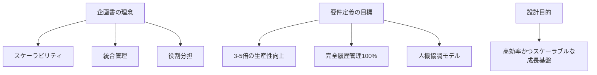

**主要目的：**
- 🚀 **スケーラビリティ**: 個人で数十人規模の組織のような生産性を実現
- 🤝 **人機協調**: 人間の判断とAIの実行力を最適に組み合わせた運営モデル
- 👁️ **透明性とガバナンス**: 全AI行動の監査可能性と教育資産化
- 📈 **継続的改善**: 知識の蓄積と循環による組織能力の向上

### 1.2 設計範囲

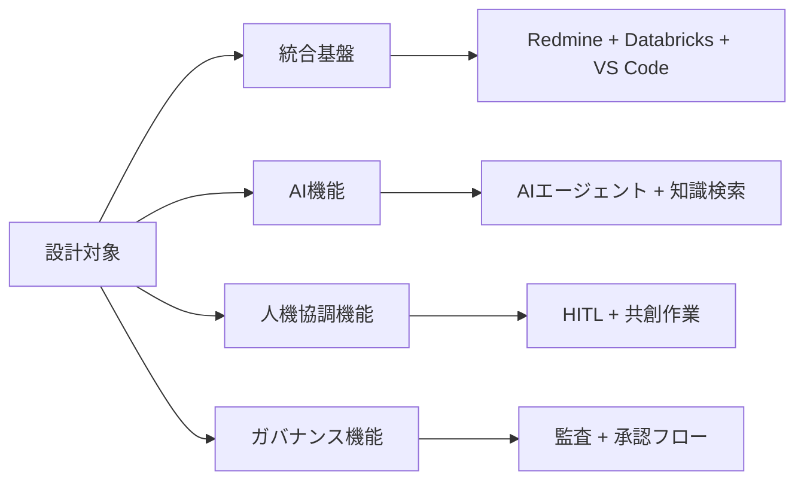

**設計対象範囲：**
- ✅ **統合基盤**: Redmine、Databricks、VS Codeの統合アーキテクチャ
- ✅ **AI機能**: AIエージェントによる業務実行と知識検索・分析機能
- ✅ **人機協調機能**: HITL承認フローと共創作業インターフェース
- ✅ **ガバナンス機能**: 監査ログ、承認プロセス、セキュリティ制御

**設計対象外：**
- ❌ 自社LLMの学習・ファインチューニング環境
- ❌ 物理的なRPA・デバイス制御
- ❌ ERP・会計パッケージの詳細設計（連携のみ対象）

---

## 🏗️ 2. 基本設計方針

### 2.1 アーキテクチャ方針

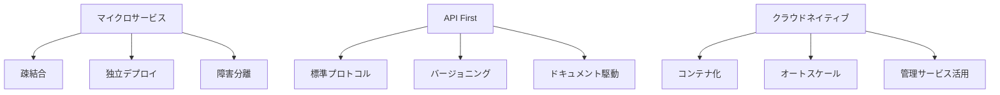

| 方針項目                 | 具体的方針                                                       | 理由・効果                             |
| ------------------------ | ---------------------------------------------------------------- | -------------------------------------- |
| **🔧 マイクロサービス**   | 各コンポーネント（Redmine/Databricks/VS Code連携）を疎結合で設計 | 独立した開発・運用、障害の影響範囲限定 |
| **🔌 API First**          | すべての機能をREST/GraphQL APIで公開                             | 拡張性確保、外部システム連携容易化     |
| **☁️ クラウドネイティブ** | コンテナ化、マネージドサービス活用                               | 運用負荷軽減、スケーラビリティ確保     |
| **📊 データドリブン**     | すべての操作をデータとして記録・分析                             | 継続的改善、監査要件満足               |

### 2.2 セキュリティ方針

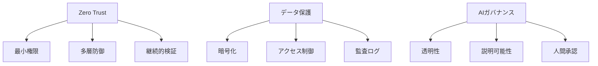

| セキュリティ要素   | 実装方針                                                   | 対応要件         |
| ------------------ | ---------------------------------------------------------- | ---------------- |
| **🔒 Zero Trust**   | 全アクセスを認証・認可で制御、ネットワーク境界に依存しない | NFR-006, NFR-007 |
| **📊 データ保護**   | 保存時・転送時暗号化、PII自動マスキング                    | NFR-016, NFR-023 |
| **👁️ 完全監査**     | 全AI行動のログ記録、改ざん防止機構                         | NFR-008, FR-008  |
| **🤖 AIガバナンス** | AI判断の根拠提示、重要操作の人間承認必須                   | FR-007, FR-010   |

### 2.3 品質特性方針

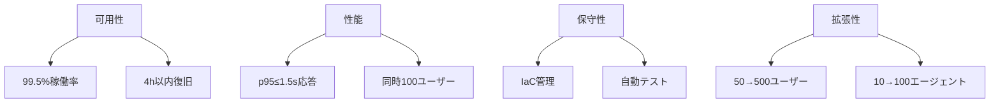

| 品質特性     | 目標値                    | 設計方針                             | 対応要件         |
| ------------ | ------------------------- | ------------------------------------ | ---------------- |
| **⚡ 可用性** | 99.5%稼働率、RTO≤4h       | 冗長化、自動復旧、ヘルスチェック     | NFR-001, NFR-002 |
| **🚀 性能**   | p95≤1.5s、同時100ユーザー | キャッシュ戦略、非同期処理、負荷分散 | NFR-003, NFR-021 |
| **🔧 保守性** | IaC、自動テスト90%以上    | Infrastructure as Code、CI/CD        | NFR-011, NFR-018 |
| **📈 拡張性** | 50→500ユーザー対応        | 水平スケール、マイクロサービス       | NFR-009          |

---

## 🎭 3. 役割分担と責任境界

### 3.1 人間とAIの役割分担

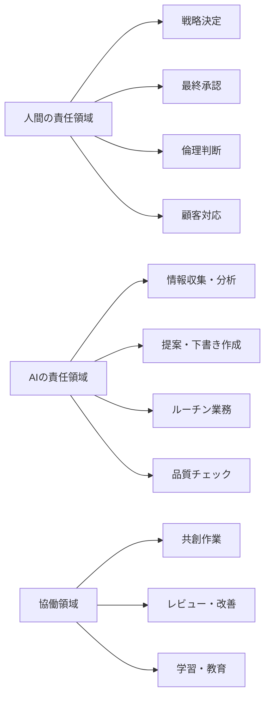

| 領域             | 担当     | 具体的責務                             | 品質保証方法               |
| ---------------- | -------- | -------------------------------------- | -------------------------- |
| **🧠 戦略・判断** | 人間     | ビジョン策定、最終承認、倫理判断       | 承認プロセス、監査ログ     |
| **⚡ 実行・分析** | AI       | 情報収集、分析、提案作成、ルーチン業務 | 根拠提示、人間レビュー     |
| **🤝 協働**       | 人機協調 | 共創作業、継続的改善、知識共有         | 透明な履歴、フィードバック |

### 3.2 システム間責任境界

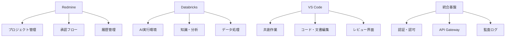

| システム         | 主要責務                         | データ所有権               | 障害時の代替           |
| ---------------- | -------------------------------- | -------------------------- | ---------------------- |
| **📋 Redmine**    | タスク管理、承認フロー、履歴保管 | プロジェクト情報、承認履歴 | マニュアル運用         |
| **🧠 Databricks** | AI実行、知識検索、データ分析     | ナレッジベース、分析結果   | 制限モードで継続       |
| **💻 VS Code**    | 共創作業、コード・文書編集       | 作業ファイル、レビュー履歴 | 他エディタで代替       |
| **🔧 統合基盤**   | 認証・認可、API管理、監査        | 認証情報、アクセスログ     | セーフモードで最小機能 |

---

## 📐 4. 技術方針

### 4.1 技術スタック方針

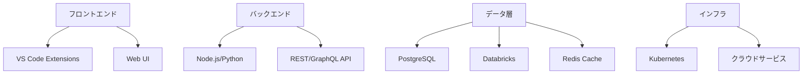

| 技術領域       | 選定技術                        | 選定理由                       | 代替技術          |
| -------------- | ------------------------------- | ------------------------------ | ----------------- |
| **🎨 UI/UX**    | VS Code Extensions + Web UI     | 開発者親和性、拡張性           | JetBrains Plugin  |
| **⚙️ API**      | Node.js/Python, REST/GraphQL    | 既存ツール連携、開発効率       | Java Spring       |
| **💾 データ**   | PostgreSQL + Redis              | 信頼性、性能、コスト           | MySQL + Memcached |
| **☁️ インフラ** | Kubernetes + マネージドサービス | 運用負荷軽減、スケーラビリティ | VM ベース         |

### 4.2 統合方針

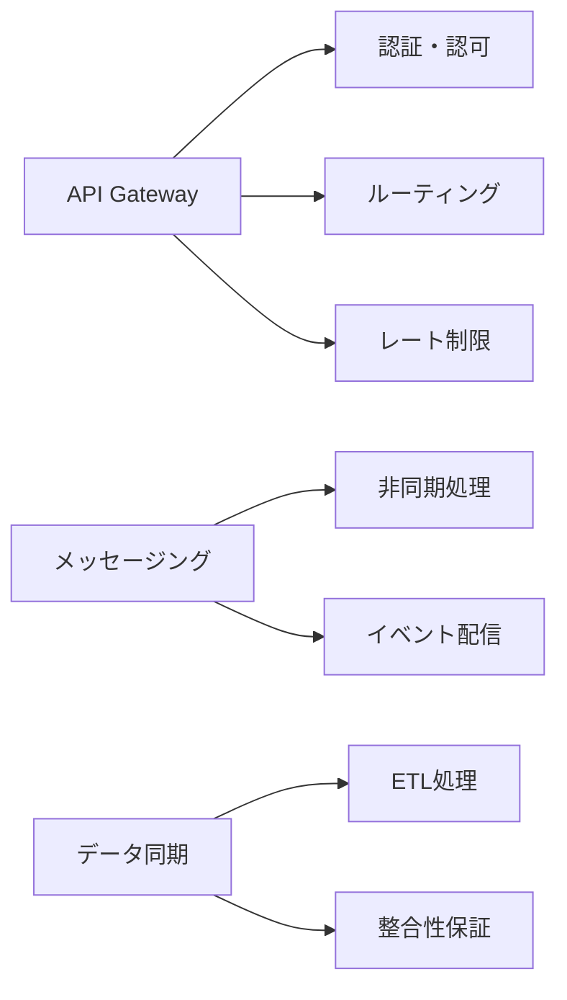

| 統合要素             | 実装方針                            | 技術選択                | 品質保証             |
| -------------------- | ----------------------------------- | ----------------------- | -------------------- |
| **🌐 API統合**        | API Gateway経由の統一エンドポイント | Kong/AWS API Gateway    | API テスト、監視     |
| **📨 メッセージング** | イベント駆動アーキテクチャ          | Apache Kafka/AWS SQS    | メッセージ重複排除   |
| **🔄 データ同期**     | 定期ETL + リアルタイム差分同期      | Apache Airflow/AWS Glue | データ整合性チェック |

---

## 🛡️ 5. セキュリティ・コンプライアンス方針

### 5.1 認証・認可方針

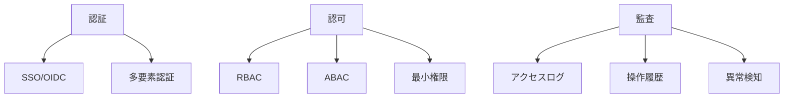

| 要素       | 実装方針                   | 技術選択         | 管理方法               |
| ---------- | -------------------------- | ---------------- | ---------------------- |
| **🔐 認証** | SSO統合、MFA必須化         | OIDC Provider    | 集中管理、定期レビュー |
| **👤 認可** | ロール・属性ベース権限制御 | RBAC + ABAC      | 権限マトリックス管理   |
| **📊 監査** | 全操作のログ記録、異常検知 | ELK Stack/Splunk | 自動アラート、定期監査 |

### 5.2 データ保護方針

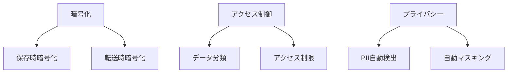

| 保護要素           | 実装方針                | 技術実装                       | 運用管理           |
| ------------------ | ----------------------- | ------------------------------ | ------------------ |
| **🔒 暗号化**       | AES-256暗号化、TLS 1.3  | データベース暗号化、証明書管理 | 鍵のローテーション |
| **📊 データ分類**   | 機密度別アクセス制御    | ラベリング、DLP                | 定期分類見直し     |
| **🤫 プライバシー** | PII自動検出・マスキング | 正規表現、ML検出               | 精度向上、例外管理 |

---

## 📈 6. 運用・保守方針

### 6.1 DevOps方針

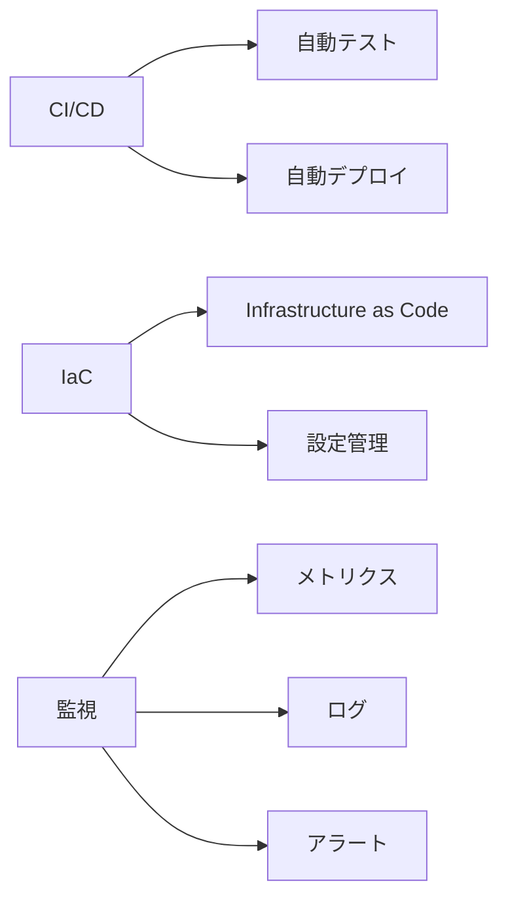

| 要素        | 実装方針                         | ツール選択               | 品質指標          |
| ----------- | -------------------------------- | ------------------------ | ----------------- |
| **🔄 CI/CD** | 自動テスト・デプロイパイプライン | GitHub Actions/Jenkins   | デプロイ成功率99% |
| **🏗️ IaC**   | 全インフラをコード管理           | Terraform/CloudFormation | 設定ドリフト0%    |
| **📊 監視**  | 全階層の可観測性確保             | Prometheus/Grafana       | MTTR≤30分         |

### 6.2 運用継続性方針

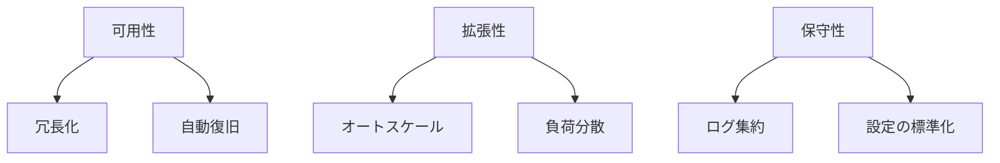

| 継続性要素   | 設計方針                             | 実装技術                    | 目標値             |
| ------------ | ------------------------------------ | --------------------------- | ------------------ |
| **🛡️ 可用性** | 単一障害点排除、自動フェイルオーバー | Load Balancer, Auto Scaling | 99.5%稼働率        |
| **📈 拡張性** | 水平スケール対応、リソース動的調整   | Kubernetes HPA              | 需要の10倍まで対応 |
| **🔧 保守性** | 中央集約ログ、統一監視ダッシュボード | ELK Stack, Grafana          | 問題特定時間≤5分   |

---

## 🎯 7. 受け入れ基準

### 7.1 機能的受け入れ基準

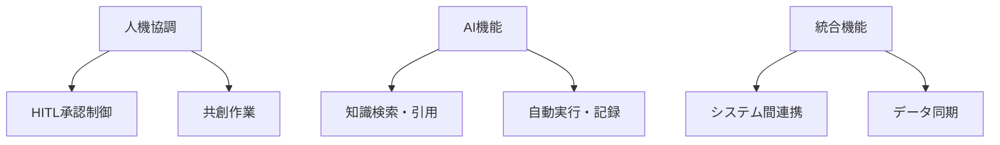

| 基準カテゴリ   | 具体的基準                       | 検証方法                   | 対応要件 |
| -------------- | -------------------------------- | -------------------------- | -------- |
| **🤝 人機協調** | 重要操作が承認なしに実行されない | 自動テスト、手動検証       | AB-01    |
| **🤖 AI機能**   | AI実行イベントが100%記録される   | ログ解析、監査ツール       | AB-02    |
| **🔗 統合機能** | 代表ユースケースがE2Eで動作      | 統合テスト、シナリオテスト | AB-06    |

### 7.2 非機能的受け入れ基準

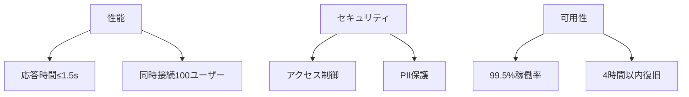

| 基準カテゴリ       | 具体的基準                        | 測定方法            | 対応要件         |
| ------------------ | --------------------------------- | ------------------- | ---------------- |
| **⚡ 性能**         | 一般操作p95≤1.5s、検索p95≤3s      | 負荷テスト、APM監視 | AB-13            |
| **🔒 セキュリティ** | ロール別アクセス制御、PII自動保護 | セキュリティテスト  | AB-05, AB-15     |
| **🛡️ 可用性**       | 月間稼働率99.5%、復旧時間≤4h      | SLA監視、障害テスト | NFR-001, NFR-002 |

---

## 📝 8. 変更管理

### 8.1 設計変更プロセス

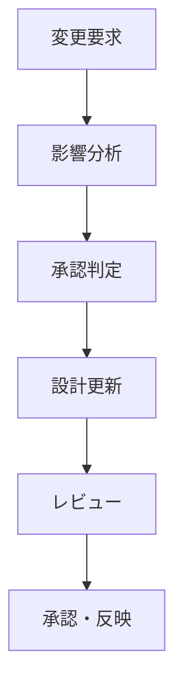

| 変更レベル   | 承認者             | 必要な検討事項                     | 更新対象文書                |
| ------------ | ------------------ | ---------------------------------- | --------------------------- |
| **🔧 軽微**   | 技術リーダー       | 実装詳細、性能影響                 | 該当設計書                  |
| **📊 中程度** | アーキテクト       | アーキテクチャ影響、他システム連携 | アーキテクチャ設計、API設計 |
| **🏗️ 重大**   | プロジェクト責任者 | 要件影響、コスト・スケジュール     | 全設計書、ADR               |

### 8.2 トレーサビリティ管理

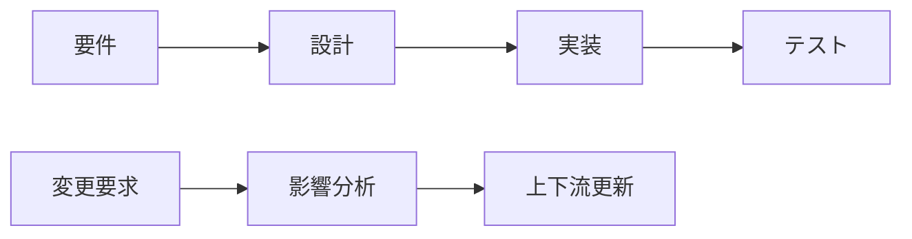

- 📋 **要件トレーサビリティ**: 各設計要素を要件IDと関連付け
- 🔄 **変更トレーサビリティ**: 変更理由・影響範囲・関連変更を記録
- ✅ **検証トレーサビリティ**: 設計決定の検証方法・結果を追跡

---

## 📚 関連文書

### 📖 上位文書
- [企画書](../../010000_企画/011000_企画書.md)
- [要件定義書](../../020000_要件定義/021000_要件定義書.md)

### 📋 下位設計文書
- [トレーサビリティ](../032000_トレーサビリティ/032010_トレーサビリティ.md)
- [全体構成](../033000_アーキテクチャ/033010_全体構成.md)
- [ランタイム構成](../033000_アーキテクチャ/033020_ランタイム構成.md)
- [インフラ設計](../033000_アーキテクチャ/033030_インフラ設計.md)

### 🔧 技術文書
- [ドメインモデル](../034000_アプリケーション設計/034010_ドメインモデル.md)
- [API設計](../036000_API設計/036010_API一覧.md)
- [セキュリティ・運用設計](../039000_セキュリティ・運用設計/039010_セキュリティ・運用設計.md)

---

## 📅 更新履歴

| 日時       | 担当               | 変更概要                                         |
| ---------- | ------------------ | ------------------------------------------------ |
| 2025-09-07 | システム開発チーム | 初版作成、企画書・要件定義書ベースの設計方針策定 |