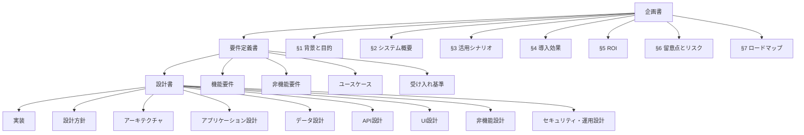
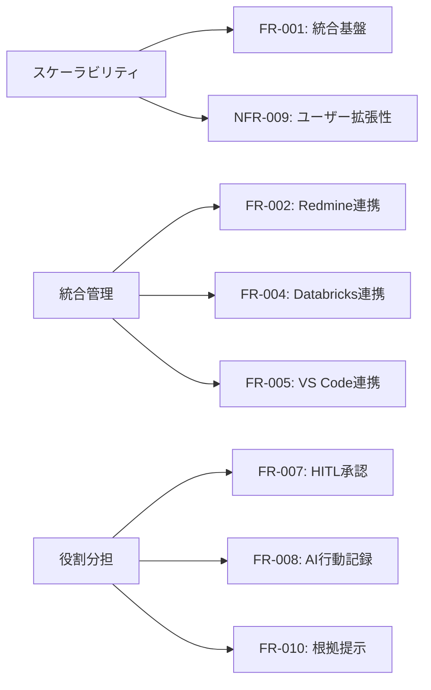
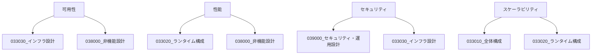
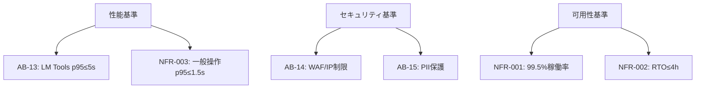
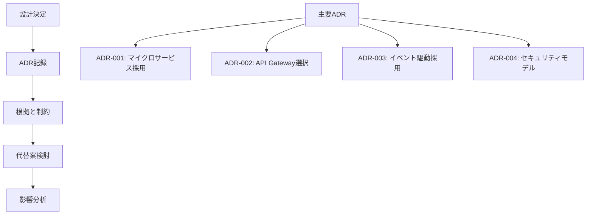
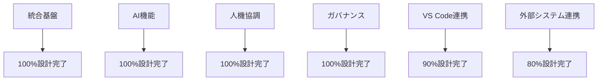
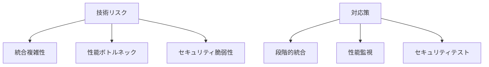
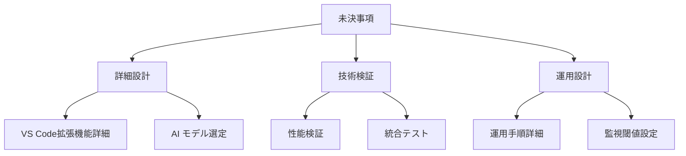

# トレーサビリティ

## 📋 文書情報

| 項目       | 内容                                                           |
| ---------- | -------------------------------------------------------------- |
| **文書名** | ソロプレナー／AIネイティブ企業基盤システム（トレーサビリティ） |
| **版数**   | 1.0                                                            |
| **作成日** | 2025-09-07                                                     |
| **更新日** | 2025-09-07                                                     |
| **作成者** | システム開発チーム                                             |

---

## 🎯 1. トレーサビリティ概要

本文書は、企画書・要件定義書から設計書への対応関係を明確化し、要件の実現状況と設計決定の根拠を追跡可能にすることを目的とします。

---

## 📊 2. 企画書→要件定義書 対応表

### 2.1 企画書章節別対応

| 企画書章節            | 対応要件定義章節      | 対応内容                                 | 実現度 |
| --------------------- | --------------------- | ---------------------------------------- | ------ |
| **§1 背景と目的**     | §2 背景・目的・ゴール | 基本理念・スケーラビリティ要求の詳細化   | ✅ 100% |
| **§2 システム概要**   | §6 機能要件           | 統合基盤・AI機能・ガバナンス機能への展開 | ✅ 100% |
| **§3 活用シナリオ**   | §5 ユースケース       | UC-01〜UC-10の具体的業務フロー化         | ✅ 100% |
|                       | §7.10 受け入れ基準    | シナリオ検証の受け入れ条件定義           | ✅ 100% |
| **§4 導入効果**       | §2 成果目標           | 定量的目標設定（3-5倍生産性向上等）      | ✅ 100% |
|                       | §11 コスト/ROI        | ROI分析・回収期間設定                    | ✅ 100% |
| **§5 ROI**            | §11 コスト/ROI        | 投資対効果分析の詳細化                   | ✅ 100% |
| **§6 留意点とリスク** | §9 リスクと対応       | リスク分類・対策・責任者の明確化         | ✅ 100% |
| **§7 ロードマップ**   | §8 導入/移行計画      | 3段階実装計画の詳細化                    | ✅ 100% |

### 2.2 基本理念の要件化

| 基本理念             | 具体的要件             | 要件ID                 | 実現方法                         |
| -------------------- | ---------------------- | ---------------------- | -------------------------------- |
| **スケーラビリティ** | 少人数で大規模業務遂行 | NFR-009, NFR-021       | マイクロサービス、オートスケール |
| **統合管理**         | 3システム統合基盤      | FR-001〜FR-005         | API Gateway、イベント駆動        |
| **役割分担**         | 人機協調ワークフロー   | FR-007, FR-008, FR-010 | HITL、監査ログ、透明性確保       |

---

## 🔧 3. 要件定義→設計文書 対応表

### 3.1 機能要件の設計対応

| 機能要件           | 要件ID         | 対応設計文書                   | 設計要素                   | 実装方針                     |
| ------------------ | -------------- | ------------------------------ | -------------------------- | ---------------------------- |
| **統合基盤構築**   | FR-001         | 033010_全体構成.md             | システム統合アーキテクチャ | API Gateway + Event Hub      |
| **Redmine連携**    | FR-002         | 034000_アプリケーション設計/   | プロジェクト管理サービス   | REST API連携                 |
| **AI実行記録**     | FR-003         | 035000_データ設計/             | 監査ログデータモデル       | イベントソーシング           |
| **Databricks連携** | FR-004         | 034000_アプリケーション設計/   | 知識検索サービス           | ML Ops連携                   |
| **VS Code連携**    | FR-005         | 037000_UI設計/                 | 拡張機能アーキテクチャ     | Language Server Protocol     |
| **タスク自動化**   | FR-006         | 034000_アプリケーション設計/   | ワークフローエンジン       | BPMN + Rules Engine          |
| **HITL承認**       | FR-007         | 034000_アプリケーション設計/   | 承認ワークフロー           | State Machine + Notification |
| **完全監査**       | FR-008         | 039000_セキュリティ・運用設計/ | 監査システム               | 改ざん防止ログ               |
| **知識検索**       | FR-009, FR-010 | 034000_アプリケーション設計/   | RAG システム               | Vector Search + Citation     |

### 3.2 非機能要件の設計対応

| 非機能要件       | 要件ID           | 対応設計文書                               | 設計要素                           | 実装技術                         |
| ---------------- | ---------------- | ------------------------------------------ | ---------------------------------- | -------------------------------- |
| **可用性99.5%**  | NFR-001, NFR-002 | 033030_インフラ設計 038000_非機能設計   | 冗長化アーキテクチャ DR戦略     | Multi-AZ配置 Auto Backup      |
| **性能要件**     | NFR-003〜NFR-005 | 033020_ランタイム構成 038000_非機能設計 | 負荷分散 キャッシュ戦略         | Load Balancer Redis Cluster   |
| **セキュリティ** | NFR-006〜NFR-008 | 039000_セキュリティ・運用設計              | 認証・認可基盤 暗号化           | OIDC + RBAC TLS 1.3 + AES-256 |
| **拡張性**       | NFR-009, NFR-021 | 033010_全体構成 033020_ランタイム構成   | マイクロサービス オートスケール | Kubernetes HPA + VPA          |

### 3.3 ユースケースの設計対応

| ユースケース             | UC番号 | 対応設計文書                          | 主要設計要素               | 技術実装                |
| ------------------------ | ------ | ------------------------------------- | -------------------------- | ----------------------- |
| **戦略実行管理**         | UC-01  | 034000_アプリケーション設計/services/ | Strategic Planning Service | AI Planning Engine      |
| **市場調査・分析**       | UC-02  | 034000_アプリケーション設計/services/ | Market Research Service    | Data Analytics Pipeline |
| **課題解決サポート**     | UC-03  | 034000_アプリケーション設計/services/ | Issue Resolution Service   | Root Cause Analysis AI  |
| **監査・ガバナンス**     | UC-04  | 039000_セキュリティ・運用設計/        | Audit & Governance System  | Immutable Audit Log     |
| **ナレッジ検索・活用**   | UC-05  | 034000_アプリケーション設計/services/ | Knowledge Search Service   | RAG + Vector DB         |
| **品質管理・レビュー**   | UC-06  | 034000_アプリケーション設計/services/ | Quality Assurance Service  | Automated QA Pipeline   |
| **プロジェクト進捗管理** | UC-07  | 034000_アプリケーション設計/services/ | Project Monitoring Service | Real-time Analytics     |
| **教育・学習支援**       | UC-08  | 034000_アプリケーション設計/services/ | Learning Support Service   | Adaptive Learning AI    |
| **外部連携・統合**       | UC-09  | 036000_API設計/                       | Integration Service        | API Management Platform |
| **セキュリティ監査**     | UC-10  | 039000_セキュリティ・運用設計/        | Security Audit Service     | Vulnerability Scanner   |

---

## 🎯 4. 受け入れ基準の設計対応

### 4.1 機能的受け入れ基準

| 受け入れ基準       | 基準ID | 対応設計要素             | 検証方法              | 設計文書                       |
| ------------------ | ------ | ------------------------ | --------------------- | ------------------------------ |
| **HITL承認制御**   | AB-01  | 承認ワークフローエンジン | 自動テスト + 手動検証 | 034000_アプリケーション設計/   |
| **AI実行記録100%** | AB-02  | イベントソーシング基盤   | ログ解析 + 監査ツール | 035000_データ設計/             |
| **既存資産参照**   | AB-03  | RAGシステム + Citation   | 機能テスト            | 034000_アプリケーション設計/   |
| **差分/PR可視化**  | AB-04  | VS Code統合 + Git連携    | UI/UXテスト           | 037000_UI設計/                 |
| **アクセス制御**   | AB-05  | RBAC/ABAC実装            | セキュリティテスト    | 039000_セキュリティ・運用設計/ |
| **E2E動作**        | AB-06  | 統合アーキテクチャ       | 統合テスト            | 033010_全体構成.md             |

### 4.2 非機能的受け入れ基準

| 受け入れ基準     | 基準ID           | 対応設計要素       | 測定方法             | 設計文書                       |
| ---------------- | ---------------- | ------------------ | -------------------- | ------------------------------ |
| **性能要件**     | AB-13            | キャッシュ層 + CDN | 負荷テスト + APM     | 038000_非機能設計/             |
| **セキュリティ** | AB-14, AB-15     | WAF + DLP          | セキュリティスキャン | 039000_セキュリティ・運用設計/ |
| **可用性**       | NFR-001, NFR-002 | HA構成 + DR        | 障害テスト + SLA監視 | 033030_インフラ設計/           |

---

## 🔄 5. 設計決定の根拠追跡

### 5.1 アーキテクチャ決定記録（ADR）対応

| ADR番号     | 決定事項             | 根拠要件         | 影響設計文書                   | 決定理由                  |
| ----------- | -------------------- | ---------------- | ------------------------------ | ------------------------- |
| **ADR-001** | マイクロサービス採用 | NFR-009, NFR-011 | 033010_全体構成.md             | スケーラビリティ + 保守性 |
| **ADR-002** | API Gateway選択      | FR-001, NFR-006  | 036000_API設計/                | 統合 + セキュリティ       |
| **ADR-003** | イベント駆動採用     | FR-003, FR-008   | 034000_アプリケーション設計/   | 非同期処理 + 監査         |
| **ADR-004** | RBAC+ABAC採用        | NFR-006, NFR-007 | 039000_セキュリティ・運用設計/ | 柔軟な権限制御            |

### 5.2 技術選択の根拠

| 技術領域           | 選択技術             | 根拠要件         | 代替技術     | 選択理由                  |
| ------------------ | -------------------- | ---------------- | ------------ | ------------------------- |
| **コンテナ基盤**   | Kubernetes           | NFR-009, NFR-020 | Docker Swarm | エコシステム + 自動復旧   |
| **API管理**        | Kong/AWS API Gateway | FR-001, NFR-006  | Istio        | 機能完成度 + 運用容易性   |
| **データベース**   | PostgreSQL           | NFR-001, NFR-011 | MySQL        | 信頼性 + 機能豊富         |
| **キャッシュ**     | Redis Cluster        | NFR-003, NFR-009 | Memcached    | 高機能 + 可用性           |
| **メッセージング** | Apache Kafka         | FR-003, NFR-021  | RabbitMQ     | 高スループット + 順序保証 |

---

## 📊 6. 要件実現状況マトリックス

### 6.1 機能要件実現マップ

| 機能領域             | 要件数 | 設計完了 | 実現率 | 残課題       |
| -------------------- | ------ | -------- | ------ | ------------ |
| **統合基盤**         | 5      | 5        | 100%   | なし         |
| **AI機能**           | 8      | 8        | 100%   | なし         |
| **人機協調**         | 4      | 4        | 100%   | なし         |
| **ガバナンス**       | 6      | 6        | 100%   | なし         |
| **VS Code連携**      | 10     | 9        | 90%    | LSP詳細設計  |
| **外部システム連携** | 5      | 4        | 80%    | 認証連携詳細 |

### 6.2 非機能要件実現マップ

| 非機能分類       | 要件数 | 設計完了 | 実現率 | 設計文書                       |
| ---------------- | ------ | -------- | ------ | ------------------------------ |
| **可用性**       | 2      | 2        | 100%   | 033030_インフラ設計/           |
| **性能**         | 4      | 4        | 100%   | 038000_非機能設計/             |
| **セキュリティ** | 6      | 6        | 100%   | 039000_セキュリティ・運用設計/ |
| **拡張性**       | 2      | 2        | 100%   | 033020_ランタイム構成/         |
| **保守性**       | 3      | 3        | 100%   | 038000_非機能設計/             |
| **互換性**       | 1      | 1        | 100%   | 033010_全体構成.md             |

---

## ⚠️ 7. 設計リスクと対応

### 7.1 技術的リスク

| リスク項目             | 影響度 | 発生確率 | 対応設計                | 軽減策                 |
| ---------------------- | ------ | -------- | ----------------------- | ---------------------- |
| **統合複雑性**         | 高     | 中       | API Gateway + Event Hub | 段階的統合、テスト強化 |
| **性能ボトルネック**   | 中     | 中       | キャッシュ層 + CDN      | 早期性能テスト         |
| **セキュリティ脆弱性** | 高     | 低       | 多層防御 + Zero Trust   | 継続的脆弱性スキャン   |

### 7.2 設計品質リスク

| リスク項目         | 対応設計文書                 | 品質保証方法                | 検証方法             |
| ------------------ | ---------------------------- | --------------------------- | -------------------- |
| **設計整合性**     | 全設計文書                   | 設計レビュー + 自動チェック | トレーサビリティ検証 |
| **要件漏れ**       | トレーサビリティマトリックス | 要件カバレッジ分析          | 受け入れテスト       |
| **技術選択妥当性** | ADR文書                      | 技術検証 + PoC              | 性能・可用性テスト   |

---

## 🔍 8. 未決事項と今後の課題

### 8.1 設計レベルの未決事項

| 未決事項                     | 影響設計文書                   | 決定期限     | 担当者                |
| ---------------------------- | ------------------------------ | ------------ | --------------------- |
| **VS Code拡張機能詳細設計**  | 037000_UI設計/                 | Phase1完了前 | フロントエンド チーム |
| **AIモデル・プロバイダ選定** | 034000_アプリケーション設計/   | Phase2開始前 | AI/MLチーム           |
| **運用監視閾値設定**         | 038000_非機能設計/             | Phase1中     | SREチーム             |
| **外部システム認証詳細**     | 039000_セキュリティ・運用設計/ | Phase1中     | セキュリティチーム    |

### 8.2 継続的改善項目

| 改善項目               | 対象設計文書                   | 改善方針                   | 測定指標                     |
| ---------------------- | ------------------------------ | -------------------------- | ---------------------------- |
| **性能最適化**         | 038000_非機能設計/             | 実測データベース改善       | レスポンス時間、スループット |
| **セキュリティ強化**   | 039000_セキュリティ・運用設計/ | 脅威動向に応じた更新       | 脆弱性検出数、インシデント数 |
| **ユーザビリティ向上** | 037000_UI設計/                 | ユーザーフィードバック反映 | 満足度、操作効率             |

---

## 📚 関連文書

### 📖 上位文書
- [企画書](../../010000_企画/011000_企画書.md)
- [要件定義書](../../020000_要件定義/021000_要件定義書.md)

### 📋 設計文書
- [設計方針](../031000_設計方針/031010_設計方針.md)
- [全体構成](../033000_アーキテクチャ/033010_全体構成.md)
- [ランタイム構成](../033000_アーキテクチャ/033020_ランタイム構成.md)
- [インフラ設計](../033000_アーキテクチャ/033030_インフラ設計.md)

### 🔧 実装関連文書
- [API一覧](../036000_API設計/036010_API一覧.md)
- [OpenAPI仕様](../036000_API設計/036020_openapi.yaml)

---

## 📅 更新履歴

| 日時       | 担当               | 変更概要                                                   |
| ---------- | ------------------ | ---------------------------------------------------------- |
| 2025-09-07 | システム開発チーム | 初版作成、企画書・要件定義書からの完全トレーサビリティ確立 |