# 全体構成

## 📋 文書情報

| 項目       | 内容                                                   |
| ---------- | ------------------------------------------------------ |
| **文書名** | ソロプレナー／AIネイティブ企業基盤システム（全体構成） |
| **版数**   | 1.0                                                    |
| **作成日** | 2025-09-07                                             |
| **更新日** | 2025-09-07                                             |
| **作成者** | システム開発チーム                                     |

---

## 🎯 1. 全体アーキテクチャ概要

本システムは、Redmine（中枢管理）、Databricks（知識・分析基盤）、VS Code（共創作業空間）を統合し、AIエージェントと人間のハイブリッドチームによる高効率な業務運営を実現する統合基盤です。

### 1.1 基本構成

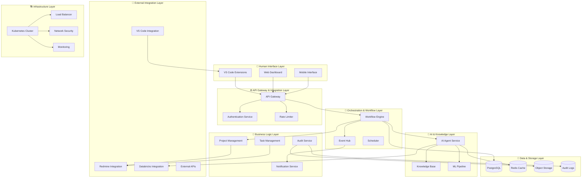

### 1.2 アーキテクチャ原則

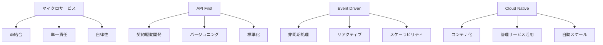

| 原則                   | 実装方針                                 | 利点                               | 適用範囲           |
| ---------------------- | ---------------------------------------- | ---------------------------------- | ------------------ |
| **🔧 マイクロサービス** | ドメイン境界での分割、独立デプロイ       | 開発速度、障害分離、技術選択自由度 | 全ビジネスロジック |
| **🔌 API First**        | OpenAPI仕様駆動、契約テスト              | 並行開発、品質確保、外部連携容易   | 全サービス間通信   |
| **📨 Event Driven**     | 非同期メッセージング、イベントソーシング | リアルタイム性、疎結合、監査性     | 状態変更、通知     |
| **☁️ Cloud Native**     | Kubernetes、マネージドサービス           | 運用負荷軽減、可用性、コスト最適化 | インフラ全体       |

---

## 🏗️ 2. システム構成要素

### 2.1 コア統合基盤

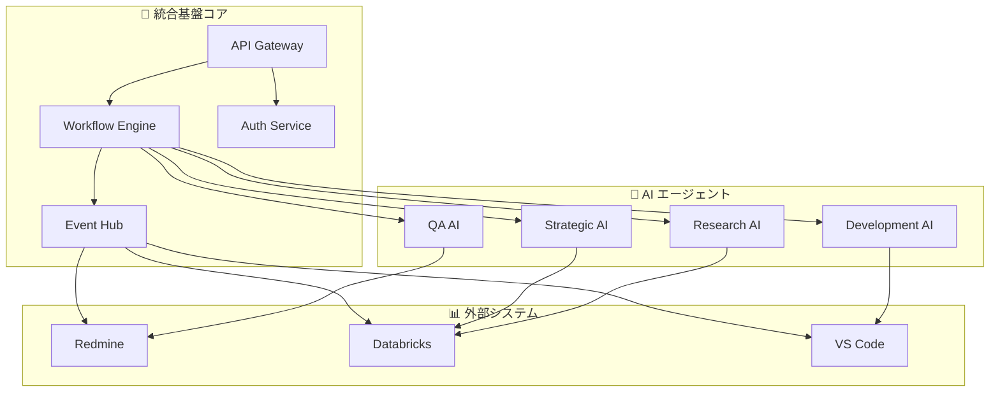

| コンポーネント        | 責務                                       | 技術実装                    | スケーリング戦略                 |
| --------------------- | ------------------------------------------ | --------------------------- | -------------------------------- |
| **🌐 API Gateway**     | 統一エンドポイント、認証・認可、レート制限 | Kong/AWS API Gateway        | 水平スケール、CDN連携            |
| **📨 Event Hub**       | イベント配信、メッセージ永続化、順序保証   | Apache Kafka/AWS MSK        | パーティション増加、クラスタ拡張 |
| **🔄 Workflow Engine** | 人機協調フロー、承認プロセス、状態管理     | Temporal/AWS Step Functions | ワーカー追加、シャーディング     |
| **🔐 Auth Service**    | SSO統合、RBAC/ABAC、トークン管理           | Keycloak/Auth0              | 冗長化、セッション分散           |

### 2.2 AIエージェント層

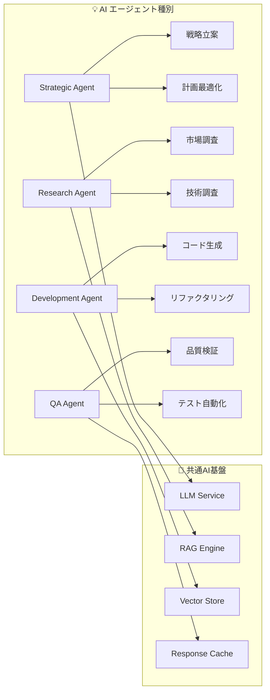

| AIエージェント          | 主要機能                               | 実行環境              | Databricks連携        |
| ----------------------- | -------------------------------------- | --------------------- | --------------------- |
| **💡 Strategic Agent**   | 戦略立案、WBS生成、リスク評価          | Databricks Serverless | MLflow Model Registry |
| **🔍 Research Agent**    | 市場調査、技術調査、競合分析           | Databricks Cluster    | Vector Search API     |
| **💻 Development Agent** | コード生成、リファクタリング、レビュー | VS Code + Databricks  | Unity Catalog         |
| **✅ QA Agent**          | 品質検証、テスト生成、脆弱性検査       | Databricks Jobs       | Delta Lake            |

### 2.3 人機協調インターフェース

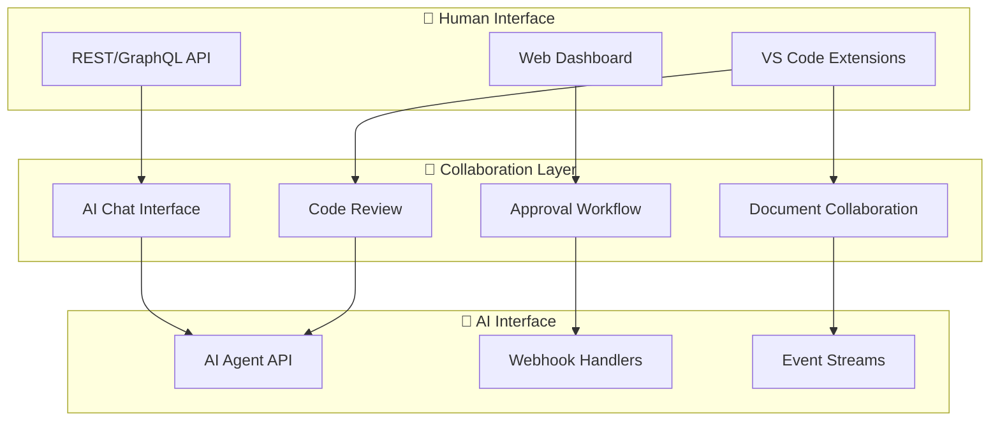

| インターフェース         | 機能                                     | 実装技術                            | 人機協調パターン           |
| ------------------------ | ---------------------------------------- | ----------------------------------- | -------------------------- |
| **💻 VS Code Extensions** | リアルタイム共同編集、AI提案、承認フロー | Language Server Protocol, WebSocket | AI提案→人間レビュー→承認   |
| **🌐 Web Dashboard**      | プロジェクト管理、監査ビュー、設定管理   | React/Vue.js, Real-time Updates     | 人間指示→AI実行→結果確認   |
| **🔌 API Interface**      | 外部ツール連携、自動化トリガー           | REST/GraphQL, OpenAPI               | システム間→AI処理→人間承認 |

---

## 🔄 3. データフローアーキテクチャ

### 3.1 統合データフロー

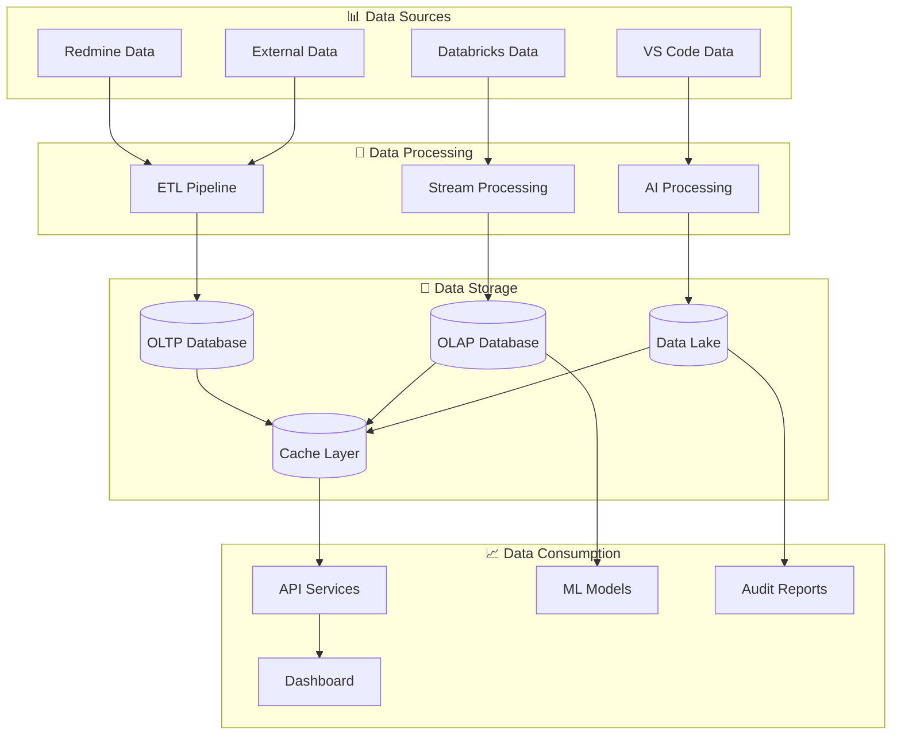

### 3.2 リアルタイムイベントフロー

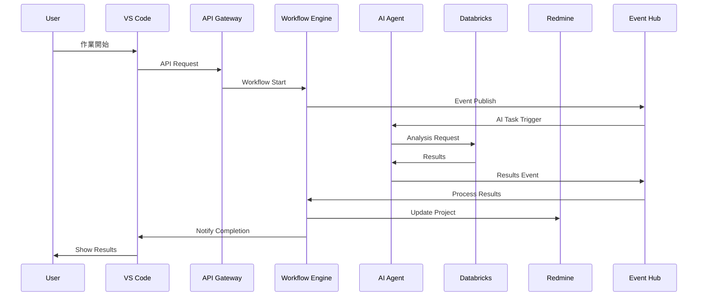

### 3.3 データ整合性戦略

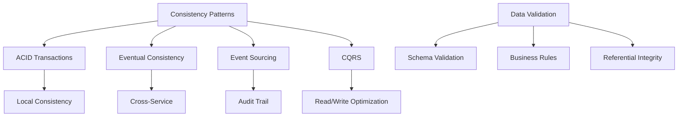

| 整合性レベル               | 適用範囲                     | 実装方式              | トレードオフ               |
| -------------------------- | ---------------------------- | --------------------- | -------------------------- |
| **🔒 Strong Consistency**   | プロジェクト管理、承認フロー | ACID Transaction      | 性能 vs 整合性             |
| **📈 Eventual Consistency** | ナレッジ同期、分析データ     | Event Sourcing + CQRS | 複雑性 vs スケーラビリティ |
| **⚡ Weak Consistency**     | ログ、メトリクス             | Best Effort Delivery  | 信頼性 vs 性能             |

---

## 🔒 4. セキュリティアーキテクチャ

### 4.1 多層防御アーキテクチャ

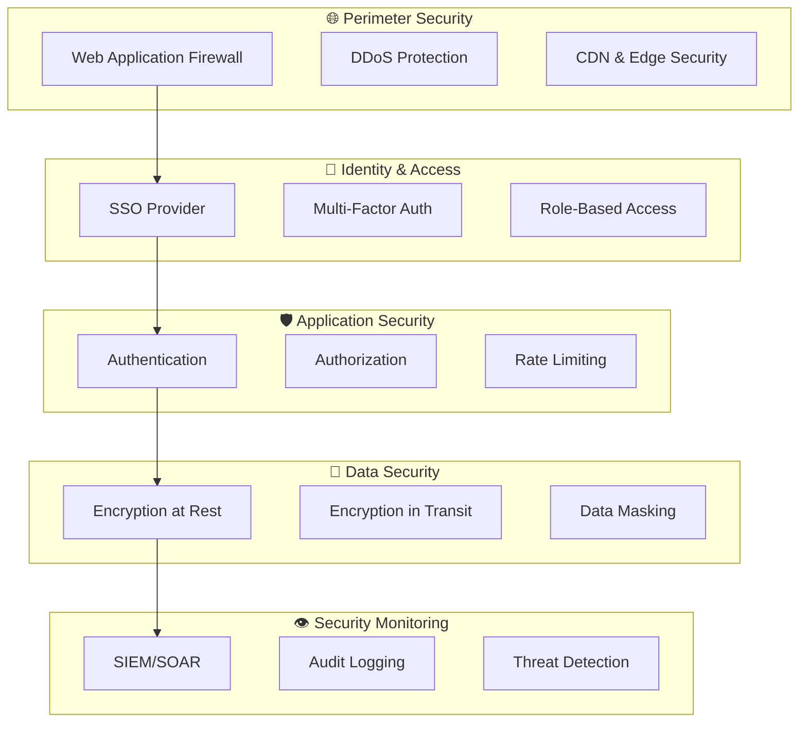

### 4.2 Zero Trustアーキテクチャ

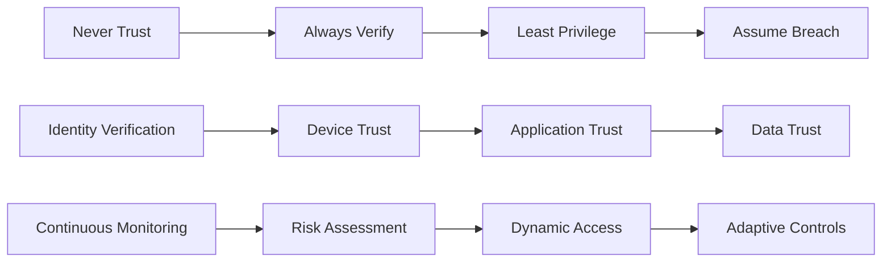

| Zero Trust要素              | 実装技術                 | 適用範囲                    | 検証方法                   |
| --------------------------- | ------------------------ | --------------------------- | -------------------------- |
| **🆔 Identity Verification** | OIDC, SAML, Biometrics   | 全ユーザー・AI エージェント | 多要素認証、証明書         |
| **📱 Device Trust**          | Device Certificates, MDM | 全アクセスデバイス          | デバイス認証、ポスチャ検証 |
| **🔐 Least Privilege**       | RBAC/ABAC, Just-in-Time  | 全リソースアクセス          | 権限監査、アクセスレビュー |
| **🔍 Continuous Monitoring** | UEBA, SIEM               | 全アクティビティ            | 異常検知、行動分析         |

---

## 📈 5. スケーラビリティアーキテクチャ

### 5.1 水平スケーリング戦略

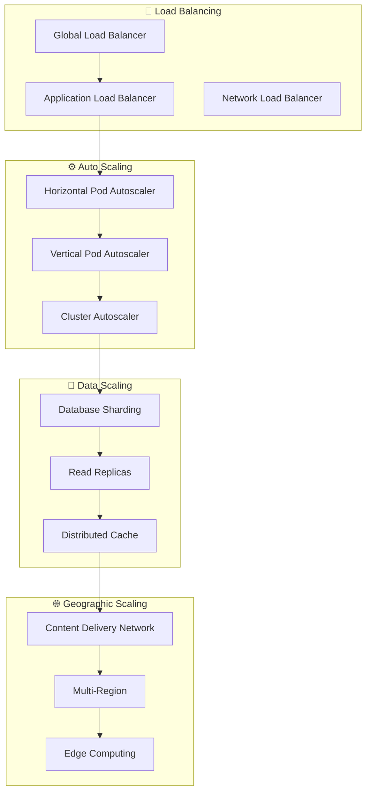

### 5.2 性能最適化アーキテクチャ

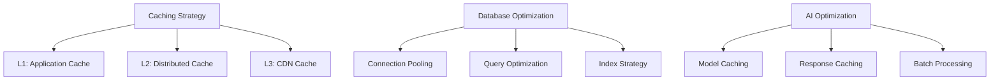

| 最適化領域              | 技術実装                          | 期待効果              | 監視指標                         |
| ----------------------- | --------------------------------- | --------------------- | -------------------------------- |
| **⚡ Application Layer** | Redis Cluster, Application Cache  | レスポンス時間50%改善 | Cache Hit Rate, Response Time    |
| **💾 Database Layer**    | Read Replicas, Connection Pooling | スループット3倍向上   | QPS, Connection Count            |
| **🤖 AI Layer**          | Model Cache, Response Cache       | 推論速度80%向上       | Inference Time, Cache Efficiency |
| **🌐 Network Layer**     | CDN, Edge Caching                 | 配信速度60%向上       | TTFB, Cache Hit Rate             |

---

## 🚨 6. 障害対応アーキテクチャ

### 6.1 可用性設計

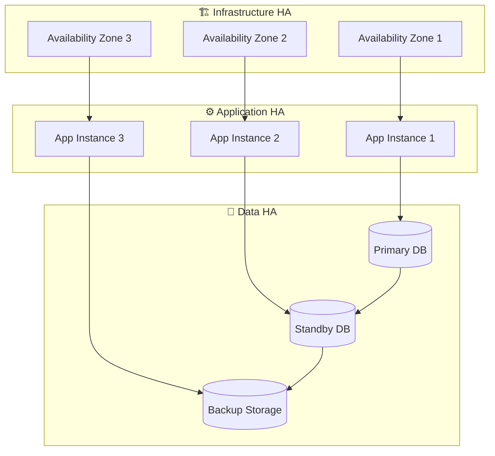

### 6.2 障害回復戦略

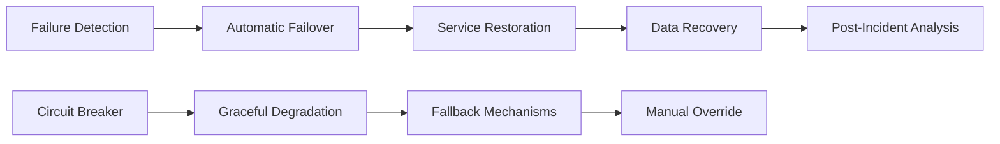

| 障害パターン                 | 検知方法              | 自動対応                | 手動対応            | RTO目標 |
| ---------------------------- | --------------------- | ----------------------- | ------------------- | ------- |
| **⚡ Service Failure**        | Health Check, Metrics | Auto Restart, Failover  | Service Recovery    | 5分     |
| **💾 Database Failure**       | Connection Monitoring | Failover to Standby     | Data Validation     | 15分    |
| **🌐 Network Partition**      | Connectivity Check    | Circuit Breaker         | Network Recovery    | 30分    |
| **☁️ Infrastructure Failure** | Cloud Monitoring      | Auto Scaling, Migration | Manual Intervention | 4時間   |

---

## 🔧 7. 運用アーキテクチャ

### 7.1 監視・可観測性

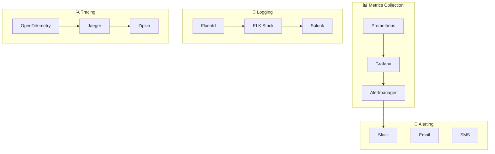

### 7.2 DevOps パイプライン

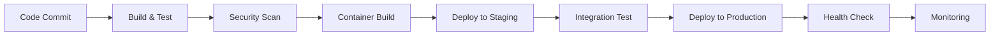

| パイプライン段階    | ツール・技術                 | 品質ゲート        | 自動化レベル |
| ------------------- | ---------------------------- | ----------------- | ------------ |
| **📝 Code Quality**  | SonarQube, ESLint            | Code Coverage 80% | 100%自動     |
| **🔒 Security Scan** | SAST, DAST, Dependency Check | 脆弱性 0件        | 100%自動     |
| **🧪 Testing**       | Unit, Integration, E2E Test  | 全テストパス      | 100%自動     |
| **🚀 Deployment**    | Blue-Green, Canary Release   | Health Check OK   | 90%自動      |

---

## 📋 8. 技術スタック詳細

### 8.1 フロントエンド技術

| レイヤー                | 技術選択             | 理由                               | 代替技術           |
| ----------------------- | -------------------- | ---------------------------------- | ------------------ |
| **🎨 UI Framework**      | React/Vue.js         | コンポーネント再利用、エコシステム | Angular, Svelte    |
| **📱 Mobile**            | React Native/Flutter | クロスプラットフォーム開発効率     | Native Development |
| **💻 VS Code Extension** | TypeScript, LSP      | 型安全性、VS Code標準              | JavaScript         |
| **🎨 Styling**           | Tailwind CSS         | ユーティリティファースト、高速開発 | Styled Components  |

### 8.2 バックエンド技術

| レイヤー            | 技術選択                  | 理由                     | 代替技術                        |
| ------------------- | ------------------------- | ------------------------ | ------------------------------- |
| **⚙️ API Framework** | Node.js (Express/Fastify) | JavaScript統一、高性能   | Python (FastAPI), Java (Spring) |
| **🔍 GraphQL**       | Apollo Server             | 柔軟なクエリ、型安全性   | Relay, GraphQL Yoga             |
| **📝 Documentation** | OpenAPI/Swagger           | API仕様の標準化          | Postman, Insomnia               |
| **✅ Testing**       | Jest, Supertest           | 包括的テスト、モッキング | Mocha, Chai                     |

### 8.3 データ・ストレージ技術

| レイヤー               | 技術選択      | 理由                     | 代替技術             |
| ---------------------- | ------------- | ------------------------ | -------------------- |
| **💾 Primary Database** | PostgreSQL    | 信頼性、ACID、JSON対応   | MySQL, SQL Server    |
| **⚡ Cache**            | Redis Cluster | 高性能、データ構造豊富   | Memcached, Hazelcast |
| **🗄️ Object Storage**   | AWS S3/MinIO  | スケーラビリティ、耐久性 | Azure Blob, GCS      |
| **📊 Analytics**        | ClickHouse    | 高速分析クエリ           | Apache Druid         |

### 8.4 インフラ・運用技術

| レイヤー             | 技術選択             | 理由                           | 代替技術               |
| -------------------- | -------------------- | ------------------------------ | ---------------------- |
| **🐳 Container**      | Docker + Kubernetes  | 標準化、ポータビリティ         | Podman, Docker Swarm   |
| **🏗️ Infrastructure** | Terraform            | IaC、マルチクラウド対応        | Pulumi, CloudFormation |
| **🔄 CI/CD**          | GitHub Actions       | GitHub統合、豊富なエコシステム | GitLab CI, Jenkins     |
| **📊 Monitoring**     | Prometheus + Grafana | CNCF標準、可視化               | DataDog, New Relic     |

---

## 🎯 9. 非機能要件実現戦略

### 9.1 性能要件実現

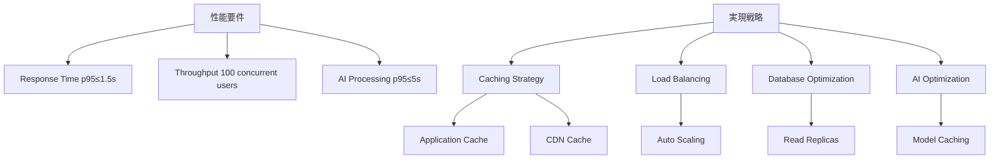

| 性能指標                   | 目標値            | 実現手法               | 測定方法      |
| -------------------------- | ----------------- | ---------------------- | ------------- |
| **⚡ API Response Time**    | p95 ≤ 1.5s        | Cache, DB Optimization | APM監視       |
| **🔍 Search Response Time** | p95 ≤ 3s          | Vector Index, Cache    | Query Metrics |
| **🤖 AI Processing Time**   | p95 ≤ 5s          | Model Cache, Batch     | AI Metrics    |
| **📊 Report Generation**    | ≤ 5min/10k events | Parallel Processing    | Job Metrics   |

### 9.2 可用性要件実現

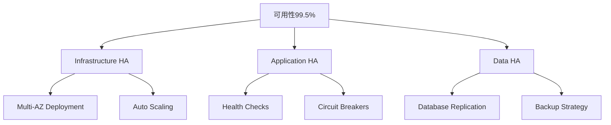

| 可用性要素           | 実装戦略                     | 目標値 | 測定指標                |
| -------------------- | ---------------------------- | ------ | ----------------------- |
| **🏗️ Infrastructure** | Multi-AZ, Auto Scaling       | 99.9%  | Infrastructure Uptime   |
| **⚙️ Application**    | Health Check, Load Balancing | 99.7%  | Service Availability    |
| **💾 Database**       | Primary-Standby, Backup      | 99.8%  | Database Uptime         |
| **🤖 AI Services**    | Graceful Degradation         | 99.0%  | AI Service Availability |

---

## 📚 関連文書

### 📖 上位文書
- [企画書](../../010000_企画/011000_企画書.md)
- [要件定義書](../../020000_要件定義/021000_要件定義書.md)
- [設計方針](../031000_設計方針/031010_設計方針.md)

### 📋 関連設計文書
- [ランタイム構成](../033000_アーキテクチャ/033020_ランタイム構成.md)
- [インフラ設計](../033000_アーキテクチャ/033030_インフラ設計.md)
- [ドメインモデル](../034000_アプリケーション設計/034010_ドメインモデル.md)
- [API設計](../036000_API設計/036010_API一覧.md)

### 🔧 実装関連文書
- [非機能設計](../038000_非機能設計/038010_非機能設計.md)
- [セキュリティ・運用設計](../039000_セキュリティ・運用設計/039010_セキュリティ・運用設計.md)

---

## 📅 更新履歴

| 日時       | 担当               | 変更概要                                   |
| ---------- | ------------------ | ------------------------------------------ |
| 2025-09-07 | システム開発チーム | 初版作成、統合基盤アーキテクチャの詳細設計 |

