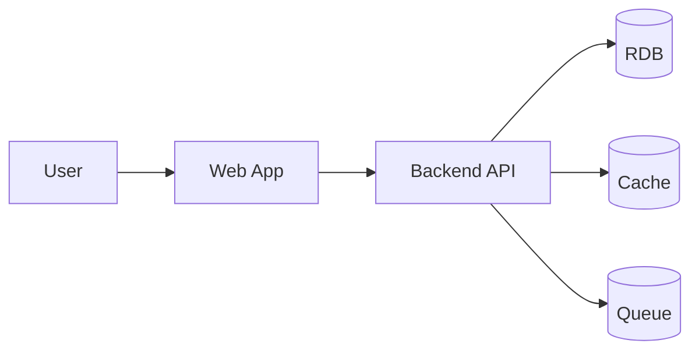

# 033010 全体構成

## コンテキスト/コンポーネント（例）

```mermaid
flowchart LR
  User[User] --> Web[Web App]
  Web --> API[Backend API]
  API --> DB[(RDB)]
  API --> Cache[(Cache)]
  API --> MQ[(Queue)]
```

## 責務と境界
- Web: UI/UX, 入力検証（軽）
- API: ドメインロジック、認可、監査ログ
- DB: 永続化、整合性制約

## 非機能上のキーポイント
- 可用性・スケーラビリティ戦略、障害分離、バックプレッシャ

