# ドメインモデル

## 📋 文書情報

| 項目       | 内容                                                         |
| ---------- | ------------------------------------------------------------ |
| **文書名** | ソロプレナー／AIネイティブ企業基盤システム（ドメインモデル） |
| **版数**   | 1.0                                                          |
| **作成日** | 2025-09-07                                                   |
| **更新日** | 2025-09-07                                                   |
| **作成者** | システム開発チーム                                           |

---

## 🎯 1. ドメインモデル概要

本システムは、人間とAIエージェントが協調して業務を遂行する統合基盤であり、以下の主要ドメインから構成されます：

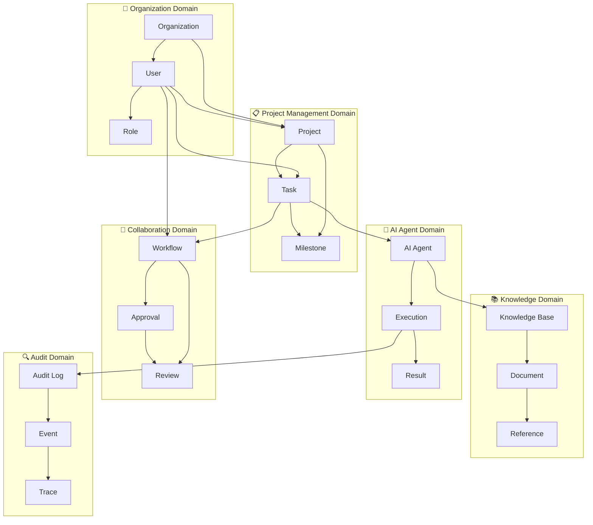

---

## 🏗️ 2. 境界づけられたコンテキスト

### 2.1 コンテキストマップ

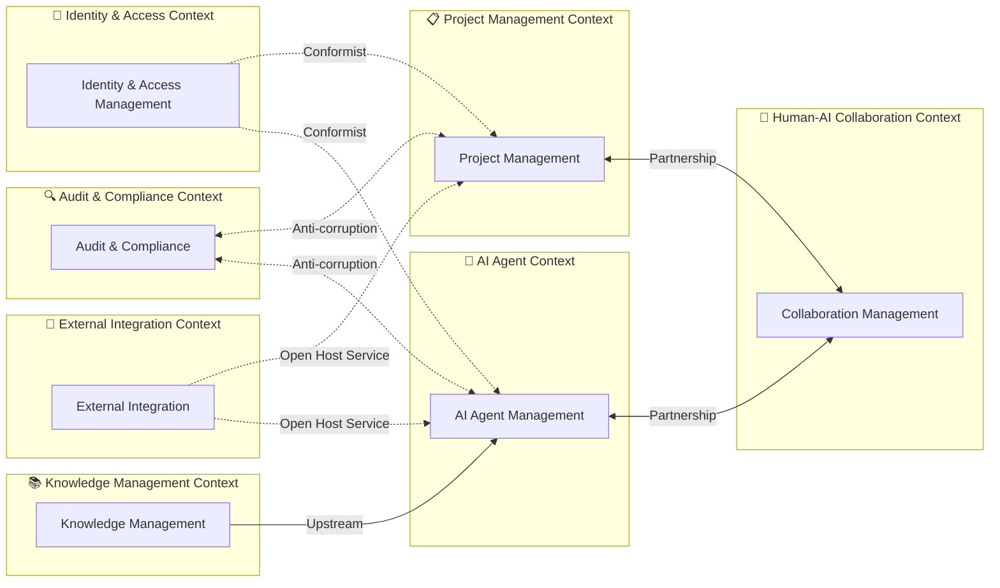

| コンテキスト             | 責務                     | 主要エンティティ              | 統合パターン      |
| ------------------------ | ------------------------ | ----------------------------- | ----------------- |
| **🔐 Identity & Access**  | 認証・認可・ユーザー管理 | User, Role, Permission        | Shared Kernel     |
| **📋 Project Management** | プロジェクト・タスク管理 | Project, Task, Milestone      | Customer-Supplier |
| **🤖 AI Agent**           | AIエージェント実行・管理 | Agent, Execution, Model       | Partnership       |
| **🤝 Collaboration**      | 人機協調・承認フロー     | Workflow, Approval, Review    | Partnership       |
| **📚 Knowledge**          | ナレッジ管理・検索       | Knowledge, Document, Citation | Upstream          |
| **🔍 Audit**              | 監査・コンプライアンス   | AuditLog, Event, Trace        | Anti-corruption   |
| **🔗 Integration**        | 外部システム連携         | Integration, Endpoint, Sync   | Open Host Service |

---

## 3. Identity & Access Management Context

### 3.1 概念モデル

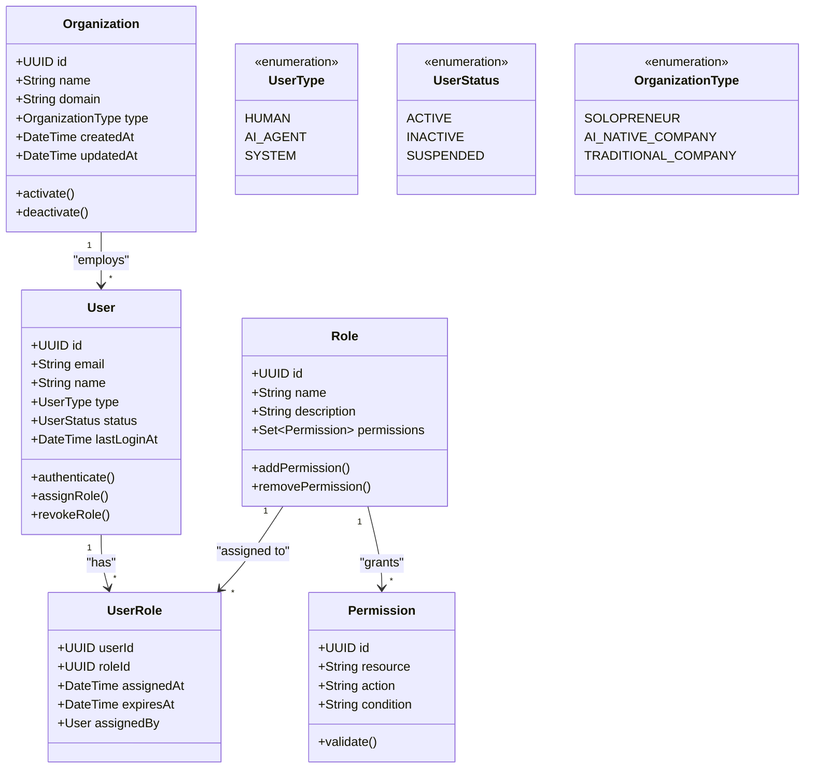

### 3.2 重要な不変条件

| エンティティ   | 不変条件                                                  | ビジネスルール                                             |
| -------------- | --------------------------------------------------------- | ---------------------------------------------------------- |
| **User**       | • 同一組織内でemail一意 • AI_AGENTは人間による作成必須 | • 管理者権限は人間のみ • AIエージェントは特定権限のみ   |
| **Role**       | • 組織内でname一意 • 最小権限原則                      | • 管理者ロールは削除不可 • AIエージェント専用ロール存在 |
| **Permission** | • resource+action+conditionで一意                         | • 重要操作は承認必須 • 監査ログアクセスは制限           |

---

## 📋 4. Project Management Context

### 4.1 概念モデル

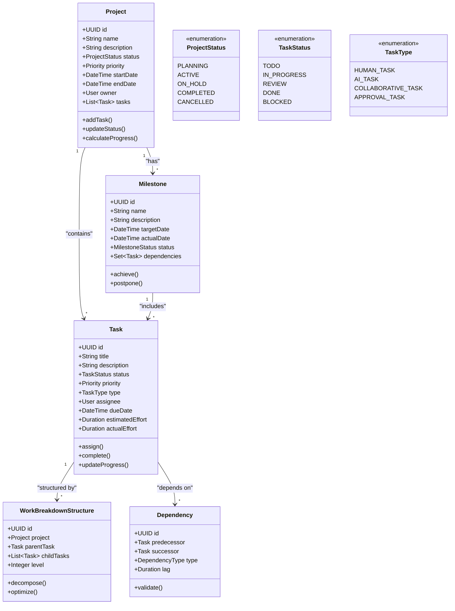

### 4.2 ドメインサービス

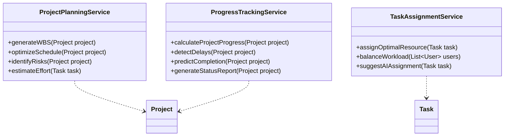

---

## 🤖 5. AI Agent Management Context

### 5.1 概念モデル

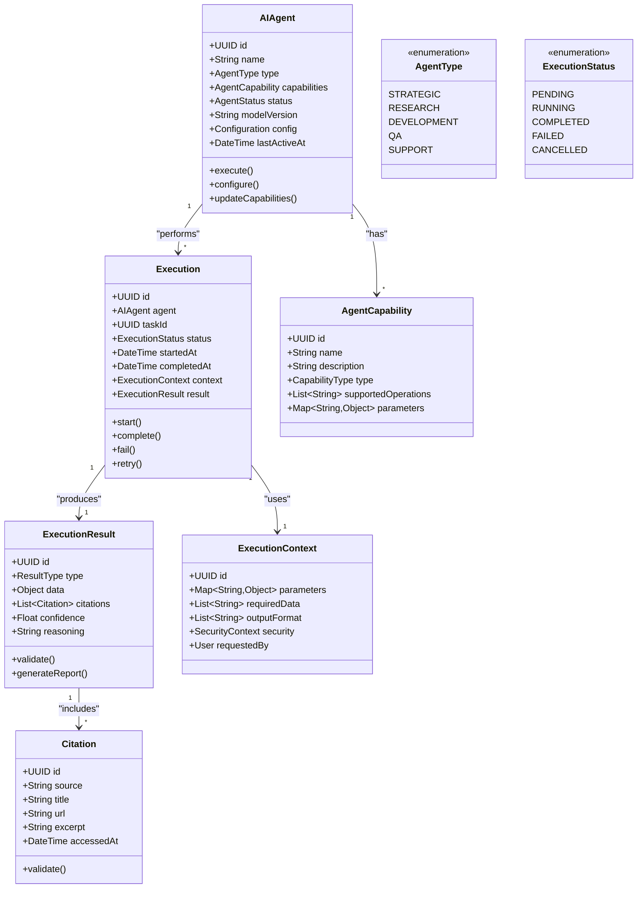

### 5.2 AIエージェント専用ドメインサービス

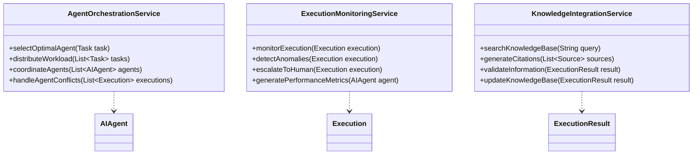

---

## 🤝 6. Human-AI Collaboration Context

### 6.1 概念モデル

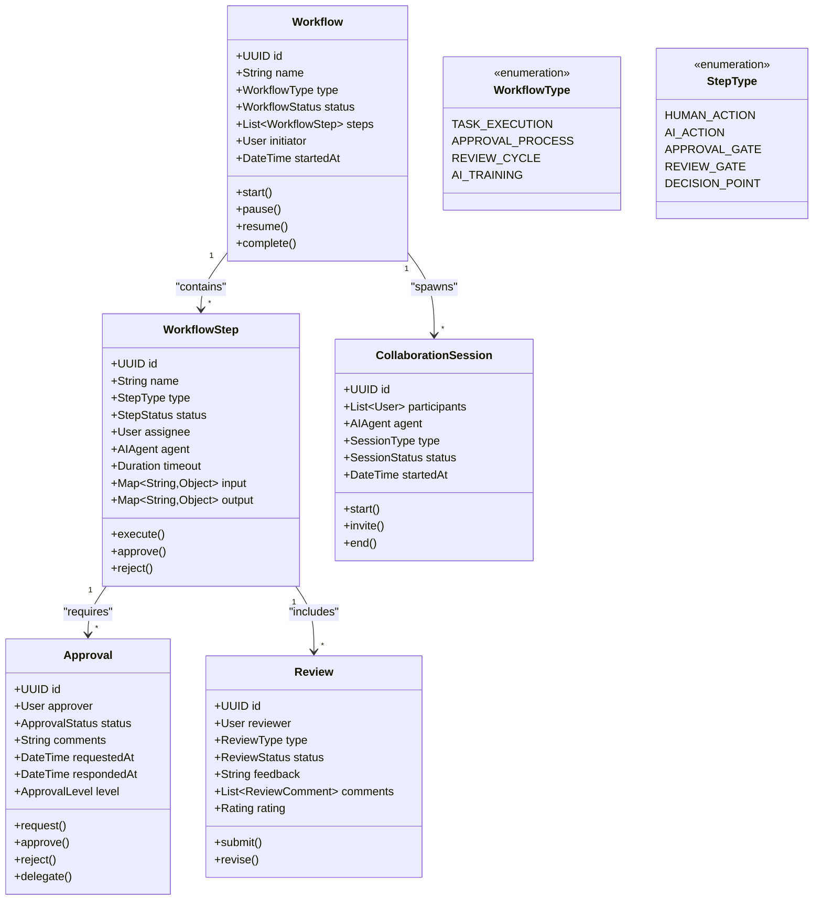

---

## 📚 7. Knowledge Management Context

### 7.1 概念モデル

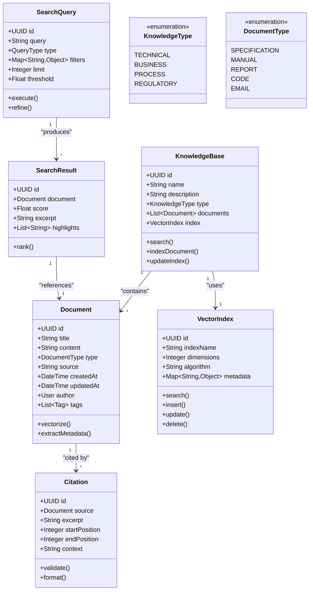

---

## 🔍 8. Audit & Compliance Context

### 8.1 概念モデル

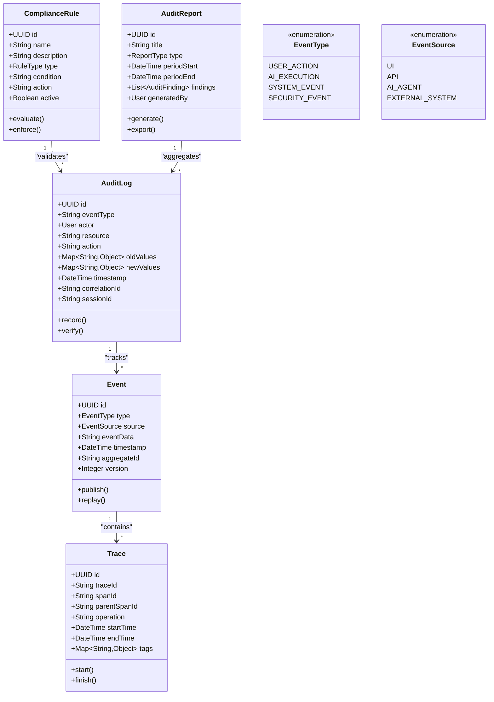

---

## 🔗 9. External Integration Context

### 9.1 概念モデル

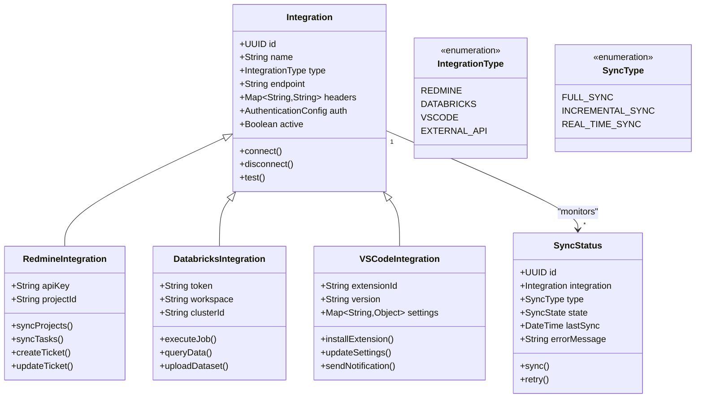

---

## 📊 10. 集約とリポジトリパターン

### 10.1 主要集約

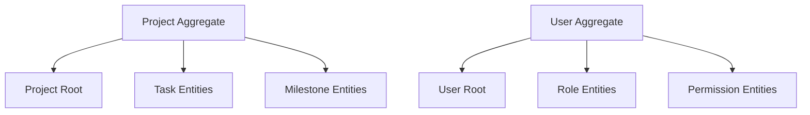

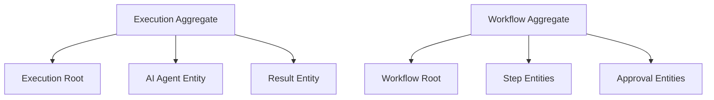

| 集約          | 集約ルート | 境界内エンティティ                 | 不変条件                                                                            |
| ------------- | ---------- | ---------------------------------- | ----------------------------------------------------------------------------------- |
| **Project**   | Project    | Task, Milestone, WBS               | • タスクは1つのプロジェクトに属する • マイルストーンは依存タスク完了後に達成可能 |
| **User**      | User       | UserRole, Permission               | • ユーザーは有効なロールのみ保持 • 権限は有効期限内のみ有効                      |
| **Execution** | Execution  | AIAgent, ExecutionResult, Citation | • 実行は1つのエージェントが担当 • 結果は実行完了後のみ生成                       |
| **Workflow**  | Workflow   | WorkflowStep, Approval, Review     | • ステップは順序に従って実行 • 承認は必要レベルを満たす必要                      |

### 10.2 リポジトリインターフェース

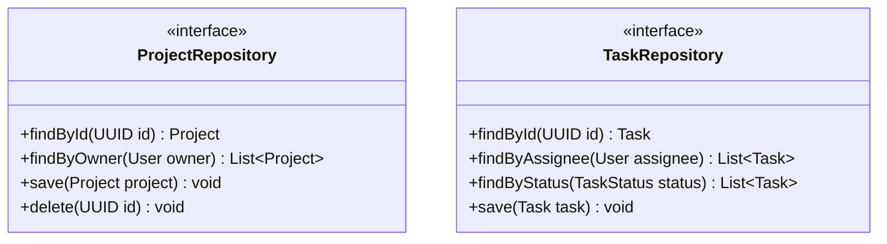

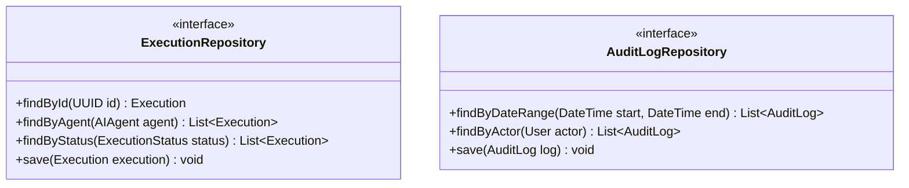

---

## 🏗️ 11. ドメインサービス

### 11.1 横断的ドメインサービス

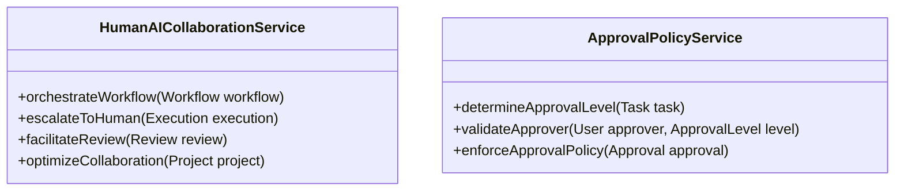

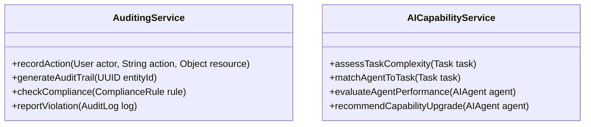

### 11.2 ドメインイベント

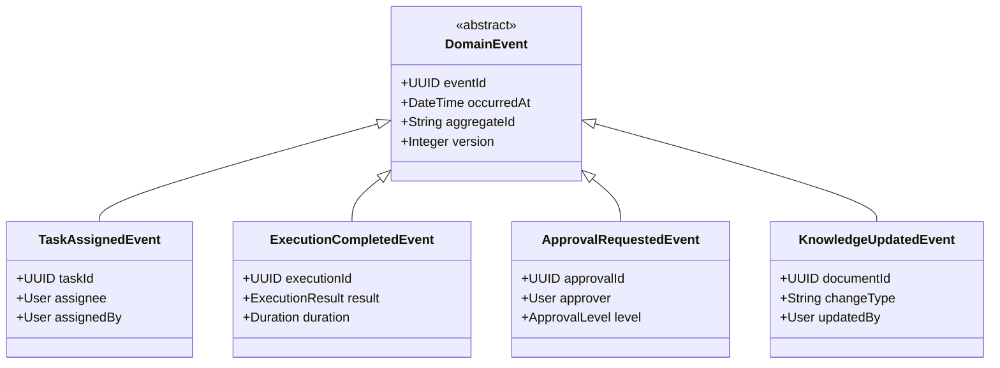

---

## 📚 12. 用語集

| 用語                         | 定義                                                       | 出典                   |
| ---------------------------- | ---------------------------------------------------------- | ---------------------- |
| **AIエージェント**           | 特定の業務領域で自律的にタスクを実行するAIシステム         | 企画書§2, 要件定義書§4 |
| **HITL (Human-in-the-Loop)** | 重要な判断において人間の承認を必須とする仕組み             | 要件定義書§6           |
| **人機協調**                 | 人間とAIが役割分担しながら協力して業務を遂行すること       | 企画書§1               |
| **統合基盤**                 | Redmine、Databricks、VS Codeを連携させる統合システム       | 企画書§2               |
| **ワークフロー**             | 業務プロセスを定義し、人間とAIの協調を制御する仕組み       | 要件定義書§5           |
| **実行コンテキスト**         | AIエージェントがタスクを実行する際の環境情報や制約         | 設計独自定義           |
| **引用（Citation）**         | AIが生成した結果の根拠となる情報源への参照                 | 要件定義書FR-010       |
| **監査ログ**                 | システム内の全ての操作を記録し、後から検証可能にしたデータ | 要件定義書FR-008       |
| **承認レベル**               | 操作の重要度に応じて設定される承認権限のレベル             | 設計独自定義           |
| **集約**                     | 整合性境界を持つエンティティの集まり                       | DDD設計原則            |

---

## 📋 13. 設計制約と決定

### 13.1 アーキテクチャ制約

| 制約項目             | 制約内容                            | 影響                 | 対応策                               |
| -------------------- | ----------------------------------- | -------------------- | ------------------------------------ |
| **外部システム依存** | Redmine/Databricks/VS CodeのAPI制限 | 機能実装の制約       | Adapter パターンで抽象化             |
| **認証基盤**         | 既存SSO基盤との統合必須             | 認証設計の制約       | 標準プロトコル（OIDC）採用           |
| **データ整合性**     | 複数システム間のデータ同期          | 整合性保証の複雑性   | Eventually Consistent + Saga Pattern |
| **AI実行時間**       | AIモデルの応答時間制限              | ユーザー体験への影響 | 非同期処理 + プログレス表示          |

### 13.2 ドメイン設計決定

| 決定事項                   | 理由                         | 代替案           | トレードオフ               |
| -------------------------- | ---------------------------- | ---------------- | -------------------------- |
| **マイクロサービス境界**   | 技術境界とドメイン境界の整合 | モノリシック設計 | 複雑性 vs 拡張性           |
| **イベントソーシング採用** | 完全な監査証跡確保           | CRUD + 監査ログ  | ストレージコスト vs 透明性 |
| **強い型付け**             | コンパイル時エラー検出       | 動的型付け       | 開発速度 vs 品質           |
| **集約サイズ制限**         | 性能とトランザクション境界   | 大きな集約       | 性能 vs 整合性             |

---

## 📚 関連文書

### 📖 上位文書
- [企画書](../../010000_企画/011000_企画書.md)
- [要件定義書](../../020000_要件定義/021000_要件定義書.md)
- [設計方針](../031000_設計方針/031010_設計方針.md)

### 📋 関連設計文書
- [全体構成](../033000_アーキテクチャ/033010_全体構成.md)
- [ユースケース設計](034020_ユースケース設計.md)
- [データ設計](../035000_データ設計/035010_ER図.mmd)
- [API設計](../036000_API設計/036010_API一覧.md)

---

## 📅 更新履歴

| 日時       | 担当               | 変更概要                                   |
| ---------- | ------------------ | ------------------------------------------ |
| 2025-09-07 | システム開発チーム | 初版作成、人機協調基盤のドメインモデル設計 |

