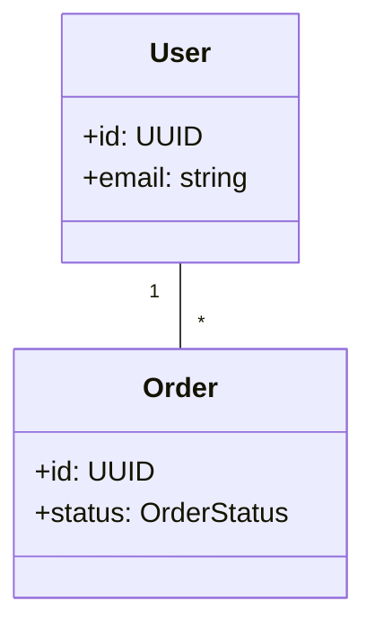

# 034010 ドメインモデル

## 境界づけられたコンテキスト
- 例: 認証、課金、在庫、注文

## 概念モデル（例）

```mermaid
classDiagram
  class User {
    +id: UUID
    +email: string
  }
  class Order {
    +id: UUID
    +status: OrderStatus
  }
  User "1" -- "*" Order
```

## 用語集
- 用語: 定義（出典: 要件定義書）

