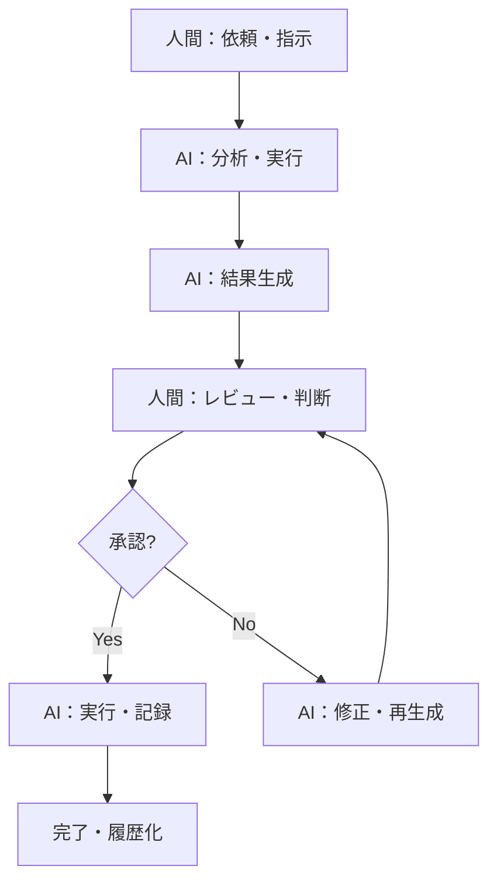

# 034020 ユースケース設計

## 概要

本文書では、ソロプレナー／AIネイティブ企業基盤システムの主要ユースケースを設計し、システム要件との対応関係を明確化します。各ユースケースは人機協調モデルに基づき、人間（戦略・承認・倫理判断）とAIエージェント（実務・分析・提案）の役割分担を定義します。

## ユースケース一覧

| UC-ID | ユースケース名       | 主要アクター                   | 前提                                   | 正常系概要                                                  | 代替/例外                        | 対応サービス              |
| ----- | -------------------- | ------------------------------ | -------------------------------------- | ----------------------------------------------------------- | -------------------------------- | ------------------------- |
| UC-01 | 戦略実行管理         | 経営者、AIエージェント         | Redmine/Databricks/VS Code統合済み     | ビジョン登録→AI分析→計画生成→人機協調レビュー→承認→実行     | 分析失敗/承認拒否/実行エラー     | StrategicExecutionService |
| UC-02 | 市場調査・分析       | 作業者、AIエージェント         | 既存資産・データベース構築済み         | 調査依頼→AI分析→レポート生成→人機協調レビュー→承認→配布     | 分析データ不足/レポート品質不良  | MarketResearchService     |
| UC-03 | 課題解決サポート     | 作業者、AIエージェント         | バグ追跡・知識ベース構築済み           | 課題報告→AI分析→修正案生成→人機協調レビュー→承認→実装       | 原因特定失敗/修正案不良/実装失敗 | IssueResolutionService    |
| UC-04 | 監査・ガバナンス     | システム管理者、AIエージェント | AI行動ログ収集機能稼働中               | 定期監査→ログ分析→レポート生成→監査結果確認→教育資産化      | 異常検出/ログ欠損/分析エラー     | AuditGovernanceService    |
| UC-05 | ナレッジ検索・活用   | 作業者、Copilot Agent          | VS Code環境・知識ベース構築済み        | コード作成→検索要求→AI検索→結果引用→成果物作成→品質チェック | 検索結果不良/引用エラー/品質不良 | KnowledgeSearchService    |
| UC-06 | 品質管理・レビュー   | 作業者、AIエージェント         | 品質基準・チェックツール整備済み       | 成果物作成→AI品質チェック→結果報告→レビュー→承認→PR作成     | 品質チェック失敗/レビュー拒否    | QualityManagementService  |
| UC-07 | プロジェクト進捗管理 | 経営者、AIエージェント         | タスク管理・履歴データ蓄積済み         | 定期分析→進捗確認→リスク検出→対策提案→承認→実行             | リスク検出失敗/対策不良/実行失敗 | ProjectManagementService  |
| UC-08 | 教育・学習支援       | 作業者、AIエージェント         | 学習リソース・履歴データ構築済み       | 学習依頼→AI調査→計画生成→人機協調レビュー→承認→実施支援     | 調査不足/計画不良/学習効果低下   | LearningService           |
| UC-09 | 外部連携・統合       | 作業者、AIエージェント         | API仕様・連携履歴データ構築済み        | 連携要求→仕様調査→計画生成→人機協調レビュー→承認→実装       | 仕様調査失敗/計画不良/連携失敗   | IntegrationService        |
| UC-10 | セキュリティ監査     | システム管理者、AIエージェント | 脆弱性データベース・監査ツール整備済み | 監査依頼→脆弱性スキャン→リスク評価→対策提案→承認→実施       | スキャン失敗/評価不良/対策失敗   | SecurityAuditService      |

## 共通パターン

### 人機協調フロー
すべてのユースケースは以下の共通フローに従います：

### システム構成要素
- **Redmine**: 中枢管理（タスク・承認フロー・履歴管理）
- **Databricks**: AIエージェント実行環境（分析・データ処理・機械学習）
- **VS Code + GitHub Copilot**: 人機協調ワークスペース（共同編集・レビュー・コード支援）

### 権限・承認レベル
| レベル           | 対象操作                               | 必要権限        | 承認者             |
| ---------------- | -------------------------------------- | --------------- | ------------------ |
| **自動実行**     | データ分析・レポート生成・品質チェック | Agent権限       | なし               |
| **軽微変更**     | ドキュメント更新・コード修正提案       | Contributor権限 | 作業者承認         |
| **重要変更**     | 戦略変更・外部連携・セキュリティ対策   | Approver権限    | 経営者承認         |
| **システム変更** | 権限変更・監査設定・インフラ変更       | Admin権限       | システム管理者承認 |

## 詳細設計参照

各ユースケースの詳細フローは、対応する各サービス配下の以下のドキュメントを参照してください：
- `services/{ServiceName}/034210_概要.md`: サービスの役割・責務
- `services/{ServiceName}/034220_詳細設計.md`: 処理フロー・エラーハンドリング
- `services/{ServiceName}/034230_シーケンス図.mmd`: 詳細シーケンス図
- `services/{ServiceName}/034240_API仕様.md`: API概要
- `services/{ServiceName}/034250_テスト観点.md`: テスト観点

