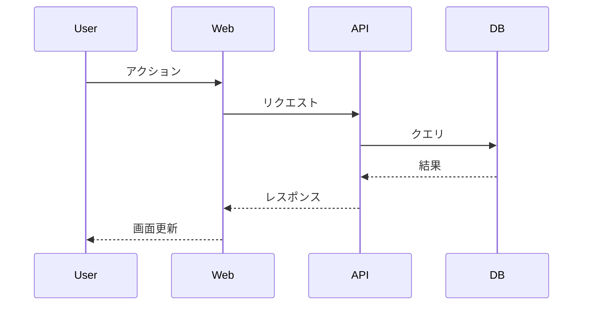

```mermaid
%% Mermaid 記法
sequenceDiagram
  participant U as User
  participant W as Web
  participant A as API
  participant D as DB
  U->>W: アクション
  W->>A: リクエスト
  A->>D: クエリ
  D-->>A: 結果
  A-->>W: レスポンス
  W-->>U: 画面更新
```

