# 035010 ER図

## 概要

ソロプレナー／AIネイティブ企業基盤システムの主要エンティティとその関係を定義します。人機協調モデルに基づき、人間とAIエージェントの行動・承認・履歴管理を包括的にサポートするデータ構造を設計しています。

## 主要エンティティ群

## 主要エンティティ群

### 1. 組織・ユーザ管理（Organization Domain）
- **Organizations**: 組織・テナント管理
- **Users**: システム利用者（人間・AIエージェント）
- **Roles**: 権限ロール（Admin/Approver/Contributor/Agent）
- **Permissions**: 具体的権限定義

### 2. プロジェクト・タスク管理（Project Management Domain）
- **Projects**: プロジェクト（戦略実行・調査・開発等）
- **Tasks**: 具体的タスク・作業項目
- **Milestones**: マイルストーン・重要な節目
- **TaskDependencies**: タスク間依存関係

### 3. 戦略・計画管理（Strategic Management Domain）
- **StrategicPlans**: 戦略計画・ビジョン
- **Objectives**: 具体的目標・KPI
- **RiskAssessments**: リスク評価・対策

### 4. AI・実行管理（AI Agent Domain）
- **AIAgents**: AIエージェント定義・設定
- **Executions**: AI実行履歴・ジョブ管理
- **ExecutionResults**: 実行結果・成果物

### 5. 人機協調・ワークフロー（Collaboration Domain）
- **Workflows**: ワークフロー定義・承認フロー
- **WorkflowSteps**: ワークフローステップ詳細
- **ApprovalFlows**: HITL承認管理
- **Reviews**: レビュー・フィードバック

### 6. ナレッジ・学習管理（Knowledge Domain）
- **KnowledgeAssets**: 知識資産・ドキュメント
- **LearningPlans**: 学習計画・カリキュラム
- **QualityChecks**: 品質チェック結果

### 7. 監査・ガバナンス（Audit Domain）
- **AuditLogs**: 包括的監査ログ
- **ComplianceChecks**: コンプライアンス確認
- **SecurityEvents**: セキュリティイベント

### 8. 外部統合（Integration Domain）
- **IntegrationConfigs**: 外部システム連携設定
- **IntegrationLogs**: 連携ログ・同期履歴

## ER図

```mermaid
erDiagram
    %% 組織・ユーザ管理（Organization Domain）
    Organizations ||--o{ Users : belongs_to
    Users ||--o{ UserRoles : has
    Roles ||--o{ UserRoles : assigned
    Roles ||--o{ RolePermissions : has
    Permissions ||--o{ RolePermissions : granted
    
    Organizations {
        UUID organization_id PK
        string organization_name UK
        string domain UK
        string organization_type "enum: enterprise, individual, team"
        boolean is_active
        datetime created_at
        datetime updated_at
    }
    
    Users {
        UUID user_id PK
        UUID organization_id FK
        string username UK
        string email UK
        string user_type "enum: human, ai_agent"
        string status "enum: active, inactive, suspended"
        json user_config
        datetime last_login_at
        datetime created_at
        datetime updated_at
    }
    
    Roles {
        UUID role_id PK
        string role_name UK "Admin/Approver/Contributor/Agent"
        string description
        boolean is_active
        datetime created_at
    }
    
    Permissions {
        UUID permission_id PK
        string permission_name UK
        string resource_type
        string action_type
        string description
    }
    
    UserRoles {
        UUID user_role_id PK
        UUID user_id FK
        UUID role_id FK
        datetime assigned_at
        datetime expires_at
    }
    
    RolePermissions {
        UUID role_permission_id PK
        UUID role_id FK
        UUID permission_id FK
        datetime created_at
    }
    
    %% プロジェクト・タスク管理（Project Management Domain）
    Organizations ||--o{ Projects : owns
    Users ||--o{ Projects : manages
    Projects ||--o{ Tasks : contains
    Projects ||--o{ Milestones : has
    Tasks ||--o{ TaskDependencies : depends_on
    Tasks ||--o{ TaskAssignments : assigned_to
    Users ||--o{ TaskAssignments : assigned
    Milestones ||--o{ Tasks : includes
    
    Projects {
        UUID project_id PK
        UUID organization_id FK
        string project_name
        string project_type "strategic/research/development/integration"
        text description
        string status "planning/active/completed/cancelled"
        UUID owner_id FK
        datetime start_date
        datetime end_date
        datetime created_at
        datetime updated_at
    }
    
    Tasks {
        UUID task_id PK
        UUID project_id FK
        string task_name
        text description
        string task_type "manual/ai_automated/hybrid"
        string status "pending/in_progress/completed/failed"
        string priority "low/medium/high/critical"
        json task_config
        datetime due_date
        datetime created_at
        datetime updated_at
    }
    
    Milestones {
        UUID milestone_id PK
        UUID project_id FK
        string milestone_name
        text description
        string status "not_started/in_progress/achieved/failed"
        datetime target_date
        datetime achieved_at
        datetime created_at
        datetime updated_at
    }
    
    TaskDependencies {
        UUID dependency_id PK
        UUID task_id FK "dependent task"
        UUID depends_on_task_id FK "prerequisite task"
        string dependency_type "finish_to_start/start_to_start"
        datetime created_at
    }
    
    TaskAssignments {
        UUID assignment_id PK
        UUID task_id FK
        UUID assignee_id FK
        string assignment_type "primary/reviewer/approver"
        datetime assigned_at
        datetime completed_at
    }
    
    %% 戦略・計画管理（Strategic Management Domain）
    Users ||--o{ StrategicPlans : creates
    StrategicPlans ||--o{ Objectives : contains
    StrategicPlans ||--o{ RiskAssessments : has
    Projects ||--o{ StrategicPlans : implements
    
    StrategicPlans {
        UUID plan_id PK
        string plan_name
        text vision_statement
        text strategic_objectives
        string status "draft/approved/active/completed"
        UUID created_by FK
        UUID approved_by FK
        datetime approval_date
        datetime start_date
        datetime end_date
        datetime created_at
        datetime updated_at
    }
    
    Objectives {
        UUID objective_id PK
        UUID plan_id FK
        string objective_name
        text description
        string success_criteria
        float target_value
        string measurement_unit
        string status "not_started/in_progress/achieved/failed"
        datetime target_date
        datetime created_at
        datetime updated_at
    }
    
    RiskAssessments {
        UUID risk_id PK
        UUID plan_id FK
        string risk_name
        text description
        string risk_category "technical/business/operational/external"
        int probability_score "1-5"
        int impact_score "1-5"
        int risk_level "calculated: probability * impact"
        text mitigation_strategy
        string status "identified/mitigated/monitoring/closed"
        datetime created_at
        datetime updated_at
    }
    
    %% AI・実行管理（AI Agent Domain）
    Users ||--o{ AIAgents : configures
    AIAgents ||--o{ Executions : performs
    Executions ||--o{ ExecutionResults : produces
    Tasks ||--o{ Executions : triggers
    
    AIAgents {
        UUID agent_id PK
        UUID owner_id FK
        string agent_name
        string agent_type "strategic/research/development/quality/audit"
        json agent_config
        string status "active/inactive/maintenance"
        datetime last_execution_at
        datetime created_at
        datetime updated_at
    }
    
    Executions {
        UUID execution_id PK
        UUID agent_id FK
        UUID task_id FK
        string execution_type "analysis/generation/monitoring/integration"
        json input_parameters
        string status "pending/running/completed/failed"
        datetime started_at
        datetime completed_at
        datetime created_at
    }
    
    ExecutionResults {
        UUID result_id PK
        UUID execution_id FK
        string result_type "report/code/analysis/recommendation"
        json result_data
        text result_summary
        string quality_score
        boolean requires_review
        datetime created_at
    }
    
    %% 人機協調・ワークフロー（Collaboration Domain）
    Projects ||--o{ Workflows : uses
    Workflows ||--o{ WorkflowSteps : contains
    Executions ||--o{ ApprovalFlows : triggers
    Users ||--o{ ApprovalFlows : approves
    ExecutionResults ||--o{ Reviews : receives
    Users ||--o{ Reviews : performs
    
    Workflows {
        UUID workflow_id PK
        UUID project_id FK
        string workflow_name
        text description
        string workflow_type "approval/review/quality_check"
        json workflow_config
        boolean is_active
        datetime created_at
        datetime updated_at
    }
    
    WorkflowSteps {
        UUID step_id PK
        UUID workflow_id FK
        string step_name
        int step_order
        string step_type "manual/automated/conditional"
        json step_config
        boolean is_required
        datetime created_at
    }
    
    ApprovalFlows {
        UUID approval_id PK
        UUID execution_id FK
        UUID workflow_id FK
        UUID requester_id FK
        UUID approver_id FK
        string approval_type "automatic/manual/escalated"
        string approval_status "pending/approved/rejected/timeout"
        text approval_reason
        text rejection_reason
        datetime requested_at
        datetime responded_at
        datetime expires_at
    }
    
    Reviews {
        UUID review_id PK
        UUID result_id FK
        UUID reviewer_id FK
        string review_type "quality/security/compliance/content"
        int rating "1-5"
        text feedback
        json review_details
        string status "pending/completed/revision_required"
        datetime reviewed_at
        datetime created_at
    }
    
    %% 監査・ガバナンス（Audit Domain）
    Executions ||--o{ AuditLogs : generates
    Users ||--o{ AuditLogs : creates
    AuditLogs ||--o{ ComplianceChecks : triggers
    Users ||--o{ SecurityEvents : generates
    
    AuditLogs {
        UUID audit_id PK
        UUID execution_id FK
        UUID user_id FK
        string event_type "create/read/update/delete/approve/execute"
        string resource_type "plan/task/knowledge/integration"
        UUID resource_id
        json before_state
        json after_state
        string ip_address
        string user_agent
        datetime timestamp
    }
    
    ComplianceChecks {
        UUID compliance_id PK
        UUID audit_id FK
        string compliance_type "data_protection/security/quality"
        string check_status "passed/failed/warning"
        json check_results
        text recommendations
        datetime checked_at
    }
    
    SecurityEvents {
        UUID event_id PK
        UUID user_id FK
        string event_type "login/logout/permission_change/suspicious_activity"
        string severity "low/medium/high/critical"
        text event_description
        json event_details
        string status "new/investigating/resolved"
        datetime detected_at
        datetime resolved_at
    }
    
    %% ナレッジ・学習管理（Knowledge Domain）
    Users ||--o{ KnowledgeAssets : creates
    KnowledgeAssets ||--o{ KnowledgeVersions : has
    Users ||--o{ LearningPlans : owns
    LearningPlans ||--o{ LearningProgress : tracks
    ExecutionResults ||--o{ QualityChecks : checked
    Users ||--o{ QualityChecks : performs
    KnowledgeAssets ||--o{ QualityChecks : evaluated
    
    KnowledgeAssets {
        UUID asset_id PK
        string asset_name
        string asset_type "document/code/analysis/report/template"
        text description
        text content
        string file_path
        json metadata
        string tags
        UUID created_by FK
        string access_level "public/internal/restricted"
        boolean is_active
        datetime created_at
        datetime updated_at
    }
    
    KnowledgeVersions {
        UUID version_id PK
        UUID asset_id FK
        int version_number
        text change_description
        text content
        UUID modified_by FK
        datetime created_at
    }
    
    LearningPlans {
        UUID plan_id PK
        UUID learner_id FK
        string plan_name
        string learning_topic
        text learning_objectives
        string difficulty_level "beginner/intermediate/advanced"
        string status "draft/active/completed/cancelled"
        datetime start_date
        datetime target_completion_date
        datetime created_at
        datetime updated_at
    }
    
    LearningProgress {
        UUID progress_id PK
        UUID plan_id FK
        string milestone_name
        text description
        string status "not_started/in_progress/completed"
        float completion_percentage
        json assessment_results
        datetime completed_at
        datetime created_at
    }
    
    QualityChecks {
        UUID check_id PK
        UUID asset_id FK
        UUID result_id FK
        UUID checked_by FK
        string check_type "automated/manual/peer_review"
        string quality_score
        json check_results
        text feedback
        string status "passed/failed/needs_improvement"
        datetime checked_at
        datetime created_at
    }
    
    %% 外部統合（Integration Domain）
    Organizations ||--o{ IntegrationConfigs : configures
    Users ||--o{ IntegrationConfigs : manages
    IntegrationConfigs ||--o{ IntegrationLogs : generates
    
    IntegrationConfigs {
        UUID config_id PK
        UUID organization_id FK
        string integration_name
        string external_system "redmine/databricks/github/vscode"
        string connection_type "api/webhook/file_sync"
        json configuration_data
        json authentication_config
        string status "active/inactive/error"
        UUID created_by FK
        datetime last_sync_at
        datetime created_at
        datetime updated_at
    }
    
    IntegrationLogs {
        UUID log_id PK
        UUID config_id FK
        string operation_type "sync/push/pull/webhook"
        string status "success/error/partial"
        json request_data
        json response_data
        text error_message
        int retry_count
        datetime operation_timestamp
    }
```

## エンティティ詳細説明

### 主要設計方針

#### 1. 人機協調サポート
- **Users**: 人間とAIエージェントを統一的に管理
- **AIAgentActions**: AIの全行動を詳細記録
- **ApprovalFlows**: Human-in-the-Loop承認プロセス

#### 2. 完全履歴化
- **AuditLogs**: すべての操作を監査ログとして記録
- **KnowledgeVersions**: 知識資産のバージョン管理
- **変更履歴**: created_at/updated_atによる時系列管理

#### 3. 柔軟な権限管理
- **Roles/Permissions**: 役割ベースアクセス制御
- **UserRoles**: 時限付き権限割り当て
- **権限レベル**: Admin/Approver/Contributor/Agent

#### 4. 統合基盤対応
- **IntegrationConfigs**: Redmine/Databricks/VS Code連携設定
- **IntegrationLogs**: 外部システム連携の詳細ログ

## データ保護・セキュリティ考慮事項

### 機密情報保護
- 戦略計画・ビジョンの適切なアクセス制御
- 個人識別情報のマスキング・暗号化
- AI学習データの匿名化

### 監査要件
- 全操作の完全ログ記録
- 承認プロセスの詳細履歴
- データ変更の追跡可能性

### パフォーマンス考慮
- 大容量ログデータのパーティショニング
- インデックス最適化（user_id, timestamp等）
- アーカイブ戦略（古いログの長期保存）

## 関連ドキュメント

- [035020_テーブル定義書.md](./035020_テーブル定義書.md): 詳細なテーブル仕様
- [021000_要件定義書.md](../../020000_要件定義/021000_要件定義書.md): システム要件
- [034020_ユースケース設計.md](../034000_アプリケーション設計/034020_ユースケース設計.md): ユースケース設計