# 035010 ER図

## 概要

ソロプレナー／AIネイティブ企業基盤システムの主要エンティティとその関係を定義します。人機協調モデルに基づき、人間とAIエージェントの行動・承認・履歴管理を包括的にサポートするデータ構造を設計しています。

**重要**: 本システムはRedmineを中枢管理システムとして活用するため、Redmineの既存テーブル構造を**完全に保持**し、AI機能拡張は**別テーブル**で管理します。これによりRedmineとの完全互換性を維持しつつ、AI機能を段階的に追加できる設計となっています。

### 設計原則

#### 1. Redmine完全互換性の保持
- Redmineの既存テーブルは**一切変更しない**
- 既存のRedmineインストールにそのまま適用可能
- Redmineのバージョンアップに影響されない

#### 2. AI拡張テーブルによる機能追加
- AI関連情報は専用の拡張テーブルで管理
- Redmineテーブルとの関連は外部キーで実現
- 段階的導入・削除が可能な設計

## 主要エンティティ群

### 1. 組織・ユーザ管理（Organization Domain - Redmine基盤）
- **Organizations**: 組織・テナント管理
- **Users**: システム利用者（人間・AIエージェント）
- **Roles**: 権限ロール（Admin/Approver/Contributor/Agent）
- **Permissions**: 具体的権限定義
- **AuthSources**: 認証ソース（LDAP/SSO等）
- **Tokens**: APIトークン・認証トークン

### 2. プロジェクト・チケット管理（Project Management Domain - Redmine基盤）
- **Projects**: プロジェクト（戦略実行・調査・開発等）
- **Issues**: Redmineチケット（タスク・バグ・要求等）
- **Trackers**: issue種別（タスク・バグ・機能・調査等）
- **IssueStatuses**: チケットステータス（新規・進行中・解決・終了等）
- **IssueCategories**: プロジェクト内カテゴリ分類
- **Versions**: バージョン・マイルストーン・リリース管理
- **Members**: プロジェクトメンバー管理
- **Workflows**: ワークフロー・ステータス遷移

### 3. 添付ファイル・ドキュメント管理（Document Domain - Redmine基盤）
- **Attachments**: Redmine添付ファイル管理
- **Documents**: プロジェクトドキュメント
- **News**: プロジェクトニュース・お知らせ
- **CustomFields**: カスタムフィールド定義
- **CustomValues**: カスタムフィールド値

### 4. 履歴・監査・ワークフロー管理（Audit Workflow Domain - Redmine基盤）
- **Journals**: 変更履歴・アクティビティログ
- **JournalDetails**: 変更履歴詳細
- **Watchers**: チケット・プロジェクト監視設定
- **Enumerations**: 列挙値・マスタデータ

### 5. AI・実行管理（AI Agent Domain - AI拡張）
- **AIAgents**: AIエージェント定義・設定
- **Executions**: AI実行履歴・ジョブ管理
- **ExecutionResults**: 実行結果・成果物
- **AIIssueLinks**: RedmineチケットとAI実行の連携

### 6. 人機協調・ワークフロー（Collaboration Domain - AI拡張）
- **ApprovalFlows**: HITL承認管理
- **Reviews**: レビュー・フィードバック
- **WorkflowSteps**: ワークフローステップ詳細

### 7. ナレッジ・学習管理（Knowledge Domain - AI拡張）
- **KnowledgeAssets**: 知識資産・ドキュメント
- **KnowledgeVersions**: ナレッジバージョン管理
- **LearningPlans**: 学習計画・カリキュラム
- **LearningProgress**: 学習進捗管理
- **QualityChecks**: 品質チェック結果

### 8. 監査・ガバナンス（Audit Domain - AI拡張）
- **AuditLogs**: 包括的監査ログ
- **ComplianceChecks**: コンプライアンス確認
- **SecurityEvents**: セキュリティイベント

### 9. 統合・拡張管理（Integration Domain - AI拡張）
- **IntegrationConfigs**: 外部システム連携設定
- **IntegrationLogs**: 連携処理ログ

## ER図（Redmine統合版）

以下のER図は、Redmineの既存テーブル構造を基盤として、AI機能拡張のための追加テーブルを統合した設計となっています。

### 1. 組織・ユーザ管理ドメイン（Redmine完全互換 + AI拡張）

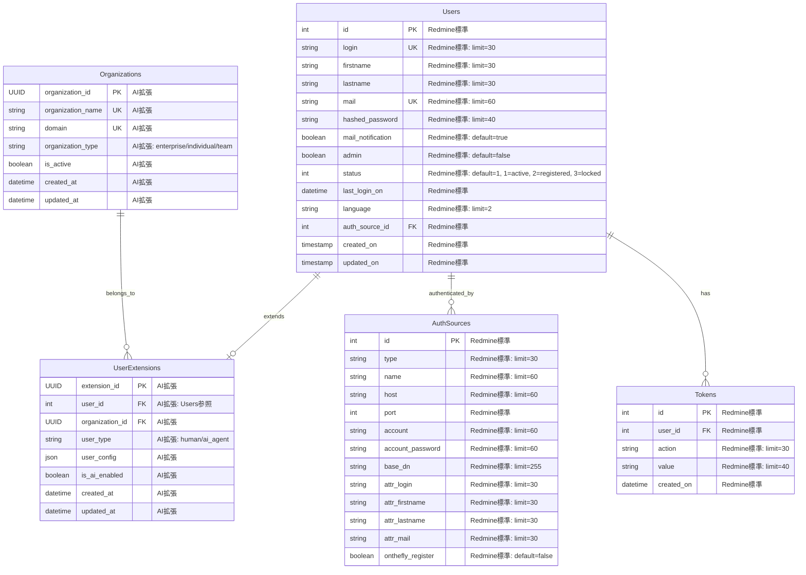
```mermaid
erDiagram
    %% Redmine標準テーブル（変更なし）
    Users {
        int id PK "Redmine標準"
        string login UK "Redmine標準: limit=30"
        string firstname "Redmine標準: limit=30"
        string lastname "Redmine標準: limit=30"
        string mail UK "Redmine標準: limit=60"
        string hashed_password "Redmine標準: limit=40"
        boolean mail_notification "Redmine標準: default=true"
        boolean admin "Redmine標準: default=false"
        int status "Redmine標準: default=1, 1=active, 2=registered, 3=locked"
        datetime last_login_on "Redmine標準"
        string language "Redmine標準: limit=2"
        int auth_source_id FK "Redmine標準"
        timestamp created_on "Redmine標準"
        timestamp updated_on "Redmine標準"
    }
    
    AuthSources {
        int id PK "Redmine標準"
        string type "Redmine標準: limit=30"
        string name "Redmine標準: limit=60"
        string host "Redmine標準: limit=60"
        int port "Redmine標準"
        string account "Redmine標準: limit=60"
        string account_password "Redmine標準: limit=60"
        string base_dn "Redmine標準: limit=255"
        string attr_login "Redmine標準: limit=30"
        string attr_firstname "Redmine標準: limit=30"
        string attr_lastname "Redmine標準: limit=30"
        string attr_mail "Redmine標準: limit=30"
        boolean onthefly_register "Redmine標準: default=false"
    }
    
    Tokens {
        int id PK "Redmine標準"
        int user_id FK "Redmine標準"
        string action "Redmine標準: limit=30"
        string value "Redmine標準: limit=40"
        datetime created_on "Redmine標準"
    }
    
    %% AI拡張テーブル（新規追加）
    Organizations {
        UUID organization_id PK "AI拡張"
        string organization_name UK "AI拡張"
        string domain UK "AI拡張"
        string organization_type "AI拡張: enterprise/individual/team"
        boolean is_active "AI拡張"
        datetime created_at "AI拡張"
        datetime updated_at "AI拡張"
    }
    
    UserExtensions {
        UUID extension_id PK "AI拡張"
        int user_id FK "AI拡張: Users参照"
        UUID organization_id FK "AI拡張"
        string user_type "AI拡張: human/ai_agent"
        json user_config "AI拡張"
        boolean is_ai_enabled "AI拡張"
        datetime created_at "AI拡張"
        datetime updated_at "AI拡張"
    }
    
    %% 関係性
    Users ||--o| UserExtensions : extends
    Organizations ||--o{ UserExtensions : belongs_to
    Users ||--o{ AuthSources : authenticated_by
    Users ||--o{ Tokens : has
```

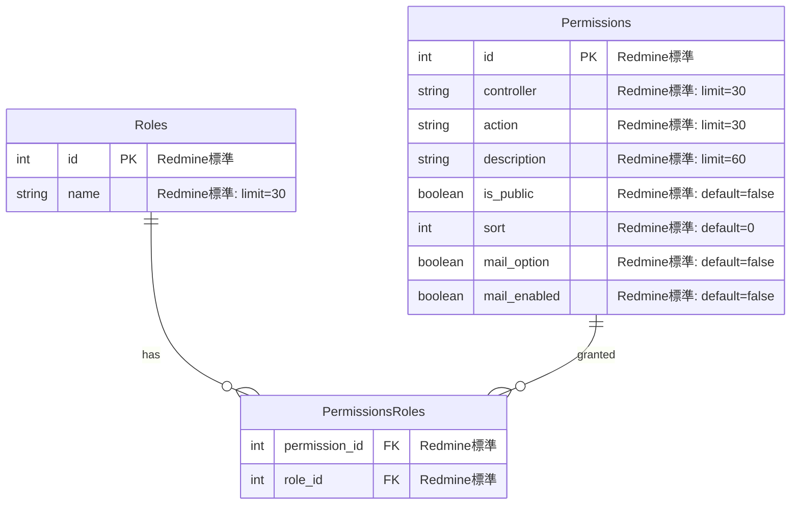
```mermaid
erDiagram
    Roles {
        int id PK "Redmine標準"
        string name "Redmine標準: limit=30"
    }
    
    Permissions {
        int id PK "Redmine標準"
        string controller "Redmine標準: limit=30"
        string action "Redmine標準: limit=30" 
        string description "Redmine標準: limit=60"
        boolean is_public "Redmine標準: default=false"
        int sort "Redmine標準: default=0"
        boolean mail_option "Redmine標準: default=false"
        boolean mail_enabled "Redmine標準: default=false"
    }
    
    PermissionsRoles {
        int permission_id FK "Redmine標準"
        int role_id FK "Redmine標準"
    }

    Roles ||--o{ PermissionsRoles : has
    Permissions ||--o{ PermissionsRoles : granted
```

### 2. プロジェクト・チケット管理ドメイン（Redmine完全互換 + AI拡張）

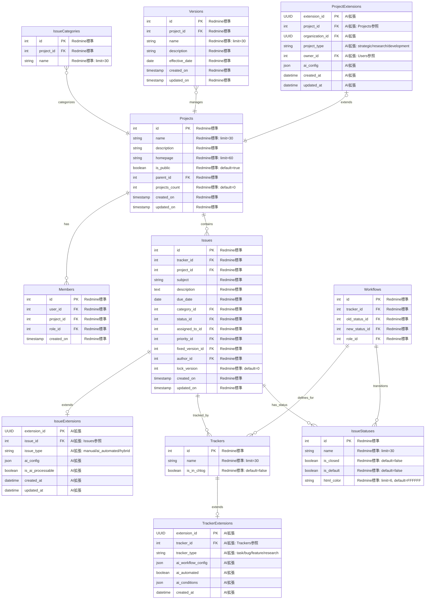
```mermaid
erDiagram
    %% Redmine標準テーブル（変更なし）
    Projects {
        int id PK "Redmine標準"
        string name "Redmine標準: limit=30"
        string description "Redmine標準"
        string homepage "Redmine標準: limit=60"
        boolean is_public "Redmine標準: default=true"
        int parent_id FK "Redmine標準"
        int projects_count "Redmine標準: default=0"
        timestamp created_on "Redmine標準"
        timestamp updated_on "Redmine標準"
    }
    
    Members {
        int id PK "Redmine標準"
        int user_id FK "Redmine標準"
        int project_id FK "Redmine標準"
        int role_id FK "Redmine標準"
        timestamp created_on "Redmine標準"
    }
    
    Issues {
        int id PK "Redmine標準"
        int tracker_id FK "Redmine標準"
        int project_id FK "Redmine標準"
        string subject "Redmine標準"
        text description "Redmine標準"
        date due_date "Redmine標準"
        int category_id FK "Redmine標準"
        int status_id FK "Redmine標準"
        int assigned_to_id FK "Redmine標準"
        int priority_id FK "Redmine標準"
        int fixed_version_id FK "Redmine標準"
        int author_id FK "Redmine標準"
        int lock_version "Redmine標準: default=0"
        timestamp created_on "Redmine標準"
        timestamp updated_on "Redmine標準"
    }
    
    Trackers {
        int id PK "Redmine標準"
        string name "Redmine標準: limit=30"
        boolean is_in_chlog "Redmine標準: default=false"
    }
    
    IssueStatuses {
        int id PK "Redmine標準"
        string name "Redmine標準: limit=30"
        boolean is_closed "Redmine標準: default=false"
        boolean is_default "Redmine標準: default=false"
        string html_color "Redmine標準: limit=6, default=FFFFFF"
    }
    
    IssueCategories {
        int id PK "Redmine標準"
        int project_id FK "Redmine標準"
        string name "Redmine標準: limit=30"
    }
    
    Versions {
        int id PK "Redmine標準"
        int project_id FK "Redmine標準"
        string name "Redmine標準: limit=30"
        string description "Redmine標準"
        date effective_date "Redmine標準"
        timestamp created_on "Redmine標準"
        timestamp updated_on "Redmine標準"
    }
    
    Workflows {
        int id PK "Redmine標準"
        int tracker_id FK "Redmine標準"
        int old_status_id FK "Redmine標準"
        int new_status_id FK "Redmine標準"
        int role_id FK "Redmine標準"
    }
    
    %% AI拡張テーブル（新規追加）
    ProjectExtensions {
        UUID extension_id PK "AI拡張"
        int project_id FK "AI拡張: Projects参照"
        UUID organization_id FK "AI拡張"
        string project_type "AI拡張: strategic/research/development"
        int owner_id FK "AI拡張: Users参照"
        json ai_config "AI拡張"
        datetime created_at "AI拡張"
        datetime updated_at "AI拡張"
    }
    
    IssueExtensions {
        UUID extension_id PK "AI拡張"
        int issue_id FK "AI拡張: Issues参照"
        string issue_type "AI拡張: manual/ai_automated/hybrid"
        json ai_config "AI拡張"
        boolean is_ai_processable "AI拡張"
        datetime created_at "AI拡張"
        datetime updated_at "AI拡張"
    }
    
    TrackerExtensions {
        UUID extension_id PK "AI拡張"
        int tracker_id FK "AI拡張: Trackers参照"
        string tracker_type "AI拡張: task/bug/feature/research"
        json ai_workflow_config "AI拡張"
        boolean ai_automated "AI拡張"
        json ai_conditions "AI拡張"
        datetime created_at "AI拡張"
    }
    
    %% 関係性
    IssueCategories }o--|| Projects : categorizes
    Versions }o--|| Projects : manages
    ProjectExtensions |o--|| Projects : extends
    Projects ||--o{ Members : has
    Projects ||--o{ Issues : contains
    Issues ||--o| IssueExtensions : extends
    Issues ||--o{ Trackers : tracked_by
    Issues ||--o{ IssueStatuses : has_status
    Trackers ||--o| TrackerExtensions : extends
    Workflows ||--o{ Trackers : defines_for
    Workflows ||--o{ IssueStatuses : transitions
```

### 3. 添付ファイル・ドキュメント管理ドメイン（Redmine完全互換 + AI拡張）

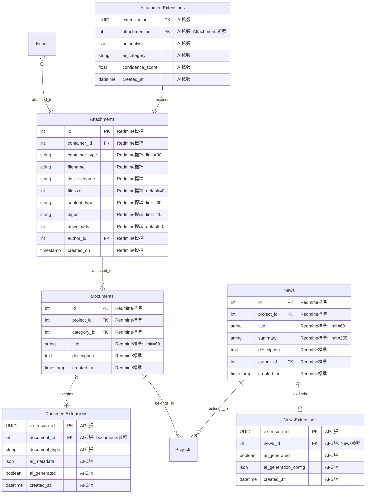
```mermaid
erDiagram
    %% Redmine標準テーブル（変更なし）
    Attachments {
        int id PK "Redmine標準"
        int container_id FK "Redmine標準"
        string container_type "Redmine標準: limit=30"
        string filename "Redmine標準"
        string disk_filename "Redmine標準"
        int filesize "Redmine標準: default=0"
        string content_type "Redmine標準: limit=60"
        string digest "Redmine標準: limit=40"
        int downloads "Redmine標準: default=0"
        int author_id FK "Redmine標準"
        timestamp created_on "Redmine標準"
    }
    
    Documents {
        int id PK "Redmine標準"
        int project_id FK "Redmine標準"
        int category_id FK "Redmine標準"
        string title "Redmine標準: limit=60"
        text description "Redmine標準"
        timestamp created_on "Redmine標準"
    }
    
    News {
        int id PK "Redmine標準"
        int project_id FK "Redmine標準"
        string title "Redmine標準: limit=60"
        string summary "Redmine標準: limit=255"
        text description "Redmine標準"
        int author_id FK "Redmine標準"
        timestamp created_on "Redmine標準"
    }
    
    %% AI拡張テーブル（新規追加）
    AttachmentExtensions {
        UUID extension_id PK "AI拡張"
        int attachment_id FK "AI拡張: Attachments参照"
        json ai_analysis "AI拡張"
        string ai_category "AI拡張"
        float confidence_score "AI拡張"
        datetime created_at "AI拡張"
    }
    
    DocumentExtensions {
        UUID extension_id PK "AI拡張"
        int document_id FK "AI拡張: Documents参照"
        string document_type "AI拡張"
        json ai_metadata "AI拡張"
        boolean ai_generated "AI拡張"
        datetime created_at "AI拡張"
    }
    
    NewsExtensions {
        UUID extension_id PK "AI拡張"
        int news_id FK "AI拡張: News参照"
        boolean ai_generated "AI拡張"
        json ai_generation_config "AI拡張"
        datetime created_at "AI拡張"
    }
    
    %% 関係性
    Issues }o--|| Attachments : attached_to
    AttachmentExtensions |o--|| Attachments : extends
    Documents ||--o| DocumentExtensions : extends
    News ||--o| NewsExtensions : extends
    Attachments ||--o{ Documents : attached_to
    Documents ||--o{ Projects : belongs_to
    News ||--o{ Projects : belongs_to
```

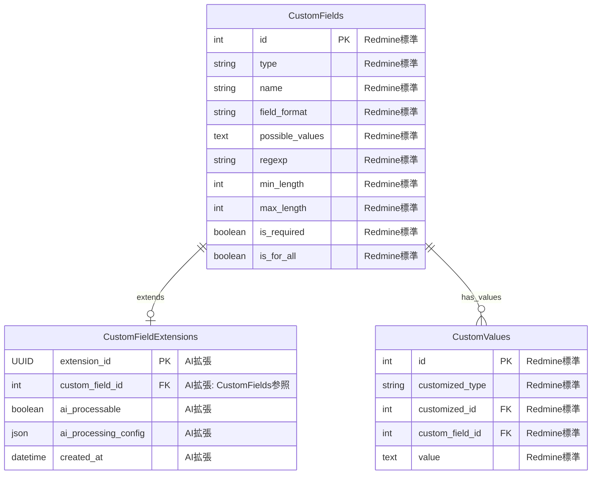
```mermaid
erDiagram
    CustomFields {
        int id PK "Redmine標準"
        string type "Redmine標準"
        string name "Redmine標準"
        string field_format "Redmine標準"
        text possible_values "Redmine標準"
        string regexp "Redmine標準"
        int min_length "Redmine標準"
        int max_length "Redmine標準"
        boolean is_required "Redmine標準"
        boolean is_for_all "Redmine標準"
    }
    
    CustomValues {
        int id PK "Redmine標準"
        string customized_type "Redmine標準"
        int customized_id FK "Redmine標準"
        int custom_field_id FK "Redmine標準"
        text value "Redmine標準"
    }
    
    CustomFieldExtensions {
        UUID extension_id PK "AI拡張"
        int custom_field_id FK "AI拡張: CustomFields参照"
        boolean ai_processable "AI拡張"
        json ai_processing_config "AI拡張"
        datetime created_at "AI拡張"
    }

    CustomFields ||--o| CustomFieldExtensions : extends
    CustomFields ||--o{ CustomValues : has_values
```

### 4. 履歴・監査・ワークフロー管理ドメイン（Redmine完全互換 + AI拡張）

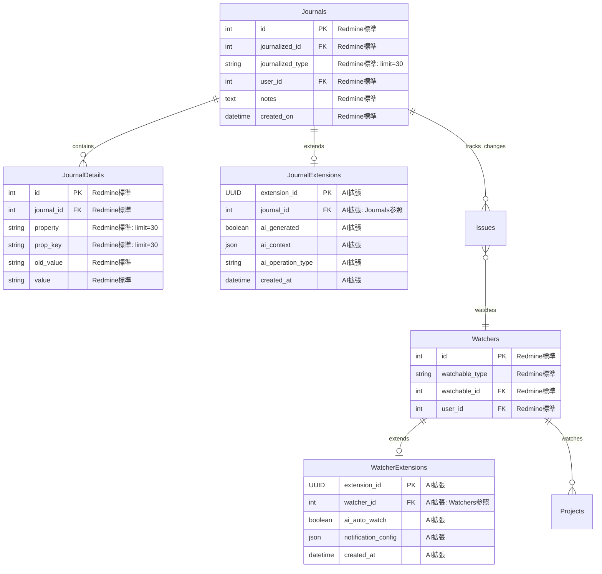
```mermaid
erDiagram
    %% Redmine標準テーブル（変更なし）
    Journals {
        int id PK "Redmine標準"
        int journalized_id FK "Redmine標準"
        string journalized_type "Redmine標準: limit=30"
        int user_id FK "Redmine標準"
        text notes "Redmine標準"
        datetime created_on "Redmine標準"
    }
    
    JournalDetails {
        int id PK "Redmine標準"
        int journal_id FK "Redmine標準"
        string property "Redmine標準: limit=30"
        string prop_key "Redmine標準: limit=30"
        string old_value "Redmine標準"
        string value "Redmine標準"
    }
    
    Watchers {
        int id PK "Redmine標準"
        string watchable_type "Redmine標準"
        int watchable_id FK "Redmine標準"
        int user_id FK "Redmine標準"
    }
    
    %% AI拡張テーブル（新規追加）
    JournalExtensions {
        UUID extension_id PK "AI拡張"
        int journal_id FK "AI拡張: Journals参照"
        boolean ai_generated "AI拡張"
        json ai_context "AI拡張"
        string ai_operation_type "AI拡張"
        datetime created_at "AI拡張"
    }
    
    WatcherExtensions {
        UUID extension_id PK "AI拡張"
        int watcher_id FK "AI拡張: Watchers参照"
        boolean ai_auto_watch "AI拡張"
        json notification_config "AI拡張"
        datetime created_at "AI拡張"
    }
    
    %% 関係性
    Journals ||--o| JournalExtensions : extends
    Watchers ||--o| WatcherExtensions : extends
    Journals ||--o{ JournalDetails : contains
    Journals ||--o{ Issues : tracks_changes
    Issues }o--|| Watchers : watches
    Watchers ||--o{ Projects : watches
```

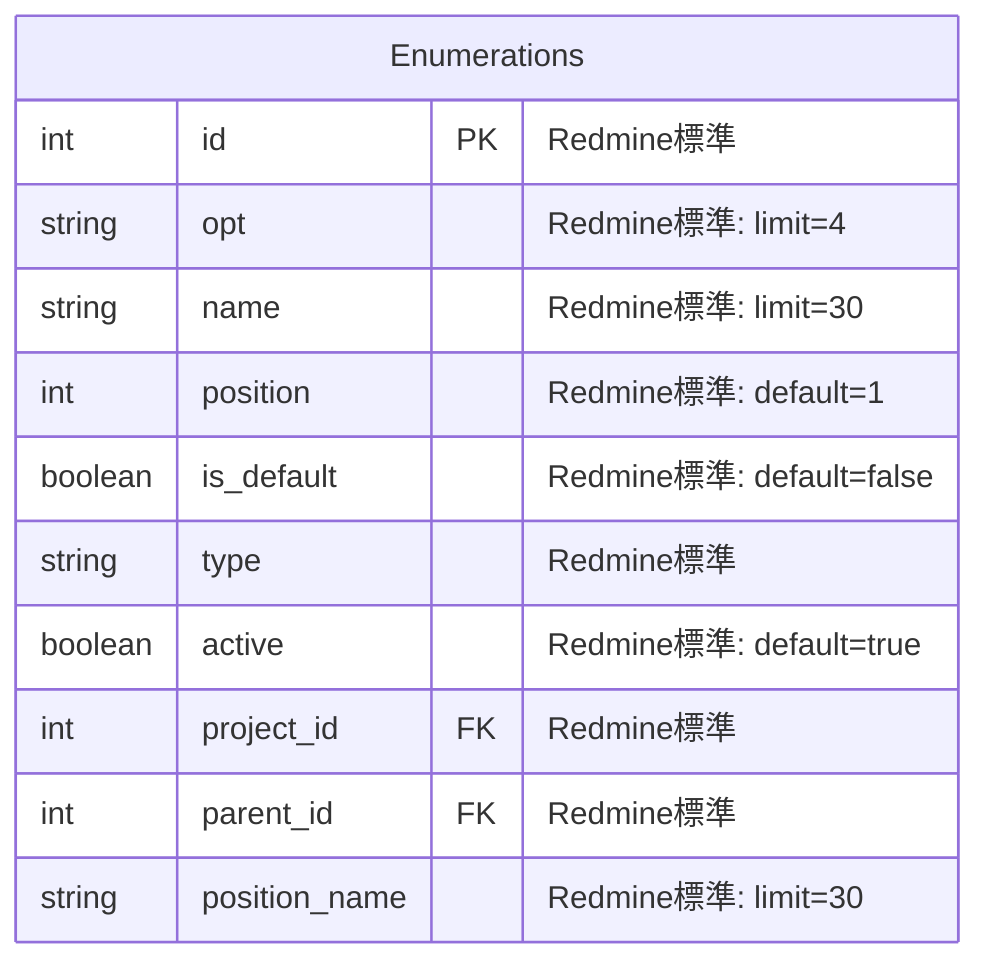
```mermaid
erDiagram
    Enumerations {
        int id PK "Redmine標準"
        string opt "Redmine標準: limit=4"
        string name "Redmine標準: limit=30"
        int position "Redmine標準: default=1"
        boolean is_default "Redmine標準: default=false"
        string type "Redmine標準"
        boolean active "Redmine標準: default=true"
        int project_id FK "Redmine標準"
        int parent_id FK "Redmine標準"
        string position_name "Redmine標準: limit=30"
    }
```

### 5. AI・実行管理ドメイン（AI拡張）

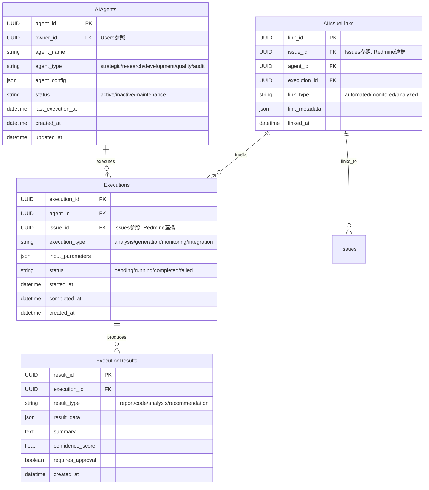
```mermaid
erDiagram
    AIAgents {
        UUID agent_id PK
        UUID owner_id FK "Users参照"
        string agent_name
        string agent_type "strategic/research/development/quality/audit"
        json agent_config
        string status "active/inactive/maintenance"
        datetime last_execution_at
        datetime created_at
        datetime updated_at
    }
    
    Executions {
        UUID execution_id PK
        UUID agent_id FK
        UUID issue_id FK "Issues参照: Redmine連携"
        string execution_type "analysis/generation/monitoring/integration"
        json input_parameters
        string status "pending/running/completed/failed"
        datetime started_at
        datetime completed_at
        datetime created_at
    }
    
    ExecutionResults {
        UUID result_id PK
        UUID execution_id FK
        string result_type "report/code/analysis/recommendation"
        json result_data
        text summary
        float confidence_score
        boolean requires_approval
        datetime created_at
    }
    
    AIIssueLinks {
        UUID link_id PK
        UUID issue_id FK "Issues参照: Redmine連携"
        UUID agent_id FK
        UUID execution_id FK
        string link_type "automated/monitored/analyzed"
        json link_metadata
        datetime linked_at
    }
    
    AIAgents ||--o{ Executions : executes
    Executions ||--o{ ExecutionResults : produces
    AIIssueLinks ||--o{ Issues : links_to
    AIIssueLinks ||--o{ Executions : tracks
```

### 6. 人機協調・ワークフロー管理ドメイン（AI拡張）

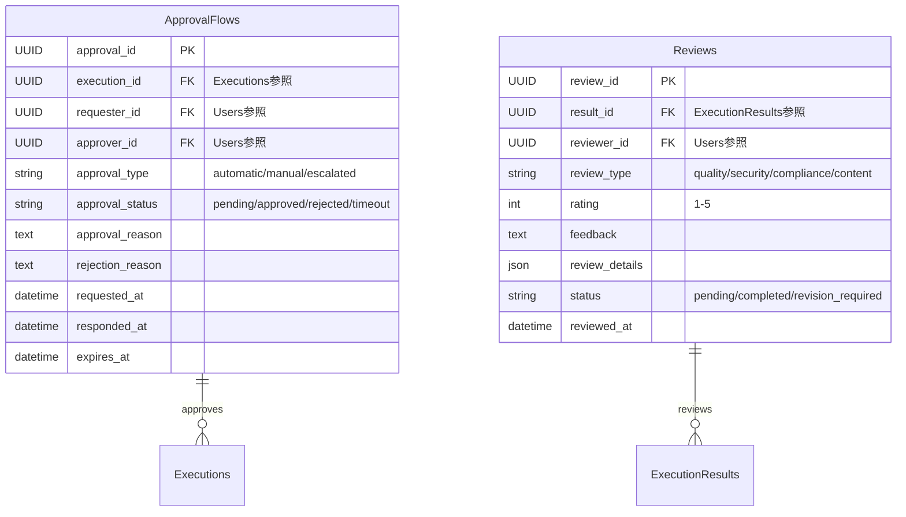
```mermaid
erDiagram
    ApprovalFlows {
        UUID approval_id PK
        UUID execution_id FK "Executions参照"
        UUID requester_id FK "Users参照"
        UUID approver_id FK "Users参照"
        string approval_type "automatic/manual/escalated"
        string approval_status "pending/approved/rejected/timeout"
        text approval_reason
        text rejection_reason
        datetime requested_at
        datetime responded_at
        datetime expires_at
    }
    
    Reviews {
        UUID review_id PK
        UUID result_id FK "ExecutionResults参照"
        UUID reviewer_id FK "Users参照"
        string review_type "quality/security/compliance/content"
        int rating "1-5"
        text feedback
        json review_details
        string status "pending/completed/revision_required"
        datetime reviewed_at
    }
    
    
    ApprovalFlows ||--o{ Executions : approves
    Reviews ||--o{ ExecutionResults : reviews
```

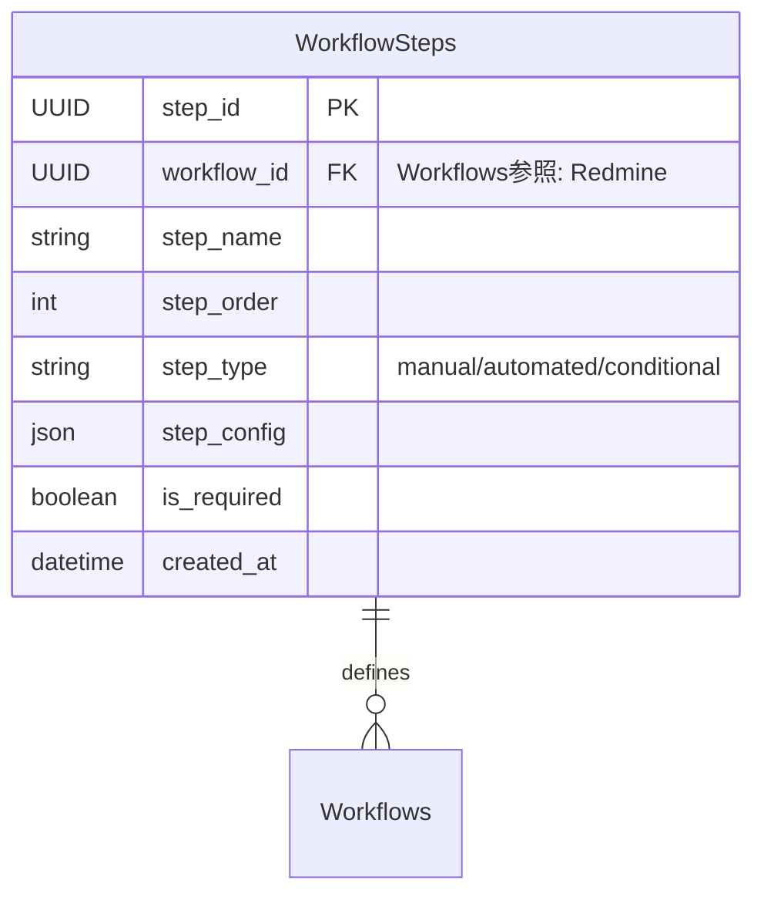
```mermaid
erDiagram
    WorkflowSteps {
        UUID step_id PK
        UUID workflow_id FK "Workflows参照: Redmine"
        string step_name
        int step_order
        string step_type "manual/automated/conditional"
        json step_config
        boolean is_required
        datetime created_at
    }

    WorkflowSteps ||--o{ Workflows : defines
```

### 7. ナレッジ・学習管理ドメイン（AI拡張）

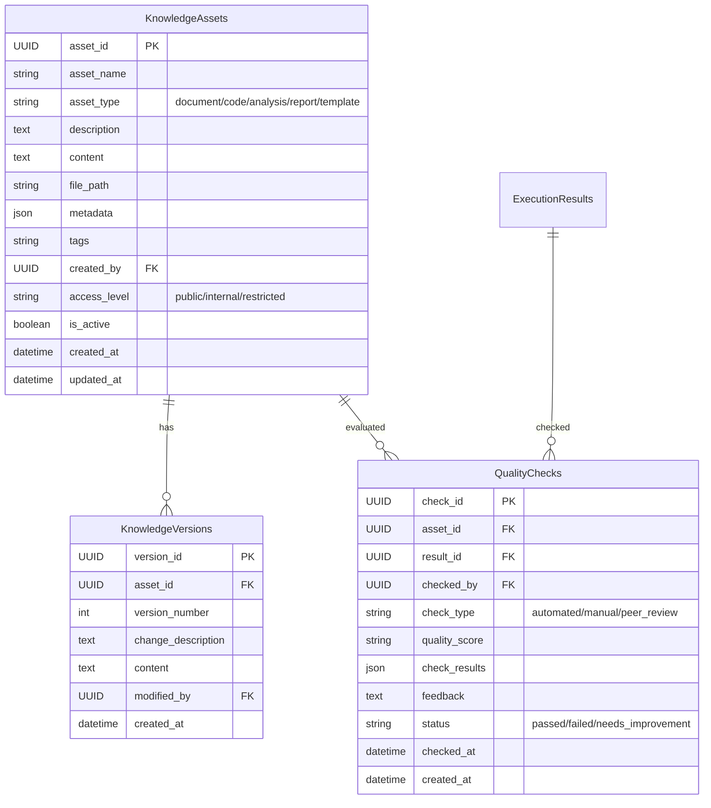
```mermaid
erDiagram
    KnowledgeAssets {
        UUID asset_id PK
        string asset_name
        string asset_type "document/code/analysis/report/template"
        text description
        text content
        string file_path
        json metadata
        string tags
        UUID created_by FK
        string access_level "public/internal/restricted"
        boolean is_active
        datetime created_at
        datetime updated_at
    }
    
    KnowledgeVersions {
        UUID version_id PK
        UUID asset_id FK
        int version_number
        text change_description
        text content
        UUID modified_by FK
        datetime created_at
    }
    
    QualityChecks {
        UUID check_id PK
        UUID asset_id FK
        UUID result_id FK
        UUID checked_by FK
        string check_type "automated/manual/peer_review"
        string quality_score
        json check_results
        text feedback
        string status "passed/failed/needs_improvement"
        datetime checked_at
        datetime created_at
    }
    
    KnowledgeAssets ||--o{ KnowledgeVersions : has
    KnowledgeAssets ||--o{ QualityChecks : evaluated
    ExecutionResults ||--o{ QualityChecks : checked
```

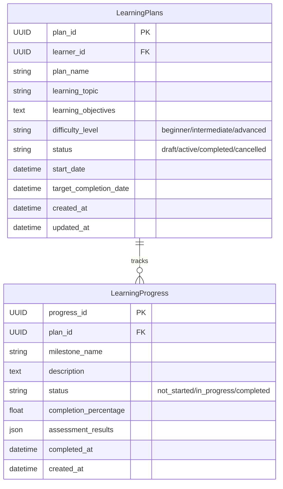
```mermaid
erDiagram
    LearningPlans {
        UUID plan_id PK
        UUID learner_id FK
        string plan_name
        string learning_topic
        text learning_objectives
        string difficulty_level "beginner/intermediate/advanced"
        string status "draft/active/completed/cancelled"
        datetime start_date
        datetime target_completion_date
        datetime created_at
        datetime updated_at
    }
    
    LearningProgress {
        UUID progress_id PK
        UUID plan_id FK
        string milestone_name
        text description
        string status "not_started/in_progress/completed"
        float completion_percentage
        json assessment_results
        datetime completed_at
        datetime created_at
    }

    LearningPlans ||--o{ LearningProgress : tracks
```

### 8. 監査・ガバナンスドメイン（AI拡張）

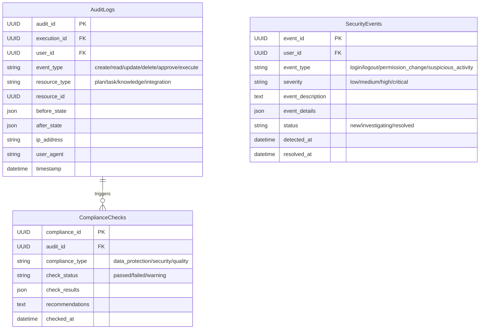
```mermaid
erDiagram
    AuditLogs {
        UUID audit_id PK
        UUID execution_id FK
        UUID user_id FK
        string event_type "create/read/update/delete/approve/execute"
        string resource_type "plan/task/knowledge/integration"
        UUID resource_id
        json before_state
        json after_state
        string ip_address
        string user_agent
        datetime timestamp
    }
    
    ComplianceChecks {
        UUID compliance_id PK
        UUID audit_id FK
        string compliance_type "data_protection/security/quality"
        string check_status "passed/failed/warning"
        json check_results
        text recommendations
        datetime checked_at
    }
    
    SecurityEvents {
        UUID event_id PK
        UUID user_id FK
        string event_type "login/logout/permission_change/suspicious_activity"
        string severity "low/medium/high/critical"
        text event_description
        json event_details
        string status "new/investigating/resolved"
        datetime detected_at
        datetime resolved_at
    }
    
    AuditLogs ||--o{ ComplianceChecks : triggers
```

### 9. 外部統合ドメイン（AI拡張）

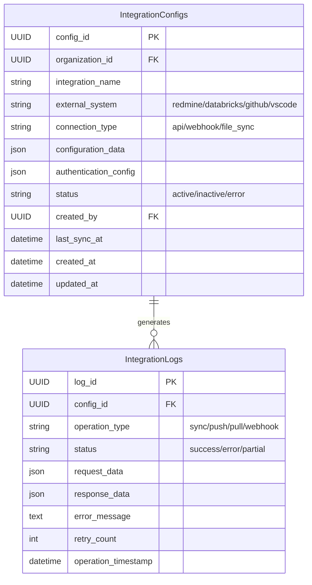
```mermaid
erDiagram
    IntegrationConfigs {
        UUID config_id PK
        UUID organization_id FK
        string integration_name
        string external_system "redmine/databricks/github/vscode"
        string connection_type "api/webhook/file_sync"
        json configuration_data
        json authentication_config
        string status "active/inactive/error"
        UUID created_by FK
        datetime last_sync_at
        datetime created_at
        datetime updated_at
    }
    
    IntegrationLogs {
        UUID log_id PK
        UUID config_id FK
        string operation_type "sync/push/pull/webhook"
        string status "success/error/partial"
        json request_data
        json response_data
        text error_message
        int retry_count
        datetime operation_timestamp
    }
    
    IntegrationConfigs ||--o{ IntegrationLogs : generates
```

## ドメイン間関係図

各ドメインがどのように相互に関連しているかを示すドメイン間関係図です。

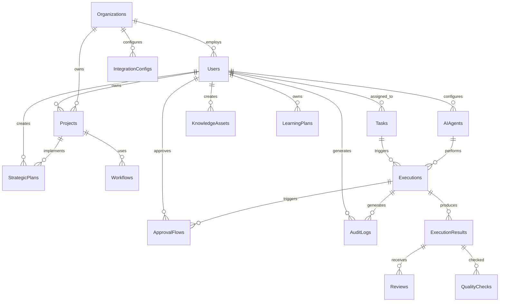
```mermaid
erDiagram
    %% 主要エンティティ間の関係（ドメイン横断）
    Users ||--o{ Projects : owns
    Users ||--o{ Tasks : assigned_to
    Users ||--o{ AIAgents : configures
    Users ||--o{ StrategicPlans : creates
    Users ||--o{ ApprovalFlows : approves
    Users ||--o{ KnowledgeAssets : creates
    Users ||--o{ LearningPlans : owns
    Users ||--o{ AuditLogs : generates
    
    Projects ||--o{ StrategicPlans : implements
    Projects ||--o{ Workflows : uses
    
    Tasks ||--o{ Executions : triggers
    
    AIAgents ||--o{ Executions : performs
    
    Executions ||--o{ ExecutionResults : produces
    Executions ||--o{ ApprovalFlows : triggers
    Executions ||--o{ AuditLogs : generates
    
    ExecutionResults ||--o{ Reviews : receives
    ExecutionResults ||--o{ QualityChecks : checked
    
    Organizations ||--o{ Users : employs
    Organizations ||--o{ Projects : owns
    Organizations ||--o{ IntegrationConfigs : configures
```

## Redmine完全互換設計原則

### 基本方針
本システムは**Redmineとの完全互換性を保持**し、既存のRedmineテーブル構造を**一切変更せず**、AI機能拡張は**専用の拡張テーブル**で管理する設計となっています。

### Redmine完全互換テーブル

#### Redmine標準テーブル（変更一切なし）
- **Users**: Redmine標準のユーザテーブル（int id, login, mail等）
- **Projects**: Redmine標準のプロジェクトテーブル
- **Issues**: Redmine標準のチケットテーブル
- **Trackers**: Redmine標準のトラッカーテーブル
- **Workflows**: Redmine標準のワークフローテーブル
- **Roles/Permissions**: Redmine標準の権限管理
- **Journals/JournalDetails**: Redmine標準の履歴管理
- **Attachments**: Redmine標準のファイル管理

### AI機能拡張テーブル

#### 拡張テーブル設計方針
- **UserExtensions**: Users拡張（AI種別、組織、設定）
- **ProjectExtensions**: Projects拡張（プロジェクト種別、AI設定）
- **IssueExtensions**: Issues拡張（AI自動化設定、処理状況）
- **TrackerExtensions**: Trackers拡張（AI実行設定）

#### 拡張テーブルの特徴
1. **1対1関係**: 各RedmineテーブルのIDを外部キーとして参照
2. **オプショナル**: 拡張テーブルにレコードがなくてもRedmine機能は完全動作
3. **段階的導入**: 必要な機能から順次拡張テーブルを追加可能

### 互換性保証メリット

1. **既存Redmine環境**: そのまま本システムに移行可能
2. **Redmineバージョンアップ**: 影響を受けない設計
3. **プラグイン互換**: 既存Redmineプラグインが継続利用可能
4. **段階的導入**: AI機能を段階的に有効化・無効化可能
5. **データ移行**: 既存Redmineデータの完全継承

## エンティティ詳細説明

### 主要設計方針

#### 1. Redmine基盤統合による見やすさ向上
- Redmineコアテーブルを基盤とした9ドメイン分割
- AI拡張テーブルの明確な識別（"AI拡張"ラベル）
- Redmine互換性の明示（"Redmine互換"ラベル）

#### 2. 人機協調サポート
- **Users**: 人間とAIエージェントを統一的に管理（user_type拡張）
- **Issues**: RedmineチケットでAIタスクも管理（issue_type拡張）
- **AIAgents/Executions**: AIの全行動をRedmineと連携記録

#### 3. 完全履歴化
- **Journals**: Redmineの変更履歴にAI行動も記録
- **Attachments**: AI生成ファイルもRedmine添付として管理
- **変更履歴**: Redmine標準の created_on/updated_on 活用

#### 4. 柔軟な権限管理
- **Roles/Permissions**: Redmine標準権限モデル活用
- **Members**: プロジェクトメンバー管理（AI含む）
- **Workflows**: RedmineワークフローにAI自動化追加

#### 5. 統合基盤対応
- **CustomFields**: Redmine柔軟性でAI設定も管理
- **IntegrationConfigs**: Databricks/VS Code連携設定

## データ保護・セキュリティ考慮事項

### 機密情報保護
- Redmine標準権限モデルによるアクセス制御
- AI処理データの適切な分離・暗号化
- Redmine管理画面での統合セキュリティ管理

### 監査要件
- Redmine Journals機能による完全ログ記録
- AI実行履歴の詳細トレーサビリティ
- 承認プロセスのRedmine連携管理

### パフォーマンス考慮
- Redmine標準インデックス活用
- AI実行ログの効率的なパーティショニング
- Redmineキャッシュ機能との整合性確保

## 関連ドキュメント

- [035020_テーブル定義書.md](./035020_テーブル定義書.md): 詳細なテーブル仕様
- [021000_要件定義書.md](../../020000_要件定義/021000_要件定義書.md): システム要件
- [034020_ユースケース設計.md](../034000_アプリケーション設計/034020_ユースケース設計.md): ユースケース設計