# 035010 ER図

## 概要

ソロプレナー／AIネイティブ企業基盤システムの主要エンティティとその関係を定義します。人機協調モデルに基づき、人間とAIエージェントの行動・承認・履歴管理を包括的にサポートするデータ構造を設計しています。

**重要**: 本システムはRedmineを中枢管理システムとして活用するため、Redmineの既存テーブル構造を**完全に保持**し、AI機能拡張は**別テーブル**で管理します。これによりRedmineとの完全互換性を維持しつつ、AI機能を段階的に追加できる設計となっています。

### 設計原則

#### 1. Redmine完全互換性の保持
- Redmineの既存テーブルは**一切変更しない**
- 既存のRedmineインストールにそのまま適用可能
- Redmineのバージョンアップに影響されない

#### 2. AI拡張テーブルによる機能追加
- AI関連情報は専用の拡張テーブルで管理
- Redmineテーブルとの関連は外部キーで実現
- 段階的導入・削除が可能な設計

## 主要エンティティ群

### 1. 組織・ユーザ管理（Organization Domain）
- **Organizations**: 組織・テナント管理
- **Users**: システム利用者（人間・AIエージェント）
- **EmailAddresses**: ユーザーメールアドレス管理
- **UserPreferences**: ユーザー設定管理（Redmine標準）
- **GroupsUsers**: グループ・ユーザー関連
- **Roles**: 権限ロール（Admin/Approver/Contributor/Agent）
- **RolesManagedRoles**: ロール管理関係
- **Permissions**: 具体的権限定義
- **AuthSources**: 認証ソース（LDAP/SSO等）
- **Tokens**: APIトークン・認証トークン
- **Settings**: システム設定
- **OauthApplications**: OAuth2アプリケーション
- **OauthAccessTokens**: OAuth2アクセストークン
- **OauthAccessGrants**: OAuth2認可グラント

### 2. プロジェクト・チケット管理（Project Management Domain）
- **Projects**: プロジェクト（戦略実行・調査・開発等）
- **Issues**: Redmineチケット（タスク・バグ・要求等）
- **Trackers**: issue種別（タスク・バグ・機能・調査等）
- **ProjectsTrackers**: プロジェクト利用可能トラッカー
- **IssueStatuses**: チケットステータス（新規・進行中・解決・終了等）
- **IssueCategories**: プロジェクト内カテゴリ分類
- **Versions**: バージョン・マイルストーン・リリース管理
- **Members**: プロジェクトメンバー管理
- **MemberRoles**: メンバーロール関連
- **Workflows**: ワークフロー・ステータス遷移
- **IssueRelations**: チケット間関係（依存・ブロック等）
- **TimeEntries**: 時間管理・工数記録
- **Queries**: 保存されたフィルタ・検索条件
- **QueriesRoles**: クエリロール制限
- **EnabledModules**: プロジェクト機能有効化設定
- **ProjectExtensions**: プロジェクトAI拡張設定
- **IssueExtensions**: チケットAI拡張設定
- **TrackerExtensions**: トラッカーAI拡張設定

### 3. 添付ファイル・ドキュメント管理（Document Domain）
- **Attachments**: Redmine添付ファイル管理
- **Documents**: プロジェクトドキュメント
- **News**: プロジェクトニュース・お知らせ
- **Boards**: プロジェクト掲示板
- **Messages**: 掲示板メッセージ・スレッド
- **Comments**: コメント管理
- **Reactions**: リアクション管理
- **CustomFields**: カスタムフィールド定義
- **CustomValues**: カスタムフィールド値
- **CustomFieldEnumerations**: カスタムフィールド選択肢
- **CustomFieldsProjects**: カスタムフィールドプロジェクト適用
- **CustomFieldsRoles**: カスタムフィールドロール適用
- **CustomFieldsTrackers**: カスタムフィールドトラッカー適用
- **AttachmentAIAnalytics**: 添付ファイルAI分析機能
- **MessageAIAssistant**: メッセージAIアシスタント機能
- **DocumentExtensions**: ドキュメントAI拡張設定
- **NewsExtensions**: ニュースAI拡張設定
- **CustomFieldExtensions**: カスタムフィールドAI拡張設定

### 4. 履歴・監査・ワークフロー管理（Audit Workflow Domain）
- **Journals**: 変更履歴・アクティビティログ
- **JournalDetails**: 変更履歴詳細
- **Watchers**: チケット・プロジェクト監視設定
- **Tokens**: APIトークン・認証トークン
- **Workflows**: ワークフロー・ステータス遷移
- **Enumerations**: 列挙値・マスタデータ
- **JournalExtensions**: 変更履歴AI拡張機能
- **WatcherExtensions**: 監視設定AI拡張機能

### 5. AI・実行管理（AI Agent Domain）
- **AIAgents**: AIエージェント定義・設定
- **Executions**: AI実行履歴・ジョブ管理
- **ExecutionResults**: 実行結果・成果物
- **AIIssueLinks**: RedmineチケットとAI実行の連携

### 6. 人機協調・ワークフロー（Collaboration Domain）
- **ApprovalFlows**: HITL承認管理
- **Reviews**: レビュー・フィードバック
- **WorkflowSteps**: ワークフローステップ詳細

### 7. ナレッジ・学習管理（Knowledge Domain）
- **Wikis**: Redmine標準Wiki機能
- **WikiPages**: Redmine標準Wikiページ管理
- **WikiContents**: Redmine標準Wikiコンテンツ・バージョン管理
- **WikiContentVersions**: Redmine標準Wikiバージョン履歴
- **WikiRedirects**: Redmine標準Wikiリダイレクト
- **WikiExtensions**: Wiki AI拡張（自動分類・タグ付け）
- **KnowledgeAssets**: AI生成知識資産・ドキュメント
- **KnowledgeVersions**: ナレッジバージョン管理
- **LearningPlans**: 学習計画・カリキュラム
- **LearningProgress**: 学習進捗管理
- **QualityChecks**: Wiki・ナレッジ品質チェック結果

### 8. 監査・ガバナンス（Audit Domain）
- **AuditLogs**: 包括的監査ログ
- **ComplianceChecks**: コンプライアンス確認
- **SecurityEvents**: セキュリティイベント

### 9. 統合・拡張管理（Integration Domain）
- **IntegrationConfigs**: 外部システム連携設定
- **IntegrationLogs**: 連携処理ログ
- **Repositories**: バージョン管理リポジトリ
- **Changesets**: コミット・変更セット
- **ChangesetParents**: 変更セット親子関係（Redmine標準）
- **ChangesetsIssues**: 変更セットとチケットの関連（Redmine標準）
- **Changes**: ファイル変更詳細
- **RepositoryAIAnalytics**: リポジトリAI分析機能
- **CodeReviewAssistant**: コードレビューAIアシスタント
- **OauthApplications**: OAuth2アプリケーション（Redmine標準）
- **OauthAccessGrants**: OAuth2アクセス許可（Redmine標準）
- **OauthAccessTokens**: OAuth2アクセストークン（Redmine標準）
- **Imports**: インポート処理（Redmine標準）
- **ImportItems**: インポート項目（Redmine標準）
- **Settings**: システム設定（Redmine標準）

## ER図

以下のER図は、Redmineの既存テーブル構造を基盤として、AI機能拡張のための追加テーブルを統合した設計となっています。

### 1. 組織・ユーザ管理ドメイン

#### 1.1. ユーザ・認証・設定管理


#### 1.2. トークン・設定管理


#### 1.3. グループ・OAuth管理


#### 1.4. AI拡張テーブル


#### 1.5. 権限・ロール管理


### 2. プロジェクト・チケット管理ドメイン

#### 2.1. プロジェクト・メンバー・チケット管理


#### 2.2. チケット分類・ステータス管理


#### 2.3. 時間管理・検索・モジュール設定


#### 2.4. AI拡張テーブル


### 3. 添付ファイル・ドキュメント管理ドメイン


#### 3.1. カスタムフィールド・コメント管理

```mermaid
erDiagram
    CustomFields {
        int id PK "Redmine標準"
        string type "Redmine標準"
        string name "Redmine標準"
        string field_format "Redmine標準"
        text possible_values "Redmine標準"
        string regexp "Redmine標準"
        int min_length "Redmine標準"
        int max_length "Redmine標準"
        boolean is_required "Redmine標準"
        boolean is_for_all "Redmine標準"
        boolean is_filter "Redmine標準"
        boolean searchable "Redmine標準"
        text default_value "Redmine標準"
        boolean editable "Redmine標準"
        boolean visible "Redmine標準"
        boolean multiple "Redmine標準"
        text format_store "Redmine標準"
        text description "Redmine標準"
    }
    
    CustomValues {
        int id PK "Redmine標準"
        string customized_type "Redmine標準"
        int customized_id FK "Redmine標準"
        int custom_field_id FK "Redmine標準"
        text value "Redmine標準"
    }
    
    CustomFieldEnumerations {
        int id PK "Redmine標準"
        int custom_field_id FK "Redmine標準"
        string name "Redmine標準"
        boolean active "Redmine標準: default=true"
        int position "Redmine標準: default=1"
    }
    
    CustomFieldsProjects {
        int custom_field_id FK "Redmine標準"
        int project_id FK "Redmine標準"
    }
    
    CustomFieldsRoles {
        int custom_field_id FK "Redmine標準"
        int role_id FK "Redmine標準"
    }
    
    CustomFieldsTrackers {
        int custom_field_id FK "Redmine標準"
        int tracker_id FK "Redmine標準"
    }
    
    %% 関係性
    CustomValues }o--|| CustomFields : "カスタムフィールド値設定"
    CustomFieldEnumerations }o--|| CustomFields : "選択肢定義"
    CustomFields ||--o{ CustomFieldsProjects : "プロジェクト適用設定"
    CustomFields ||--o{ CustomFieldsRoles : "ロール適用設定"
    CustomFields ||--o{ CustomFieldsTrackers : "トラッカー適用設定"
    CustomFieldsProjects }o--|| Projects : "プロジェクト制限管理"
    CustomFieldsRoles }o--|| Roles : "ロール制限管理"
    CustomFieldsTrackers }o--|| Trackers : "トラッカー制限管理"
```




#### 3.2. AI拡張テーブル


### 4. 履歴・監査・ワークフロー管理ドメイン


### 5. AI・実行管理ドメイン


### 6. 人機協調・ワークフロー管理ドメイン


### 7. ナレッジ・学習管理ドメイン（Redmine基盤 + AI拡張）

```mermaid
erDiagram
    %% Redmine標準Wikiテーブル（変更なし）
    Wikis {
        int id PK "Redmine標準"
        int project_id FK "Redmine標準"
        string start_page "Redmine標準: limit=255"
        int status "Redmine標準: default=1"
    }
    
    WikiPages {
        int id PK "Redmine標準"
        int wiki_id FK "Redmine標準"
        string title "Redmine標準: limit=255"
        datetime created_on "Redmine標準"
    }
    
    WikiContents {
        int id PK "Redmine標準"
        int page_id FK "Redmine標準"
        int author_id FK "Redmine標準"
        text text "Redmine標準"
        string comments "Redmine標準: limit=255"
        datetime updated_on "Redmine標準"
        int version "Redmine標準"
    }
    
    WikiContentVersions {
        int id PK "Redmine標準"
        int wiki_content_id FK "Redmine標準"
        int page_id FK "Redmine標準"
        int author_id FK "Redmine標準"
        binary data "Redmine標準"
        string compression "Redmine標準: limit=6"
        string comments "Redmine標準: limit=255"
        datetime updated_on "Redmine標準"
        int version "Redmine標準"
    }
    
    WikiRedirects {
        int id PK "Redmine標準"
        int wiki_id FK "Redmine標準"
        string title "Redmine標準"
        string redirects_to "Redmine標準"
        datetime created_on "Redmine標準"
    }
    
    %% AI拡張ナレッジテーブル（新規追加）
    WikiExtensions {
        UUID extension_id PK "AI拡張"
        int wiki_page_id FK "AI拡張: WikiPages参照"
        boolean ai_generated "AI拡張"
        json ai_metadata "AI拡張"
        string knowledge_category "AI拡張"
        json tags "AI拡張"
        float relevance_score "AI拡張"
        datetime created_at "AI拡張"
    }
    
    KnowledgeAssets {
        UUID asset_id PK "AI拡張"
        string asset_name "AI拡張"
        string asset_type "AI拡張: wiki/document/code/analysis/report/template"
        text description "AI拡張"
        text content "AI拡張"
        string file_path "AI拡張"
        json metadata "AI拡張"
        json tags "AI拡張"
        UUID created_by FK "AI拡張: Users参照"
        string access_level "AI拡張: public/internal/restricted"
        boolean is_active "AI拡張"
        datetime created_at "AI拡張"
        datetime updated_at "AI拡張"
    }
    
    %% 関係性
    Projects }o--|| Wikis : "プロジェクトWiki"
    Wikis ||--o{ WikiPages : "Wikiページ管理"
    WikiPages ||--o{ WikiContents : "ページコンテンツ"
    WikiPages ||--o| WikiExtensions : "WikiAI機能拡張"
    WikiContents ||--o{ WikiContentVersions : "コンテンツバージョン管理"
    Wikis ||--o{ WikiRedirects : "Wikiリダイレクト"
    
    %% AI拡張との連携
    KnowledgeAssets }o--|| WikiPages : "Wikiページ参照"
```

```mermaid
erDiagram
    QualityChecks {
        UUID check_id PK "AI拡張"
        UUID asset_id FK "AI拡張: KnowledgeAssets参照"
        UUID result_id FK "AI拡張: ExecutionResults参照"
        int wiki_page_id FK "AI拡張: WikiPages参照"
        UUID checked_by FK "AI拡張: Users参照"
        string check_type "AI拡張: automated/manual/peer_review"
        string quality_score "AI拡張"
        json check_results "AI拡張"
        text feedback "AI拡張"
        string status "AI拡張: passed/failed/needs_improvement"
        datetime checked_at "AI拡張"
        datetime created_at "AI拡張"
    }
    
    KnowledgeVersions {
        UUID version_id PK "AI拡張"
        UUID asset_id FK "AI拡張: KnowledgeAssets参照"
        int version_number "AI拡張"
        text change_description "AI拡張"
        text content "AI拡張"
        UUID modified_by FK "AI拡張: Users参照"
        datetime created_at "AI拡張"
    }
    
    %% 関係性
    KnowledgeAssets ||--o{ KnowledgeVersions : "ナレッジバージョン管理"
    KnowledgeAssets ||--o{ QualityChecks : "ナレッジ品質評価"
    WikiPages ||--o{ QualityChecks : "Wiki品質チェック"
    ExecutionResults ||--o{ QualityChecks : "AI実行結果チェック"
```

```mermaid
erDiagram
    LearningProgress {
        UUID progress_id PK "AI拡張"
        UUID plan_id FK "AI拡張"
        string milestone_name "AI拡張"
        text description "AI拡張"
        string status "AI拡張: not_started/in_progress/completed"
        float completion_percentage "AI拡張"
        json assessment_results "AI拡張"
        datetime completed_at "AI拡張"
        datetime created_at "AI拡張"
    }

    LearningPlans {
        UUID plan_id PK "AI拡張"
        UUID learner_id FK "AI拡張"
        string plan_name "AI拡張"
        string learning_topic "AI拡張"
        text learning_objectives "AI拡張"
        string difficulty_level "AI拡張: beginner/intermediate/advanced"
        string status "AI拡張: draft/active/completed/cancelled"
        datetime start_date "AI拡張"
        datetime target_completion_date "AI拡張"
        datetime created_at "AI拡張"
        datetime updated_at "AI拡張"
    }
    

    LearningProgress }o--|| LearningPlans : "学習進捗管理"
```

### 8. 監査・ガバナンスドメイン

```mermaid
erDiagram
    AuditLogs {
        UUID audit_id PK "AI拡張"
        UUID execution_id FK "AI拡張"
        UUID user_id FK "AI拡張"
        string event_type "AI拡張: create/read/update/delete/approve/execute"
        string resource_type "AI拡張: plan/task/knowledge/integration"
        UUID resource_id "AI拡張"
        json before_state "AI拡張"
        json after_state "AI拡張"
        string ip_address "AI拡張"
        string user_agent "AI拡張"
        datetime timestamp "AI拡張"
    }
    
    ComplianceChecks {
        UUID compliance_id PK "AI拡張"
        UUID audit_id FK "AI拡張"
        string compliance_type "AI拡張: data_protection/security/quality"
        string check_status "AI拡張: passed/failed/warning"
        json check_results "AI拡張"
        text recommendations "AI拡張"
        datetime checked_at "AI拡張"
    }
    
    SecurityEvents {
        UUID event_id PK "AI拡張"
        UUID user_id FK "AI拡張"
        string event_type "AI拡張: login/logout/permission_change/suspicious_activity"
        string severity "AI拡張: low/medium/high/critical"
        text event_description "AI拡張"
        json event_details "AI拡張"
        string status "AI拡張: new/investigating/resolved"
        datetime detected_at "AI拡張"
        datetime resolved_at "AI拡張"
    }
    
    AuditLogs ||--o{ ComplianceChecks : "監査コンプライアンスチェック"
```

### 9. 外部統合ドメイン

#### 9.1. 統合設定・ログ管理

```mermaid
erDiagram
    IntegrationConfigs {
        UUID config_id PK "AI拡張"
        UUID organization_id FK "AI拡張"
        string integration_name "AI拡張"
        string external_system "AI拡張: redmine/databricks/github/vscode"
        string connection_type "AI拡張: api/webhook/file_sync"
        json configuration_data "AI拡張"
        json authentication_config "AI拡張"
        string status "AI拡張: active/inactive/error"
        UUID created_by FK "AI拡張"
        datetime last_sync_at "AI拡張"
        datetime created_at "AI拡張"
        datetime updated_at "AI拡張"
    }
    
    IntegrationLogs {
        UUID log_id PK "AI拡張"
        UUID config_id FK "AI拡張"
        string operation_type "AI拡張: sync/push/pull/webhook"
        string status "AI拡張: success/error/partial"
        json request_data "AI拡張"
        json response_data "AI拡張"
        text error_message "AI拡張"
        int retry_count "AI拡張"
        datetime operation_timestamp "AI拡張"
    }
    
    Imports {
        int id PK "Redmine標準"
        string type "Redmine標準"
        int user_id FK "Redmine標準"
        string filename "Redmine標準"
        text settings "Redmine標準"
        int total_items "Redmine標準"
        boolean finished "Redmine標準: default=false"
        datetime created_at "Redmine標準"
        datetime updated_at "Redmine標準"
    }
    
    ImportItems {
        int id PK "Redmine標準"
        int import_id FK "Redmine標準"
        int position "Redmine標準"
        int obj_id FK "Redmine標準"
        text message "Redmine標準"
    }
    
    %% 関係性
    IntegrationConfigs ||--o{ IntegrationLogs : "統合処理ログ管理"
    Users ||--o{ Imports : "ユーザーインポート実行"
    Imports ||--o{ ImportItems : "インポート項目詳細"
```

#### 9.4. バージョン管理統合

```mermaid
erDiagram
    %% Redmine基盤: バージョン管理統合
    Repositories {
        int id PK "Redmine標準"
        int project_id FK "Redmine標準"
        string url "Redmine標準"
        string login "Redmine標準"
        string password "Redmine標準"
        string root_url "Redmine標準"
        string type "Redmine標準: Subversion/Git/Mercurial/Bazaar/Filesystem"
        string path_encoding "Redmine標準"
        string log_encoding "Redmine標準"
        boolean is_default "Redmine標準"
        text extra_info "Redmine標準"
        datetime created_at "Redmine標準"
        datetime updated_at "Redmine標準"
    }
    
    Changesets {
        int id PK "Redmine標準"
        int repository_id FK "Redmine標準"
        string revision "Redmine標準"
        string committer "Redmine標準"
        datetime committed_on "Redmine標準"
        text comments "Redmine標準"
        datetime created_at "Redmine標準"
        datetime updated_at "Redmine標準"
    }
    
    ChangesetParents {
        int changeset_id FK "Redmine標準"
        int parent_id FK "Redmine標準"
    }
    
    ChangesetsIssues {
        int changeset_id FK "Redmine標準"
        int issue_id FK "Redmine標準"
    }
    
    Changes {
        int id PK "Redmine標準"
        int changeset_id FK "Redmine標準"
        string action "Redmine標準: A/M/D/R"
        string path "Redmine標準"
        string from_path "Redmine標準"
        string from_revision "Redmine標準"
        string revision "Redmine標準"
        string branch "Redmine標準"
    }
    
    %% 関係性
    Projects ||--o{ Repositories : "プロジェクトリポジトリ管理"
    Repositories ||--o{ Changesets : "リポジトリ変更セット"
    Changesets ||--o{ Changes : "変更セットファイル変更"
    Changesets ||--o{ ChangesetParents : "変更セット親子関係"
    Changesets ||--o{ ChangesetsIssues : "変更セットチケット関連"
    ChangesetsIssues }o--|| Issues : "関連チケット参照"
    Users ||--o{ Repositories : "リポジトリ管理者"
```

#### 9.5. AI拡張統合機能

```mermaid
erDiagram
    %% AI拡張: リポジトリ統合AI機能
    RepositoryAIAnalytics {
        UUID analytics_id PK "AI拡張"
        int repository_id FK "AI拡張"
        string commit_hash "AI拡張"
        json code_quality_metrics "AI拡張"
        json security_scan_results "AI拡張"
        json performance_impact "AI拡張"
        float ai_code_review_score "AI拡張"
        json ai_suggestions "AI拡張"
        json collaboration_metrics "AI拡張"
        UUID analyzed_by FK "AI拡張"
        datetime analysis_timestamp "AI拡張"
        datetime created_at "AI拡張"
        datetime updated_at "AI拡張"
    }
    
    CodeReviewAssistant {
        UUID review_id PK "AI拡張"
        int changeset_id FK "AI拡張"
        UUID reviewer_id FK "AI拡張"
        json ai_analysis_results "AI拡張"
        json suggested_improvements "AI拡張"
        json risk_assessment "AI拡張"
        string review_status "AI拡張: pending/approved/needs_changes"
        text ai_summary "AI拡張"
        datetime review_timestamp "AI拡張"
        datetime created_at "AI拡張"
        datetime updated_at "AI拡張"
    }
    
    %% 関係性
    Repositories ||--o{ RepositoryAIAnalytics : "リポジトリAI分析"
    Changesets ||--o{ CodeReviewAssistant : "変更セットAIレビュー"
    Users ||--o{ CodeReviewAssistant : "AIレビュー実行者"
```

## ドメイン間関係図

各ドメインがどのように相互に関連しているかを示すドメイン間関係図です。

```mermaid
erDiagram
    %% 主要エンティティ間の関係（ドメイン横断）
    Users ||--o{ Projects : "プロジェクト所有者"
    Users ||--o{ Tasks : "タスク担当者"
    Users ||--o{ AIAgents : "AIエージェント設定者"
    Users ||--o{ StrategicPlans : "戦略計画作成者"
    Users ||--o{ ApprovalFlows : "承認者"
    Users ||--o{ KnowledgeAssets : "ナレッジ作成者"
    Users ||--o{ LearningPlans : "学習計画所有者"
    Users ||--o{ AuditLogs : "監査ログ生成者"
    
    Projects ||--o{ StrategicPlans : "プロジェクト戦略実装"
    Projects ||--o{ Workflows : "プロジェクトワークフロー"
    
    Tasks ||--o{ Executions : "タスク実行トリガー"
    
    AIAgents ||--o{ Executions : "AI実行者"
    
    Executions ||--o{ ExecutionResults : "実行結果生成"
    Executions ||--o{ ApprovalFlows : "承認フロートリガー"
    Executions ||--o{ AuditLogs : "監査ログ生成"
    
    ExecutionResults ||--o{ Reviews : "結果レビュー"
    ExecutionResults ||--o{ QualityChecks : "品質チェック対象"
    
    Organizations ||--o{ Users : "組織メンバー"
    Organizations ||--o{ Projects : "組織プロジェクト"
    Organizations ||--o{ IntegrationConfigs : "組織統合設定"
```


## データ保護・セキュリティ考慮事項

### 機密情報保護
- Redmine標準権限モデルによるアクセス制御
- AI処理データの適切な分離・暗号化
- Redmine管理画面での統合セキュリティ管理

### 監査要件
- Redmine Journals機能による完全ログ記録
- AI実行履歴の詳細トレーサビリティ
- 承認プロセスのRedmine連携管理

### パフォーマンス考慮
- Redmine標準インデックス活用
- AI実行ログの効率的なパーティショニング
- Redmineキャッシュ機能との整合性確保

## 関連ドキュメント

- [035020_テーブル定義書.md](./035020_テーブル定義書.md): 詳細なテーブル仕様
- [021000_要件定義書.md](../../020000_要件定義/021000_要件定義書.md): システム要件
- [034020_ユースケース設計.md](../034000_アプリケーション設計/034020_ユースケース設計.md): ユースケース設計