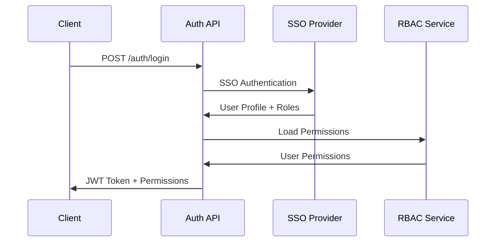
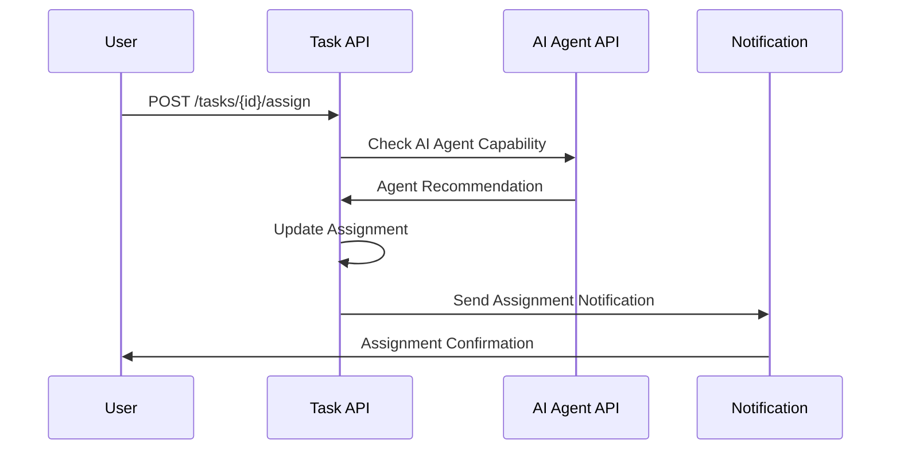
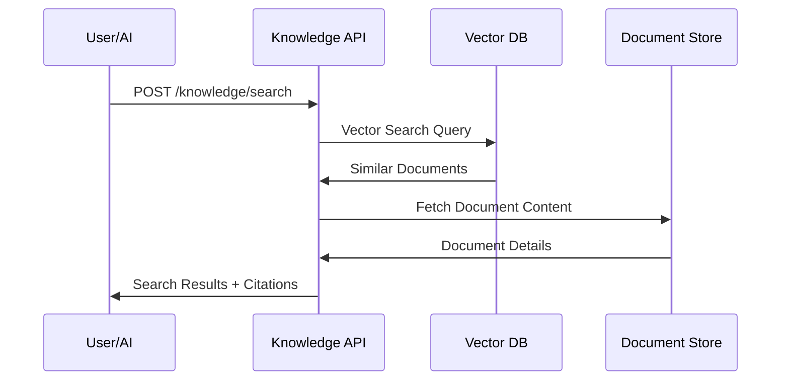
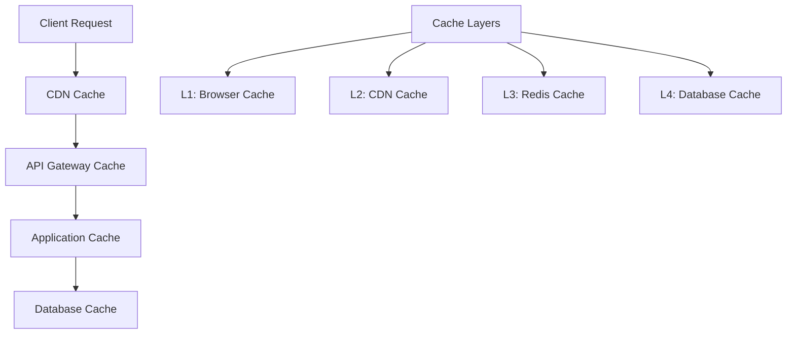
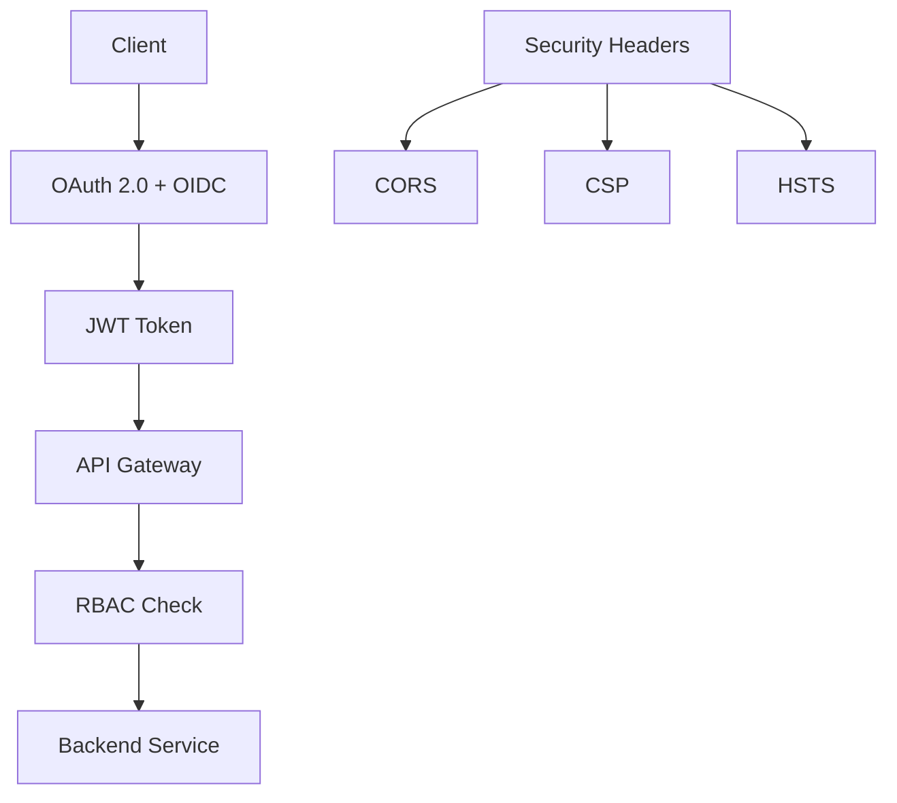
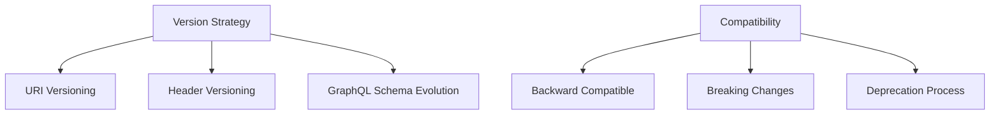

# API一覧

## 📋 文書情報

| 項目       | 内容                                                  |
| ---------- | ----------------------------------------------------- |
| **文書名** | ソロプレナー／AIネイティブ企業基盤システム（API一覧） |
| **版数**   | 1.0                                                   |
| **作成日** | 2025-09-07                                            |
| **更新日** | 2025-09-07                                            |
| **作成者** | システム開発チーム                                    |

> **注意**: 詳細なAPI仕様は `036020_openapi.yaml` をSingle Source of Truth（SoT）として参照してください。

---

## 🎯 1. API設計概要

本システムは、人間とAIエージェントの協調作業を支援する統合基盤として、以下のAPI群を提供します：

```mermaid
graph TD
    subgraph "🌐 API Gateway"
        AUTH[Authentication API]
        RATE[Rate Limiting]
        ROUTE[Routing]
    end
    
    subgraph "📋 Core Business APIs"
        PROJ[Project Management API]
        TASK[Task Management API]
        WF[Workflow API]
        APPR[Approval API]
    end
    
    subgraph "🤖 AI Integration APIs"
        AGENT[AI Agent API]
        EXEC[Execution API]
        KB[Knowledge Base API]
        SEARCH[Search API]
    end
    
    subgraph "🔗 External Integration APIs"
        REDMINE[Redmine Integration API]
        DATABRICKS[Databricks Integration API]
        VSCODE[VS Code Integration API]
    end
    
    subgraph "🔍 Monitoring & Audit APIs"
        AUDIT[Audit API]
        METRICS[Metrics API]
        HEALTH[Health Check API]
    end
    
    AUTH --> PROJ
    AUTH --> AGENT
    AUTH --> REDMINE
    AUTH --> AUDIT
```



### 1.1 API設計原則

| 原則                  | 詳細                             | 実装方針          |
| --------------------- | -------------------------------- | ----------------- |
| **🔌 RESTful Design**  | HTTP標準メソッド、リソース指向   | OpenAPI 3.0準拠   |
| **📊 GraphQL Support** | 柔軟なクエリ、型安全性           | Apollo Server実装 |
| **🔐 Security First**  | 認証・認可必須、HTTPS強制        | OAuth 2.0 + RBAC  |
| **⚡ Performance**     | キャッシュ対応、ページネーション | Redis + CDN       |
| **📋 Consistency**     | 統一エラーフォーマット、命名規則 | API Style Guide   |

---

## 🔐 2. Authentication & Authorization APIs

### 2.1 認証・認可関連

| メソッド | パス                | サマリ           | 認可          | バージョン | 備考             |
| -------- | ------------------- | ---------------- | ------------- | ---------- | ---------------- |
| POST     | `/auth/login`       | ログイン         | public        | v1         | SSO統合対応      |
| POST     | `/auth/logout`      | ログアウト       | authenticated | v1         | セッション無効化 |
| POST     | `/auth/refresh`     | トークン更新     | authenticated | v1         | JWT Refresh      |
| GET      | `/auth/profile`     | プロファイル取得 | authenticated | v1         | ユーザー情報     |
| PUT      | `/auth/profile`     | プロファイル更新 | authenticated | v1         | 個人情報変更     |
| GET      | `/auth/permissions` | 権限一覧取得     | authenticated | v1         | RBAC権限確認     |



### 2.2 ユーザー・組織管理

| メソッド | パス                  | サマリ       | 認可       | バージョン | 備考                 |
| -------- | --------------------- | ------------ | ---------- | ---------- | -------------------- |
| GET      | `/users`              | ユーザー一覧 | admin      | v1         | ページネーション対応 |
| GET      | `/users/{id}`         | ユーザー詳細 | user:read  | v1         | 個人情報マスキング   |
| POST     | `/users`              | ユーザー作成 | admin      | v1         | 招待メール送信       |
| PUT      | `/users/{id}`         | ユーザー更新 | user:write | v1         | 自分または管理者     |
| DELETE   | `/users/{id}`         | ユーザー削除 | admin      | v1         | ソフトデリート       |
| GET      | `/organizations/{id}` | 組織情報取得 | member     | v1         | 組織メンバーのみ     |

---

## 📋 3. Project Management APIs

### 3.1 プロジェクト管理

| メソッド | パス                          | サマリ           | 認可           | バージョン | 備考                   |
| -------- | ----------------------------- | ---------------- | -------------- | ---------- | ---------------------- |
| GET      | `/projects`                   | プロジェクト一覧 | project:read   | v1         | フィルター・ソート対応 |
| GET      | `/projects/{id}`              | プロジェクト詳細 | project:read   | v1         | 進捗・統計情報含む     |
| POST     | `/projects`                   | プロジェクト作成 | project:create | v1         | WBS自動生成            |
| PUT      | `/projects/{id}`              | プロジェクト更新 | project:write  | v1         | 変更履歴記録           |
| DELETE   | `/projects/{id}`              | プロジェクト削除 | project:delete | v1         | アーカイブ処理         |
| GET      | `/projects/{id}/progress`     | 進捗情報取得     | project:read   | v1         | リアルタイム計算       |
| POST     | `/projects/{id}/generate-wbs` | WBS生成          | project:write  | v1         | AI支援機能             |

### 3.2 タスク管理

| メソッド | パス                          | サマリ         | 認可         | バージョン | 備考               |
| -------- | ----------------------------- | -------------- | ------------ | ---------- | ------------------ |
| GET      | `/projects/{projectId}/tasks` | タスク一覧     | task:read    | v1         | 階層構造対応       |
| GET      | `/tasks/{id}`                 | タスク詳細     | task:read    | v1         | 依存関係・履歴含む |
| POST     | `/projects/{projectId}/tasks` | タスク作成     | task:create  | v1         | 自動担当者提案     |
| PUT      | `/tasks/{id}`                 | タスク更新     | task:write   | v1         | 状態変更通知       |
| DELETE   | `/tasks/{id}`                 | タスク削除     | task:delete  | v1         | 依存関係チェック   |
| POST     | `/tasks/{id}/assign`          | タスク割り当て | task:assign  | v1         | 人間・AI選択可能   |
| POST     | `/tasks/{id}/complete`        | タスク完了     | task:execute | v1         | 成果物添付可能     |



---

## 🤖 4. AI Integration APIs

### 4.1 AIエージェント管理

| メソッド | パス                           | サマリ               | 認可         | バージョン | 備考                 |
| -------- | ------------------------------ | -------------------- | ------------ | ---------- | -------------------- |
| GET      | `/ai/agents`                   | エージェント一覧     | ai:read      | v1         | 能力・状態フィルター |
| GET      | `/ai/agents/{id}`              | エージェント詳細     | ai:read      | v1         | 性能メトリクス含む   |
| POST     | `/ai/agents`                   | エージェント作成     | ai:admin     | v1         | 設定テンプレート     |
| PUT      | `/ai/agents/{id}`              | エージェント設定更新 | ai:configure | v1         | バージョン管理       |
| POST     | `/ai/agents/{id}/activate`     | エージェント有効化   | ai:manage    | v1         | ヘルスチェック実行   |
| POST     | `/ai/agents/{id}/deactivate`   | エージェント無効化   | ai:manage    | v1         | 実行中タスク処理     |
| GET      | `/ai/agents/{id}/capabilities` | 能力一覧取得         | ai:read      | v1         | 動的能力更新         |

### 4.2 AI実行・タスク処理

| メソッド | パス                          | サマリ       | 認可           | バージョン | 備考                 |
| -------- | ----------------------------- | ------------ | -------------- | ---------- | -------------------- |
| POST     | `/ai/execute`                 | AI実行要求   | ai:execute     | v1         | 非同期処理           |
| GET      | `/ai/executions`              | 実行履歴一覧 | ai:read        | v1         | 状態・期間フィルター |
| GET      | `/ai/executions/{id}`         | 実行詳細     | ai:read        | v1         | ログ・結果・引用     |
| POST     | `/ai/executions/{id}/approve` | 実行承認     | approval:grant | v1         | HITL承認             |
| POST     | `/ai/executions/{id}/reject`  | 実行拒否     | approval:grant | v1         | 理由記録必須         |
| POST     | `/ai/executions/{id}/retry`   | 実行再試行   | ai:execute     | v1         | 設定調整可能         |
| GET      | `/ai/executions/{id}/results` | 実行結果取得 | ai:read        | v1         | 引用・根拠付き       |

### 4.3 ナレッジ・検索

| メソッド | パス                        | サマリ             | 認可            | バージョン | 備考                 |
| -------- | --------------------------- | ------------------ | --------------- | ---------- | -------------------- |
| POST     | `/knowledge/search`         | ナレッジ検索       | knowledge:read  | v1         | ベクトル検索対応     |
| GET      | `/knowledge/documents`      | 文書一覧           | knowledge:read  | v1         | メタデータ検索       |
| GET      | `/knowledge/documents/{id}` | 文書詳細           | knowledge:read  | v1         | 引用追跡可能         |
| POST     | `/knowledge/documents`      | 文書登録           | knowledge:write | v1         | 自動ベクトル化       |
| PUT      | `/knowledge/documents/{id}` | 文書更新           | knowledge:write | v1         | バージョン管理       |
| POST     | `/knowledge/index/rebuild`  | インデックス再構築 | knowledge:admin | v1         | バックグラウンド実行 |
| GET      | `/knowledge/citations`      | 引用一覧           | knowledge:read  | v1         | 使用状況追跡         |



---

## 🔄 5. Workflow & Approval APIs

### 5.1 ワークフロー管理

| メソッド | パス                     | サマリ               | 認可             | バージョン | 備考             |
| -------- | ------------------------ | -------------------- | ---------------- | ---------- | ---------------- |
| GET      | `/workflows`             | ワークフロー一覧     | workflow:read    | v1         | テンプレート含む |
| GET      | `/workflows/{id}`        | ワークフロー詳細     | workflow:read    | v1         | 実行状況・統計   |
| POST     | `/workflows`             | ワークフロー作成     | workflow:create  | v1         | テンプレート活用 |
| PUT      | `/workflows/{id}`        | ワークフロー更新     | workflow:write   | v1         | バージョン管理   |
| POST     | `/workflows/{id}/start`  | ワークフロー開始     | workflow:execute | v1         | パラメータ設定   |
| POST     | `/workflows/{id}/pause`  | ワークフロー一時停止 | workflow:control | v1         | 状態保存         |
| POST     | `/workflows/{id}/resume` | ワークフロー再開     | workflow:control | v1         | 状態復元         |
| GET      | `/workflows/{id}/status` | 実行状況取得         | workflow:read    | v1         | リアルタイム更新 |

### 5.2 承認プロセス

| メソッド | パス                       | サマリ       | 認可              | バージョン | 備考             |
| -------- | -------------------------- | ------------ | ----------------- | ---------- | ---------------- |
| GET      | `/approvals`               | 承認待ち一覧 | approval:read     | v1         | 担当者フィルター |
| GET      | `/approvals/{id}`          | 承認詳細     | approval:read     | v1         | 関連情報・履歴   |
| POST     | `/approvals/{id}/approve`  | 承認実行     | approval:grant    | v1         | コメント必須     |
| POST     | `/approvals/{id}/reject`   | 承認拒否     | approval:grant    | v1         | 理由必須         |
| POST     | `/approvals/{id}/delegate` | 承認委譲     | approval:delegate | v1         | 委譲先指定       |
| GET      | `/approvals/history`       | 承認履歴     | approval:read     | v1         | 監査ログ連携     |
| POST     | `/approvals/bulk-approve`  | 一括承認     | approval:bulk     | v1         | 権限チェック強化 |

---

## 🔗 6. External Integration APIs

### 6.1 Redmine統合

| メソッド | パス                                 | サマリ                  | 認可              | バージョン | 備考               |
| -------- | ------------------------------------ | ----------------------- | ----------------- | ---------- | ------------------ |
| GET      | `/integrations/redmine/projects`     | Redmineプロジェクト同期 | integration:read  | v1         | 差分同期対応       |
| POST     | `/integrations/redmine/tickets`      | チケット作成            | integration:write | v1         | 自動項目マッピング |
| PUT      | `/integrations/redmine/tickets/{id}` | チケット更新            | integration:write | v1         | 双方向同期         |
| GET      | `/integrations/redmine/sync-status`  | 同期状況確認            | integration:read  | v1         | エラー詳細表示     |
| POST     | `/integrations/redmine/sync`         | 手動同期実行            | integration:admin | v1         | 全体・部分選択可   |

### 6.2 Databricks統合

| メソッド | パス                                 | サマリ             | 認可               | バージョン | 備考             |
| -------- | ------------------------------------ | ------------------ | ------------------ | ---------- | ---------------- |
| POST     | `/integrations/databricks/jobs`      | ジョブ実行         | databricks:execute | v1         | 非同期処理       |
| GET      | `/integrations/databricks/jobs/{id}` | ジョブ状況確認     | databricks:read    | v1         | ログ・メトリクス |
| POST     | `/integrations/databricks/query`     | SQLクエリ実行      | databricks:query   | v1         | 結果キャッシュ   |
| GET      | `/integrations/databricks/datasets`  | データセット一覧   | databricks:read    | v1         | メタデータ含む   |
| POST     | `/integrations/databricks/upload`    | データアップロード | databricks:write   | v1         | 大容量対応       |

### 6.3 VS Code統合

| メソッド | パス                                 | サマリ             | 認可           | バージョン | 備考                   |
| -------- | ------------------------------------ | ------------------ | -------------- | ---------- | ---------------------- |
| GET      | `/integrations/vscode/workspace`     | ワークスペース情報 | vscode:read    | v1         | プロジェクト連携       |
| POST     | `/integrations/vscode/notifications` | 通知送信           | vscode:notify  | v1         | リアルタイム配信       |
| GET      | `/integrations/vscode/extensions`    | 拡張機能一覧       | vscode:read    | v1         | バージョン管理         |
| POST     | `/integrations/vscode/commands`      | コマンド実行       | vscode:execute | v1         | セキュリティ制限       |
| GET      | `/integrations/vscode/settings`      | 設定取得           | vscode:read    | v1         | ユーザー・プロジェクト |

---

## 🔍 7. Monitoring & Audit APIs

### 7.1 監査・ログ

| メソッド | パス                | サマリ               | 認可             | バージョン | 備考             |
| -------- | ------------------- | -------------------- | ---------------- | ---------- | ---------------- |
| GET      | `/audit/logs`       | 監査ログ一覧         | audit:read       | v1         | 高性能検索対応   |
| GET      | `/audit/logs/{id}`  | 監査ログ詳細         | audit:read       | v1         | 関連イベント表示 |
| POST     | `/audit/search`     | 監査ログ検索         | audit:read       | v1         | 複合条件対応     |
| GET      | `/audit/reports`    | 監査レポート一覧     | audit:report     | v1         | 定期レポート含む |
| POST     | `/audit/reports`    | 監査レポート生成     | audit:report     | v1         | カスタム期間対応 |
| GET      | `/audit/compliance` | コンプライアンス状況 | audit:compliance | v1         | リアルタイム評価 |

### 7.2 メトリクス・監視

| メソッド | パス                      | サマリ             | 認可             | バージョン | 備考                |
| -------- | ------------------------- | ------------------ | ---------------- | ---------- | ------------------- |
| GET      | `/metrics/system`         | システムメトリクス | metrics:read     | v1         | Prometheus形式      |
| GET      | `/metrics/business`       | ビジネスメトリクス | metrics:business | v1         | KPI・ダッシュボード |
| GET      | `/metrics/ai-performance` | AI性能メトリクス   | metrics:ai       | v1         | 精度・速度・コスト  |
| GET      | `/health`                 | ヘルスチェック     | public           | v1         | 依存サービス含む    |
| GET      | `/health/deep`            | 詳細ヘルスチェック | admin            | v1         | 全コンポーネント    |
| GET      | `/status`                 | サービス状況       | public           | v1         | ステータスページ用  |

---

## 📊 8. GraphQL API

### 8.1 統合クエリインターフェース

```graphql
type Query {
  # プロジェクト関連
  project(id: ID!): Project
  projects(filter: ProjectFilter, sort: ProjectSort, pagination: Pagination): ProjectConnection
  
  # タスク関連
  task(id: ID!): Task
  tasks(filter: TaskFilter, sort: TaskSort, pagination: Pagination): TaskConnection
  
  # AIエージェント関連
  aiAgent(id: ID!): AIAgent
  aiAgents(filter: AIAgentFilter): [AIAgent]
  aiExecution(id: ID!): AIExecution
  
  # ナレッジ検索
  searchKnowledge(query: String!, filters: KnowledgeFilter): KnowledgeSearchResult
  
  # 監査・ログ
  auditLogs(filter: AuditLogFilter, pagination: Pagination): AuditLogConnection
}

type Mutation {
  # プロジェクト操作
  createProject(input: CreateProjectInput!): ProjectPayload
  updateProject(id: ID!, input: UpdateProjectInput!): ProjectPayload
  
  # タスク操作
  createTask(input: CreateTaskInput!): TaskPayload
  assignTask(taskId: ID!, assigneeId: ID!): TaskPayload
  
  # AI操作
  executeAITask(input: AIExecutionInput!): AIExecutionPayload
  approveAIExecution(executionId: ID!, comment: String): ApprovalPayload
  
  # ワークフロー操作
  startWorkflow(workflowId: ID!, parameters: JSON): WorkflowExecutionPayload
}

type Subscription {
  # リアルタイム更新
  projectUpdated(projectId: ID!): Project
  taskStatusChanged(taskId: ID!): Task
  aiExecutionCompleted(executionId: ID!): AIExecution
  approvalRequested(userId: ID!): Approval
}
```

### 8.2 GraphQLスキーマ設計方針

| 設計要素         | 方針                           | 実装技術                   |
| ---------------- | ------------------------------ | -------------------------- |
| **型安全性**     | 強い型定義、スキーマファースト | Apollo Server + TypeScript |
| **性能最適化**   | DataLoader、クエリ複雑度制限   | Apollo Federation          |
| **認可制御**     | フィールドレベル認可           | GraphQL Shield             |
| **リアルタイム** | Subscription活用               | WebSocket + Redis          |

---

## ⚡ 9. API性能・制限

### 9.1 レート制限

| API カテゴリ  | 制限   | 期間  | 対象        |
| ------------- | ------ | ----- | ----------- |
| **認証API**   | 10回   | 1分   | IP アドレス |
| **一般API**   | 1000回 | 1時間 | ユーザー    |
| **AI実行API** | 100回  | 1時間 | ユーザー    |
| **検索API**   | 500回  | 1時間 | ユーザー    |
| **管理API**   | 50回   | 1時間 | 管理者      |

### 9.2 性能目標

| 指標               | 目標値     | 測定方法   | 対応策               |
| ------------------ | ---------- | ---------- | -------------------- |
| **レスポンス時間** | p95 ≤ 1.5s | APM監視    | キャッシュ、DB最適化 |
| **スループット**   | 1000 RPS   | 負荷テスト | 水平スケール         |
| **可用性**         | 99.5%      | SLA監視    | 冗長化、自動復旧     |
| **エラー率**       | < 1%       | ログ分析   | 回路ブレーカー       |

### 9.3 キャッシュ戦略



| キャッシュレイヤー | TTL    | 対象データ         | 無効化戦略          |
| ------------------ | ------ | ------------------ | ------------------- |
| **CDN**            | 24時間 | 静的リソース       | バージョン更新時    |
| **API Gateway**    | 5分    | 参照系API          | タグベース無効化    |
| **Application**    | 30分   | ユーザー情報、権限 | イベントドリブン    |
| **Database**       | 1時間  | マスターデータ     | 手動 + スケジュール |

---

## 🔒 10. API セキュリティ

### 10.1 認証・認可方式



| セキュリティ要素 | 実装方式            | 詳細                |
| ---------------- | ------------------- | ------------------- |
| **認証**         | OAuth 2.0 + OIDC    | SSO統合、MFA対応    |
| **認可**         | RBAC + ABAC         | ロール・属性ベース  |
| **トークン**     | JWT (RS256)         | 短期 + リフレッシュ |
| **通信**         | TLS 1.3             | 全通信暗号化        |
| **API保護**      | WAF + Rate Limiting | DDoS対策            |

### 10.2 セキュリティヘッダー

| ヘッダー                      | 設定値                                | 目的                     |
| ----------------------------- | ------------------------------------- | ------------------------ |
| **Strict-Transport-Security** | max-age=31536000; includeSubDomains   | HTTPS強制                |
| **Content-Security-Policy**   | default-src 'self'; script-src 'self' | XSS対策                  |
| **X-Frame-Options**           | DENY                                  | クリックジャッキング対策 |
| **X-Content-Type-Options**    | nosniff                               | MIME型推測防止           |
| **Referrer-Policy**           | strict-origin-when-cross-origin       | 情報漏洩防止             |

---

## 📋 11. API文書化・テスト

### 11.1 OpenAPI仕様

```yaml
# 036020_openapi.yaml の抜粋例
openapi: 3.0.3
info:
  title: AgentOps Platform API
  version: 1.0.0
  description: ソロプレナー／AIネイティブ企業基盤システム API
  
security:
  - OAuth2: []
  - BearerAuth: []

paths:
  /projects:
    get:
      summary: プロジェクト一覧取得
      operationId: listProjects
      parameters:
        - name: status
          in: query
          schema:
            type: string
            enum: [PLANNING, ACTIVE, COMPLETED]
      responses:
        '200':
          description: プロジェクト一覧
          content:
            application/json:
              schema:
                $ref: '#/components/schemas/ProjectList'
```

### 11.2 API テスト戦略

| テストレベル         | 対象               | ツール              | 自動化レベル |
| -------------------- | ------------------ | ------------------- | ------------ |
| **Unit Test**        | 個別エンドポイント | Jest, Supertest     | 100%         |
| **Integration Test** | サービス間連携     | Postman, Newman     | 90%          |
| **Contract Test**    | API仕様準拠        | Pact, Dredd         | 100%         |
| **E2E Test**         | ユーザーシナリオ   | Cypress, Playwright | 70%          |
| **Load Test**        | 性能・負荷         | k6, Artillery       | 自動化       |
| **Security Test**    | 脆弱性検査         | OWASP ZAP           | 自動化       |

---

## 🔄 12. API バージョニング・進化

### 12.1 バージョニング戦略



| バージョニング方式           | 適用範囲   | 例                                             | 備考               |
| ---------------------------- | ---------- | ---------------------------------------------- | ------------------ |
| **URI Versioning**           | REST API   | `/v1/projects`, `/v2/projects`                 | メジャーバージョン |
| **Header Versioning**        | 細かい変更 | `Accept: application/vnd.api+json;version=1.1` | マイナーバージョン |
| **GraphQL Schema Evolution** | GraphQL    | フィールド追加・非推奨化                       | 下位互換性重視     |

### 12.2 廃止プロセス

| 段階                 | 期間       | アクション              | 通知方法           |
| -------------------- | ---------- | ----------------------- | ------------------ |
| **非推奨宣言**       | リリース時 | Deprecationヘッダー追加 | API文書、メール    |
| **警告期間**         | 6ヶ月      | Warning ヘッダー追加    | ダッシュボード表示 |
| **サポート終了予告** | 3ヶ月前    | エラーレスポンス予告    | 強制通知           |
| **完全廃止**         | 予告日     | 404エラー返却           | サポート終了       |

---

## 📚 関連文書

### 📖 上位文書
- [企画書](../../010000_企画/011000_企画書.md)
- [要件定義書](../../020000_要件定義/021000_要件定義書.md)
- [設計方針](../031000_設計方針/031010_設計方針.md)

### 📋 関連設計文書
- [全体構成](../033000_アーキテクチャ/033010_全体構成.md)
- [ドメインモデル](../034000_アプリケーション設計/034010_ドメインモデル.md)
- [データ設計](../035000_データ設計/035020_テーブル定義書.md)

### 🔧 実装関連文書
- [OpenAPI仕様](036020_openapi.yaml) - **Single Source of Truth**
- [セキュリティ・運用設計](../039000_セキュリティ・運用設計/039010_セキュリティ・運用設計.md)

---

## 📅 更新履歴

| 日時       | 担当               | 変更概要                      |
| ---------- | ------------------ | ----------------------------- |
| 2025-09-07 | システム開発チーム | 初版作成、統合基盤API設計完了 |

