# 非機能設計

## 📋 文書情報

| 項目       | 内容                                                     |
| ---------- | -------------------------------------------------------- |
| **文書名** | ソロプレナー／AIネイティブ企業基盤システム（非機能設計） |
| **版数**   | 1.0                                                      |
| **作成日** | 2025-09-07                                               |
| **更新日** | 2025-09-07                                               |
| **作成者** | システム開発チーム                                       |

---

## 🎯 1. 非機能設計概要

本設計は、要件定義書で定義された非機能要件を実現するための具体的な技術方式・アーキテクチャパターン・運用方針を定義します。

### 1.1 非機能要件マップ

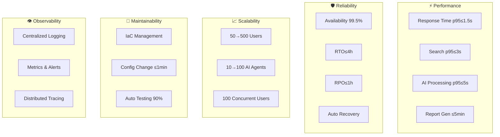

### 1.2 設計アプローチ

| 品質特性       | 設計アプローチ                 | 主要技術・パターン          | 測定指標                         |
| -------------- | ------------------------------ | --------------------------- | -------------------------------- |
| **⚡ 性能**     | 多層キャッシュ、非同期処理     | Redis Cluster, Event Driven | Response Time, Throughput        |
| **🛡️ 可用性**   | 冗長化、自動復旧               | Multi-AZ, Auto Scaling      | Uptime, MTTR                     |
| **📈 拡張性**   | 水平スケール、マイクロサービス | Kubernetes, Load Balancer   | Concurrent Users, Resource Usage |
| **🔧 保守性**   | Infrastructure as Code         | Terraform, GitOps           | Deployment Frequency, Lead Time  |
| **👁️ 可観測性** | 統合監視、分散トレーシング     | Prometheus, Jaeger          | MTTD, Alert Response             |

---

## ⚡ 2. 性能設計

### 2.1 応答時間要件実現

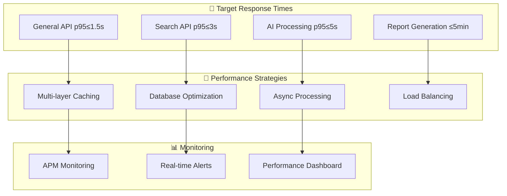

#### 2.1.1 キャッシュ戦略

| キャッシュ層             | 技術実装          | TTL    | 対象データ         | ヒット率目標 |
| ------------------------ | ----------------- | ------ | ------------------ | ------------ |
| **L1: アプリケーション** | In-Memory Cache   | 5分    | セッション、設定   | 90%          |
| **L2: 分散キャッシュ**   | Redis Cluster     | 30分   | ユーザー情報、権限 | 85%          |
| **L3: データベース**     | PostgreSQL Buffer | 1時間  | 参照マスター       | 95%          |
| **L4: CDN**              | CloudFront        | 24時間 | 静的リソース       | 98%          |

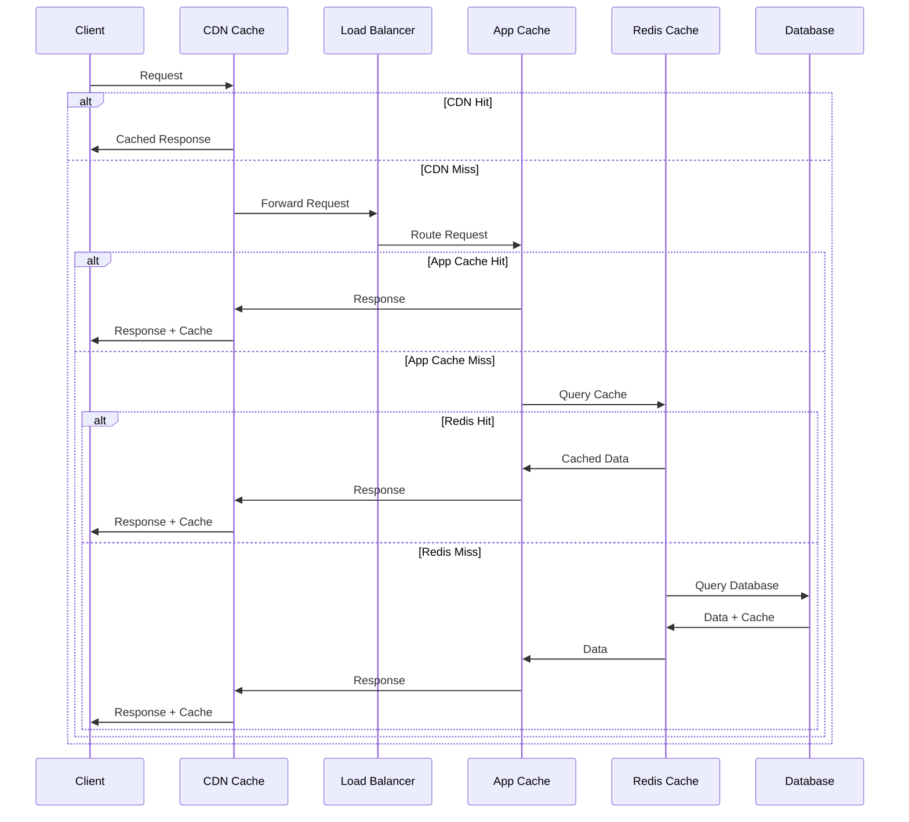

#### 2.1.2 データベース性能最適化

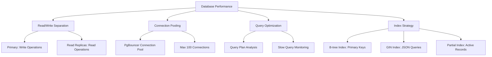

| 最適化要素                 | 実装方針                  | 性能改善目標              | 監視指標             |
| -------------------------- | ------------------------- | ------------------------- | -------------------- |
| **読み書き分離**           | Primary + 3 Read Replicas | 読み取り性能3倍向上       | Read/Write QPS       |
| **コネクションプーリング** | PgBouncer                 | 接続オーバーヘッド50%削減 | Connection Count     |
| **クエリ最適化**           | EXPLAIN Plan分析          | スロークエリ80%削減       | Query Execution Time |
| **インデックス戦略**       | 自動化 + 定期最適化       | 検索性能5倍向上           | Index Hit Rate       |

#### 2.1.3 AI処理性能最適化

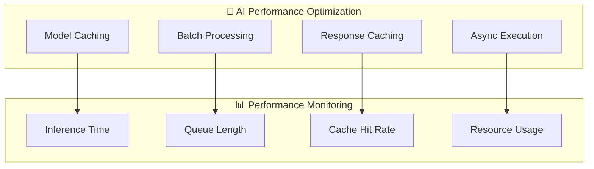

| 最適化手法               | 実装技術                  | 性能改善            | 適用範囲       |
| ------------------------ | ------------------------- | ------------------- | -------------- |
| **モデルキャッシュ**     | GPU Memory Caching        | 初期化時間90%削減   | 頻繁実行モデル |
| **レスポンスキャッシュ** | Redis + Vector Similarity | 類似クエリ95%高速化 | 検索・質問応答 |
| **バッチ処理**           | Databricks Jobs           | スループット5倍向上 | 大量データ処理 |
| **非同期実行**           | Celery + Redis            | UI応答性向上        | 長時間処理     |

### 2.2 スループット要件実現

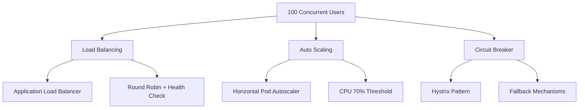

| 要素               | 設定値                           | 監視指標             | 自動アクション             |
| ------------------ | -------------------------------- | -------------------- | -------------------------- |
| **負荷分散**       | 3+インスタンス、Health Check 30s | Request Distribution | Unhealthy Instance Removal |
| **オートスケール** | CPU 70%で2倍、最大10インスタンス | CPU/Memory Usage     | Pod Scale Out/In           |
| **回路ブレーカー** | 5秒で5回失敗時Open               | Error Rate           | Fallback Mode              |
| **レート制限**     | 1000 req/hour/user               | API Call Rate        | Throttling                 |

---

## 🛡️ 3. 可用性・信頼性設計

### 3.1 高可用性アーキテクチャ

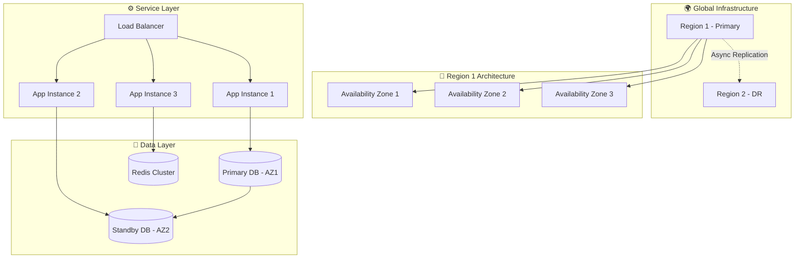

#### 3.1.1 可用性目標と実現方式

| 目標                 | 実現方式                            | 技術実装                      | 検証方法           |
| -------------------- | ----------------------------------- | ----------------------------- | ------------------ |
| **99.5% 月間稼働率** | Multi-AZ配置 + 自動フェイルオーバー | AWS ELB + RDS Multi-AZ        | Monthly SLA Report |
| **RTO ≤ 4時間**      | 自動復旧 + 手動エスカレーション     | Auto Scaling + Runbook        | DR訓練             |
| **RPO ≤ 1時間**      | 継続バックアップ + レプリケーション | WAL-E + Streaming Replication | 復旧テスト         |
| **単一障害点排除**   | 全コンポーネント冗長化              | Kubernetes + StatefulSet      | Chaos Engineering  |

#### 3.1.2 自動復旧メカニズム

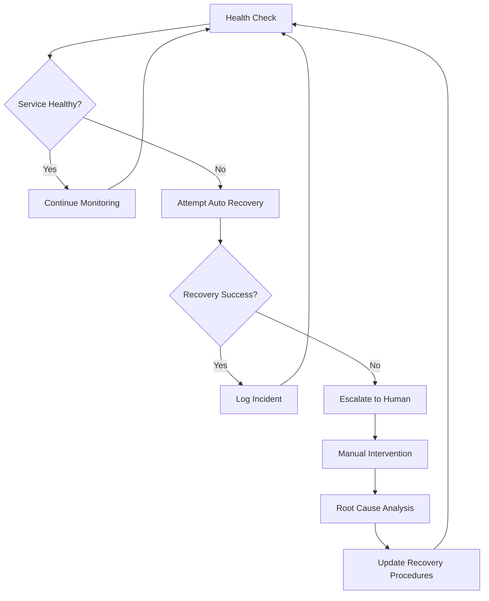

| 障害タイプ               | 検知時間 | 自動復旧時間 | 手動復旧時間 | 復旧手順                       |
| ------------------------ | -------- | ------------ | ------------ | ------------------------------ |
| **アプリケーション障害** | 30秒     | 2分          | 15分         | Pod Restart + Traffic Reroute  |
| **データベース障害**     | 1分      | 5分          | 30分         | Failover to Standby            |
| **ネットワーク障害**     | 1分      | N/A          | 1時間        | Route Change + Manual Check    |
| **インフラ障害**         | 2分      | 10分         | 4時間        | Auto Scaling + Region Failover |

### 3.2 災害復旧設計

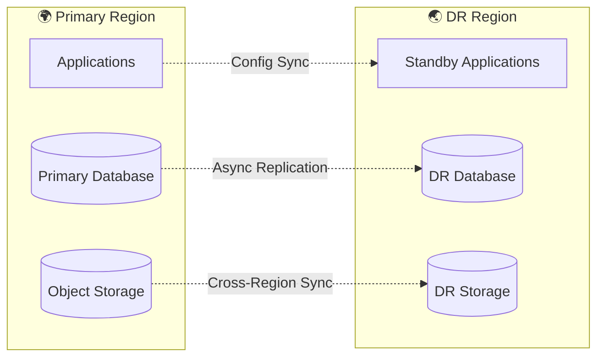

| DR要素                 | 実装方式                   | 同期頻度     | 切り替え時間 |
| ---------------------- | -------------------------- | ------------ | ------------ |
| **アプリケーション**   | IaC + Container Registry   | 毎デプロイ   | 15分         |
| **データベース**       | Streaming Replication      | リアルタイム | 5分          |
| **ファイルストレージ** | Cross-Region Replication   | 15分         | 30分         |
| **設定・シークレット** | Git Sync + Encrypted Store | 毎変更       | 5分          |

---

## 📈 4. 拡張性設計

### 4.1 水平スケーリング戦略

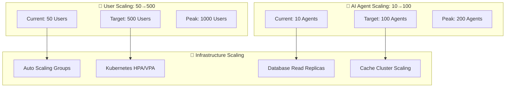

#### 4.1.1 スケーリング設定

| リソース                | 現在構成           | 目標構成           | 最大構成            | スケーリング条件      |
| ----------------------- | ------------------ | ------------------ | ------------------- | --------------------- |
| **Webアプリケーション** | 2インスタンス      | 10インスタンス     | 20インスタンス      | CPU 70% or Memory 80% |
| **API Gateway**         | 3インスタンス      | 15インスタンス     | 30インスタンス      | RPS 1000/instance     |
| **AIエージェント**      | 5ワーカー          | 50ワーカー         | 100ワーカー         | Queue Length > 10     |
| **データベース**        | 1 Primary + 2 Read | 1 Primary + 5 Read | 1 Primary + 10 Read | Read Load > 70%       |
| **Redis Cluster**       | 3ノード            | 9ノード            | 15ノード            | Memory Usage > 80%    |

#### 4.1.2 マイクロサービス分離戦略

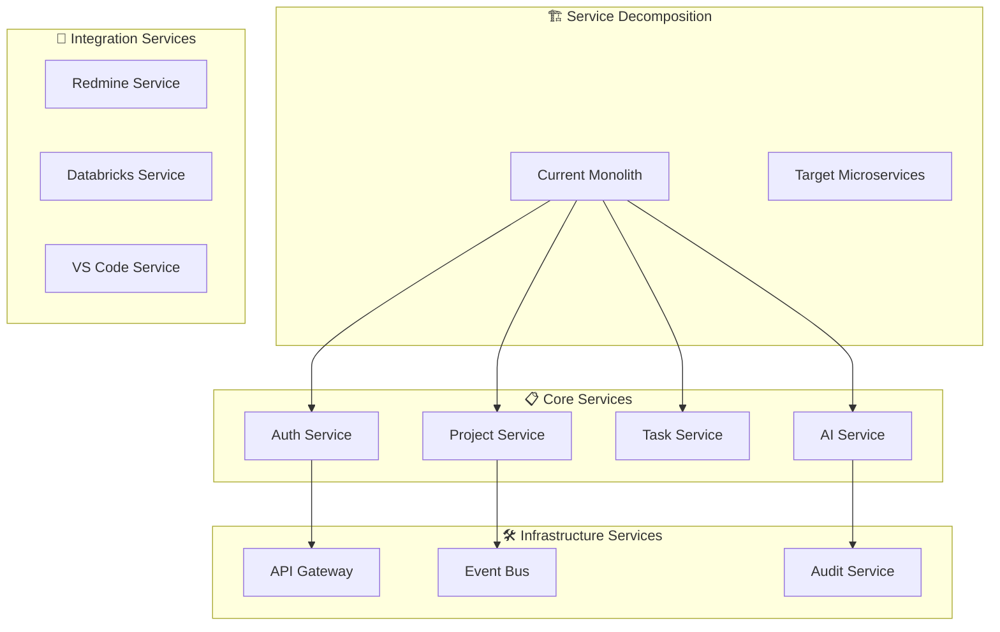

| サービス             | 分離レベル | データベース分離 | 独立デプロイ | 負荷特性           |
| -------------------- | ---------- | ---------------- | ------------ | ------------------ |
| **認証サービス**     | 高         | 専用DB           | 可能         | 低負荷・高可用性   |
| **プロジェクト管理** | 中         | 専用DB           | 可能         | 中負荷・一般的     |
| **AI実行サービス**   | 高         | 専用DB           | 可能         | 高負荷・スパイキー |
| **外部統合**         | 低         | 共有DB           | 制限あり     | 低負荷・バッチ処理 |

### 4.2 性能拡張パターン

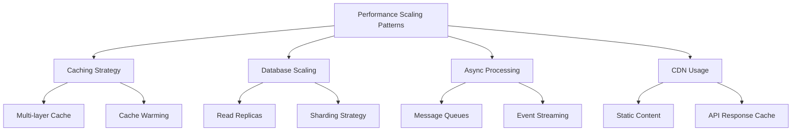

| パターン             | 実装技術                    | 適用タイミング   | 性能改善              |
| -------------------- | --------------------------- | ---------------- | --------------------- |
| **キャッシュ階層化** | Redis Cluster + Local Cache | 50ユーザー時点   | レスポンス時間50%改善 |
| **DB読み取り分散**   | PostgreSQL Read Replicas    | 100ユーザー時点  | 読み取り性能3倍       |
| **非同期処理**       | Celery + RabbitMQ           | AI負荷増加時     | UI応答性90%改善       |
| **CDN活用**          | CloudFront + S3             | グローバル展開時 | 配信速度60%改善       |

---

## 🔧 5. 保守性・運用性設計

### 5.1 Infrastructure as Code

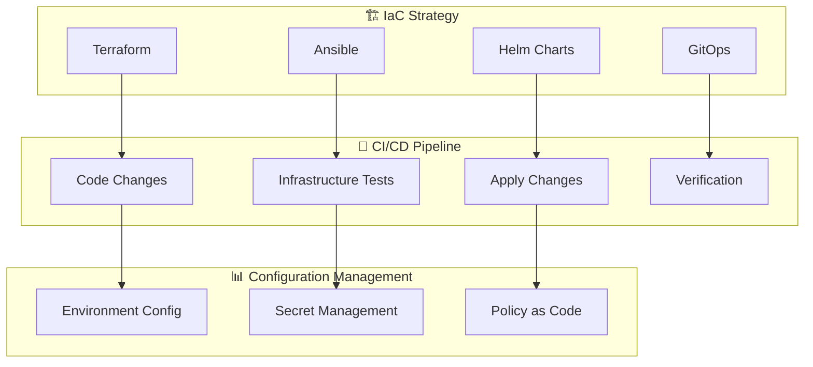

#### 5.1.1 IaC実装戦略

| 要素                 | 技術選択        | 管理範囲                      | 自動化レベル |
| -------------------- | --------------- | ----------------------------- | ------------ |
| **インフラ定義**     | Terraform       | VPC, Subnets, Security Groups | 100%         |
| **サーバー構成**     | Ansible         | OS設定, ミドルウェア          | 95%          |
| **アプリケーション** | Helm Charts     | K8s Manifests, ConfigMaps     | 100%         |
| **設定管理**         | GitOps (ArgoCD) | アプリケーション設定          | 90%          |

#### 5.1.2 設定変更の即時反映

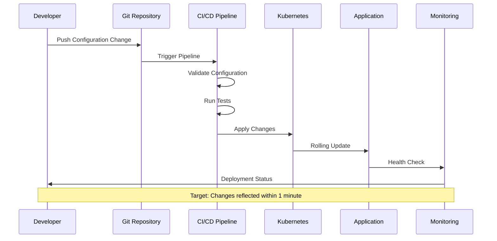

| 設定種別                 | 変更方法      | 反映時間 | 検証方法             |
| ------------------------ | ------------- | -------- | -------------------- |
| **アプリケーション設定** | ConfigMap更新 | 30秒     | Health Check         |
| **環境変数**             | Secret更新    | 45秒     | Integration Test     |
| **スケーリング設定**     | HPA更新       | 15秒     | Metrics Verification |
| **ルーティング設定**     | Ingress更新   | 1分      | Endpoint Test        |

### 5.2 監視・可観測性

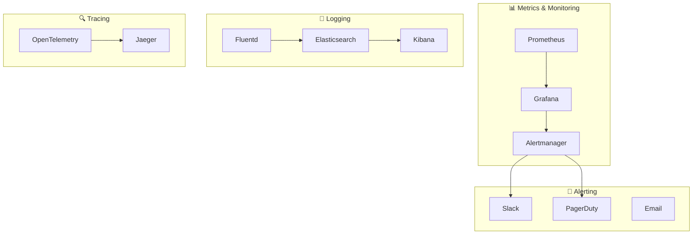

#### 5.2.1 監視項目とアラート設定

| 監視カテゴリ         | 監視項目       | 警告閾値 | 重大閾値 | 対応時間 |
| -------------------- | -------------- | -------- | -------- | -------- |
| **インフラ**         | CPU使用率      | 70%      | 90%      | 5分      |
| **インフラ**         | メモリ使用率   | 80%      | 95%      | 5分      |
| **アプリケーション** | エラー率       | 1%       | 5%       | 即座     |
| **アプリケーション** | レスポンス時間 | p95 > 2s | p95 > 5s | 5分      |
| **データベース**     | 接続数         | 80%      | 95%      | 10分     |
| **AI**               | 実行キュー長   | 50       | 100      | 15分     |

#### 5.2.2 ログ管理戦略

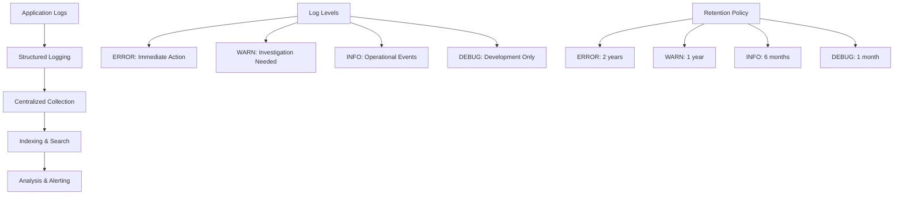

| ログ種別                 | フォーマット    | 収集方法 | 保持期間 | 用途             |
| ------------------------ | --------------- | -------- | -------- | ---------------- |
| **アプリケーションログ** | JSON構造化      | Fluentd  | 6ヶ月    | デバッグ・分析   |
| **アクセスログ**         | Apache Combined | Nginx    | 3ヶ月    | 性能分析         |
| **監査ログ**             | Custom JSON     | 直接送信 | 3年      | コンプライアンス |
| **エラーログ**           | Stack Trace付き | Sentry   | 2年      | 障害対応         |

---

## 👁️ 6. 可観測性設計

### 6.1 分散トレーシング

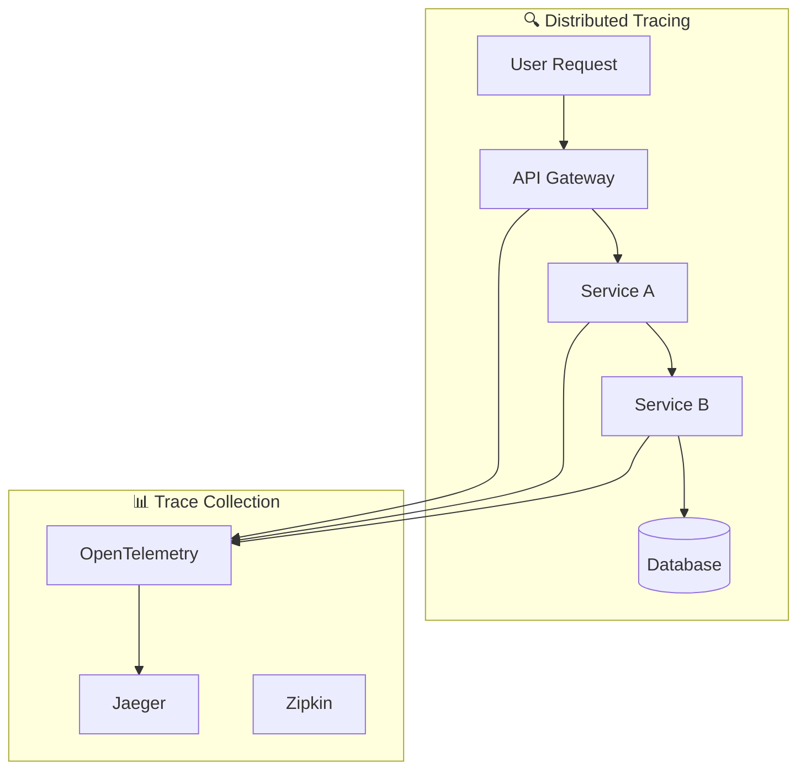

#### 6.1.1 トレーシング実装

| 要素           | 実装技術         | 設定        | サンプリング率         |
| -------------- | ---------------- | ----------- | ---------------------- |
| **計装**       | OpenTelemetry    | 自動 + 手動 | 1% (本番), 100% (開発) |
| **収集**       | Jaeger Collector | gRPC        | -                      |
| **ストレージ** | Elasticsearch    | 7日保持     | -                      |
| **可視化**     | Jaeger UI        | Web UI      | -                      |

### 6.2 メトリクス設計

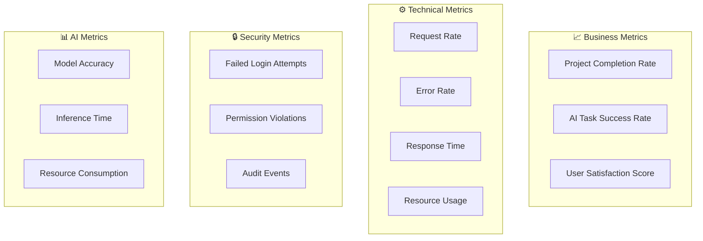

#### 6.2.1 メトリクス定義

| メトリクス種別   | 指標名         | 単位  | 目標値     | ダッシュボード |
| ---------------- | -------------- | ----- | ---------- | -------------- |
| **SLI/SLO**      | API可用性      | %     | 99.5%      | リアルタイム   |
| **SLI/SLO**      | レスポンス時間 | ms    | p95<1500ms | リアルタイム   |
| **ビジネス**     | タスク完了率   | %     | 95%        | 日次           |
| **AI**           | 推論成功率     | %     | 90%        | リアルタイム   |
| **セキュリティ** | 異常アクセス   | 件/日 | <10件      | リアルタイム   |

---

## 🔄 7. 回復性設計

### 7.1 障害対応パターン

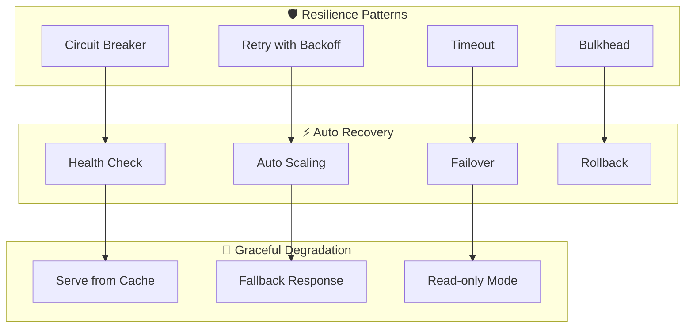

#### 7.1.1 回復性パターン実装

| パターン           | 実装技術             | 設定値           | 適用範囲         |
| ------------------ | -------------------- | ---------------- | ---------------- |
| **回路ブレーカー** | Hystrix/Resilience4j | 5秒で5回失敗     | 外部API呼び出し  |
| **リトライ**       | Exponential Backoff  | 最大3回、2秒間隔 | 一時的障害       |
| **タイムアウト**   | HTTP Client          | 30秒             | 全外部通信       |
| **バルクヘッド**   | Thread Pool分離      | コア数×2         | 重要・非重要処理 |

### 7.2 自動復旧メカニズム

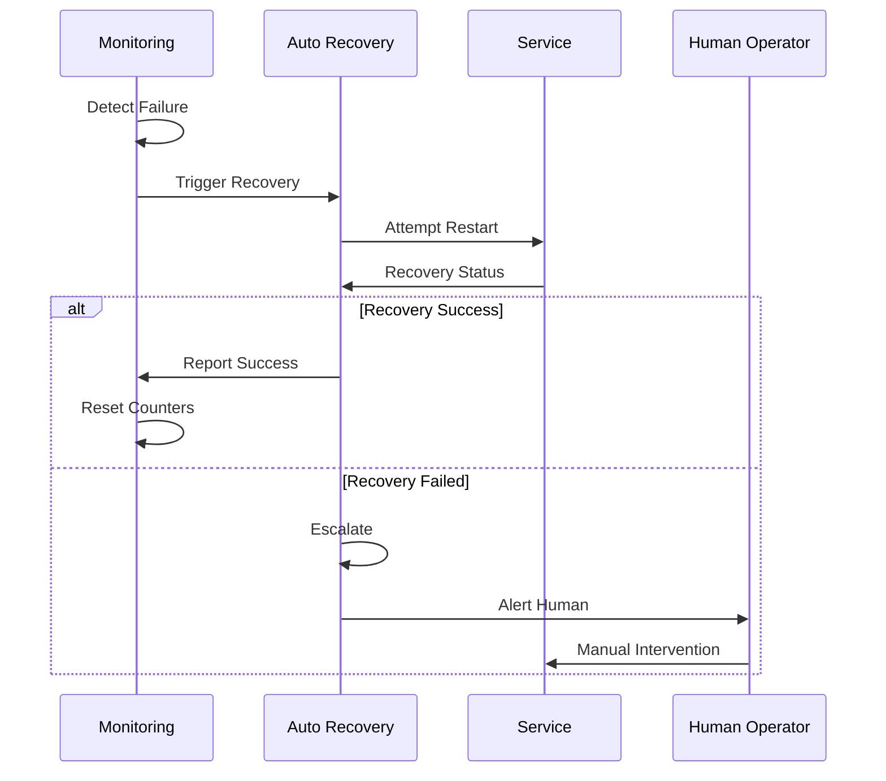

| 障害レベル | 検知時間 | 自動復旧       | 手動エスカレーション | 最大復旧時間 |
| ---------- | -------- | -------------- | -------------------- | ------------ |
| **軽微**   | 30秒     | Pod再起動      | 3回失敗後            | 5分          |
| **中程度** | 1分      | サービス再起動 | 2回失敗後            | 15分         |
| **重大**   | 2分      | ノード交換     | 1回失敗後            | 1時間        |
| **致命的** | 即座     | 手動のみ       | 即座                 | 4時間        |

---

## 🎯 8. 性能テスト・検証

### 8.1 性能テスト戦略

```mermaid
graph TD
    subgraph "🧪 Load Testing"
        NORMAL[Normal Load Test]
        PEAK[Peak Load Test]
        STRESS[Stress Test]
        SPIKE[Spike Test]
    end
    
    subgraph "📊 Test Scenarios"
        USER[User Scenarios]
        API[API Load]
        AI[AI Processing]
        BATCH[Batch Jobs]
    end
    
    subgraph "🎯 Success Criteria"
        RT[Response Time]
        TP[Throughput]
        ERR[Error Rate]
        RES[Resource Usage]
    end
    
    NORMAL --> USER
    PEAK --> API
    STRESS --> AI
    SPIKE --> BATCH
    
    USER --> RT
    API --> TP
    AI --> ERR
    BATCH --> RES
```

#### 8.1.1 テストシナリオ

| テスト種別     | 負荷パターン      | 期間  | 成功基準           | 実行頻度 |
| -------------- | ----------------- | ----- | ------------------ | -------- |
| **通常負荷**   | 50ユーザー×8時間  | 8時間 | 全要件満足         | 毎週     |
| **ピーク負荷** | 200ユーザー×2時間 | 2時間 | レスポンス時間+50% | 毎月     |
| **ストレス**   | 500ユーザー×30分  | 30分  | エラー率<5%        | 毎月     |
| **スパイク**   | 0→200→0ユーザー   | 15分  | 自動復旧確認       | 毎月     |

### 8.2 継続的性能監視

```mermaid
graph TD
    A[Continuous Performance Monitoring] --> B[Real-time Metrics]
    A --> C[Automated Alerts]
    A --> D[Performance Regression]
    A --> E[Capacity Planning]
    
    B --> B1[Response Time Tracking]
    B --> B2[Throughput Monitoring]
    
    C --> C1[SLA Violation Alerts]
    C --> C2[Anomaly Detection]
    
    D --> D1[Pre/Post Deployment Comparison]
    D --> D2[Historical Trend Analysis]
    
    E --> E1[Resource Utilization Forecasting]
    E --> E2[Scaling Decision Support]
```

| 監視要素           | 測定間隔 | アラート条件  | ダッシュボード更新 |
| ------------------ | -------- | ------------- | ------------------ |
| **API応答時間**    | 1分      | p95 > 2秒     | リアルタイム       |
| **スループット**   | 1分      | < 目標値の80% | リアルタイム       |
| **エラー率**       | 30秒     | > 1%          | リアルタイム       |
| **リソース使用率** | 30秒     | > 80%         | リアルタイム       |

---

## 📚 関連文書

### 📖 上位文書
- [企画書](../../010000_企画/011000_企画書.md)
- [要件定義書](../../020000_要件定義/021000_要件定義書.md)
- [設計方針](../031000_設計方針/031010_設計方針.md)

### 📋 関連設計文書
- [全体構成](../033000_アーキテクチャ/033010_全体構成.md)
- [ランタイム構成](../033000_アーキテクチャ/033020_ランタイム構成.md)
- [インフラ設計](../033000_アーキテクチャ/033030_インフラ設計.md)

### 🔧 実装関連文書
- [API設計](../036000_API設計/036010_API一覧.md)
- [セキュリティ・運用設計](../039000_セキュリティ・運用設計/039010_セキュリティ・運用設計.md)

---

## 📅 更新履歴

| 日時       | 担当               | 変更概要                           |
| ---------- | ------------------ | ---------------------------------- |
| 2025-09-07 | システム開発チーム | 初版作成、非機能要件の詳細設計完了 |