# セキュリティ・運用設計

## 📋 文書情報

| 項目       | 内容                                                                 |
| ---------- | -------------------------------------------------------------------- |
| **文書名** | ソロプレナー／AIネイティブ企業基盤システム（セキュリティ・運用設計） |
| **版数**   | 1.0                                                                  |
| **作成日** | 2025-09-07                                                           |
| **更新日** | 2025-09-07                                                           |
| **作成者** | システム開発チーム                                                   |

---

## 🎯 1. セキュリティ・運用設計概要

本設計は、人間とAIエージェントが協調する統合基盤において、セキュリティ要件を満たしつつ、効率的な運用を実現するための設計を定義します。

### 1.1 セキュリティ設計原則


| 原則               | 実装方針                           | 適用範囲                 | 検証方法               |
| ------------------ | ---------------------------------- | ------------------------ | ---------------------- |
| **🔒 Zero Trust**   | 全アクセスを認証・認可で制御       | 全ユーザー・AI・システム | 定期アクセスレビュー   |
| **🛡️ 多層防御**     | 複数のセキュリティ制御を組み合わせ | 全システム層             | ペネトレーションテスト |
| **👤 最小権限**     | 必要最小限の権限のみ付与           | 全アクセス権限           | 権限監査               |
| **🤫 プライバシー** | 個人情報の自動保護                 | 全データ処理             | プライバシー影響評価   |

---

## 🔐 2. 認証・認可設計

### 2.1 認証アーキテクチャ

```mermaid
graph TD
    subgraph "🌐 External Identity"
        SSO[SSO Provider]
        LDAP[LDAP/AD]
        SOCIAL[Social Login]
        MFA[MFA Provider]
    end
    
    subgraph "👤 Users & Agents"
        HUMAN[Human Users]
        AI[AI Agents]
        SYS[System Services]
        EXT[External Systems]
    end
    
    subgraph "🔑 Identity & Access Management"
        IDP[Identity Provider]
        TOKEN[Token Service]
        AUTHZ[Authorization Service]
        POLICY[Policy Engine]
    end
    
    SSO --> IDP
    LDAP --> IDP
    SOCIAL --> IDP
    MFA --> IDP
    
    HUMAN --> IDP
    AI --> TOKEN
    SYS --> TOKEN
    EXT --> AUTHZ
    
    IDP --> TOKEN
    TOKEN --> AUTHZ
    POLICY --> AUTHZ
    
    subgraph "🎯 Protected Resources"
        API[APIs]
        DATA[Databases]
        FILES[File Storage]
        ADMIN[Admin Console]
    end
    
    AUTHZ --> API
    AUTHZ --> DATA
    AUTHZ --> FILES
    AUTHZ --> ADMIN
```



#### 2.1.1 認証方式

| ユーザー種別         | 認証方式        | 多要素認証 | トークン有効期限 | 更新方式        |
| -------------------- | --------------- | ---------- | ---------------- | --------------- |
| **人間ユーザー**     | SSO (OIDC)      | 必須       | 8時間            | Refresh Token   |
| **AIエージェント**   | Service Account | 証明書     | 24時間           | Auto Rotation   |
| **システムサービス** | mTLS            | 証明書     | 1時間            | Auto Rotation   |
| **外部システム**     | API Key + OAuth | N/A        | 1年              | Manual Rotation |

#### 2.1.2 認可モデル（RBAC + ABAC）


| ロール              | 権限概要         | 対象リソース     | 制約条件             |
| ------------------- | ---------------- | ---------------- | -------------------- |
| **Admin**           | 全システム管理   | 全リソース       | 人間のみ、MFA必須    |
| **Project Manager** | プロジェクト管理 | 担当プロジェクト | 業務時間内           |
| **Developer**       | 開発・実行       | 開発リソース     | プロジェクトメンバー |
| **AI Agent**        | 自動実行         | 許可されたタスク | 承認フロー経由       |
| **Viewer**          | 読み取り専用     | 参照権限のみ     | データマスキング     |

### 2.2 API セキュリティ


#### 2.2.1 API セキュリティ制御

| セキュリティ制御 | 実装技術             | 設定値             | 監視項目         |
| ---------------- | -------------------- | ------------------ | ---------------- |
| **WAF**          | AWS WAF/CloudFlare   | OWASP Top 10 Rules | 攻撃ブロック数   |
| **レート制限**   | Kong/AWS API Gateway | 1000 req/hour/user | API呼び出し率    |
| **IP制限**       | Security Groups      | Office + VPN IPs   | 不正アクセス試行 |
| **TLS終端**      | Load Balancer        | TLS 1.3 only       | SSL/TLS違反      |

---

## 🔒 3. データ保護設計

### 3.1 データ分類・保護


#### 3.1.1 データ分類基準

| 分類             | 定義           | 例                       | 保護要件               |
| ---------------- | -------------- | ------------------------ | ---------------------- |
| **Public**       | 公開可能な情報 | サービス仕様、FAQ        | アクセス制御           |
| **Internal**     | 内部利用情報   | プロジェクト情報、タスク | 認証必須               |
| **Confidential** | 機密情報       | 顧客情報、財務データ     | 暗号化 + マスキング    |
| **Secret**       | 極秘情報       | 認証情報、暗号鍵         | HSM + 厳格アクセス制御 |

#### 3.1.2 暗号化実装


| 暗号化対象             | アルゴリズム | 鍵管理              | ローテーション |
| ---------------------- | ------------ | ------------------- | -------------- |
| **データベース**       | AES-256-GCM  | AWS KMS             | 年1回          |
| **ファイルストレージ** | AES-256-GCM  | AWS KMS             | 年1回          |
| **バックアップ**       | AES-256-CBC  | AWS KMS             | 年1回          |
| **通信**               | TLS 1.3      | Certificate Manager | 90日           |

### 3.2 個人情報保護（PII Protection）


#### 3.2.1 PII保護実装

| PII種別            | 検出方法       | 保護方式           | アクセス制御           |
| ------------------ | -------------- | ------------------ | ---------------------- |
| **氏名**           | 正規表現 + NLP | 動的マスキング     | 業務必要性に基づく     |
| **メールアドレス** | 正規表現       | ハッシュ化         | ログでは部分マスキング |
| **電話番号**       | 正規表現       | 暗号化             | 管理者のみ             |
| **IPアドレス**     | パターンマッチ | 最終オクテット除去 | 匿名化ログ             |

---

## 🚨 4. 脅威検知・対応

### 4.1 セキュリティ監視アーキテクチャ


#### 4.1.1 脅威検知ルール

| 脅威タイプ               | 検知ロジック           | 対応レベル | 自動対応         |
| ------------------------ | ---------------------- | ---------- | ---------------- |
| **ブルートフォース攻撃** | 5分以内に10回失敗      | 高         | IP一時ブロック   |
| **異常ログイン**         | 通常外時間・場所       | 中         | MFA要求          |
| **権限昇格試行**         | 許可外リソースアクセス | 高         | セッション終了   |
| **データ大量アクセス**   | 通常の10倍以上         | 中         | レート制限       |
| **AIエージェント異常**   | 予期外動作パターン     | 中         | エージェント停止 |

### 4.2 インシデント対応プロセス


#### 4.2.1 インシデント分類・対応時間

| 重要度       | 定義                           | 対応時間 | 対応チーム         | エスカレーション |
| ------------ | ------------------------------ | -------- | ------------------ | ---------------- |
| **Critical** | システム停止、データ漏洩       | 15分     | CSIRT + CTO        | CEO              |
| **High**     | 重要機能影響、セキュリティ侵害 | 1時間    | CSIRT              | CTO              |
| **Medium**   | 部分機能影響、潜在脅威         | 4時間    | セキュリティチーム | CSO              |
| **Low**      | 軽微影響、予防的対応           | 24時間   | 運用チーム         | なし             |

---

## 🔍 5. 監査・コンプライアンス

### 5.1 監査ログアーキテクチャ


#### 5.1.1 監査ログ要件

| ログ種別           | 記録項目                           | 保持期間 | 改ざん防止         | アクセス制御  |
| ------------------ | ---------------------------------- | -------- | ------------------ | ------------- |
| **認証ログ**       | ユーザー、時刻、IP、結果           | 3年      | デジタル署名       | Admin のみ    |
| **操作ログ**       | ユーザー、操作、リソース、結果     | 3年      | ハッシュチェーン   | Auditor 以上  |
| **AIログ**         | エージェント、タスク、入出力、承認 | 3年      | ブロックチェーン   | AI Admin 以上 |
| **データアクセス** | ユーザー、データ、時刻、用途       | 7年      | Write-Once Storage | DPO のみ      |

#### 5.1.2 改ざん防止機構


### 5.2 コンプライアンス管理


#### 5.2.1 主要コンプライアンス要件

| 規制          | 主要要件                     | 実装方法              | 監査頻度   |
| ------------- | ---------------------------- | --------------------- | ---------- |
| **GDPR**      | データ主体の権利、データ保護 | PII自動保護、同意管理 | 年1回      |
| **ISO 27001** | 情報セキュリティ管理         | ISMS構築、リスク管理  | 年1回      |
| **SOX**       | 内部統制、財務報告           | 監査ログ、変更管理    | 四半期     |
| **業界固有**  | 業界特有のセキュリティ要件   | カスタマイズ対応      | 規制による |

---

## 🏃‍♂️ 6. 運用管理設計

### 6.1 DevOps・CI/CD セキュリティ


#### 6.1.1 セキュアCI/CD実装

| フェーズ     | セキュリティ制御             | ツール                       | 品質ゲート           |
| ------------ | ---------------------------- | ---------------------------- | -------------------- |
| **開発**     | SAST、コードレビュー         | SonarQube、CodeQL            | 重大脆弱性 0         |
| **ビルド**   | 依存性スキャン               | Snyk、OWASP Dependency Check | 高リスク脆弱性 0     |
| **テスト**   | DAST、ペネトレーションテスト | OWASP ZAP、Burp Suite        | クリティカル脆弱性 0 |
| **デプロイ** | コンテナスキャン、設定検証   | Trivy、Falco                 | セキュリティ設定準拠 |

### 6.2 インフラセキュリティ運用


#### 6.2.1 セキュリティ運用タスク

| 運用項目                   | 実行頻度           | 自動化レベル | 責任者   |
| -------------------------- | ------------------ | ------------ | -------- |
| **脆弱性スキャン**         | 日次               | 100%         | SecOps   |
| **設定監査**               | 週次               | 90%          | DevOps   |
| **パッチ適用**             | 月次（緊急時即座） | 70%          | SRE      |
| **ペネトレーションテスト** | 四半期             | 0%           | 外部業者 |
| **セキュリティ訓練**       | 半年               | 30%          | CISO     |

---

## 🔄 7. バックアップ・災害復旧

### 7.1 バックアップ戦略


#### 7.1.1 バックアップ要件

| データ種別             | バックアップ頻度   | 保持期間 | 暗号化  | テスト頻度 |
| ---------------------- | ------------------ | -------- | ------- | ---------- |
| **データベース**       | 日次フル、時間増分 | 3年      | AES-256 | 月次       |
| **ファイルストレージ** | 日次               | 1年      | AES-256 | 月次       |
| **設定・コード**       | 変更時             | 永続     | なし    | 週次       |
| **監査ログ**           | リアルタイム       | 7年      | AES-256 | 四半期     |

### 7.2 災害復旧計画


#### 7.2.1 災害復旧手順

| 災害種別           | 検知時間 | 意思決定時間 | 復旧開始時間 | 完全復旧時間 |
| ------------------ | -------- | ------------ | ------------ | ------------ |
| **サイト障害**     | 5分      | 15分         | 30分         | 2時間        |
| **リージョン障害** | 10分     | 30分         | 1時間        | 4時間        |
| **サイバー攻撃**   | 15分     | 1時間        | 2時間        | 8時間        |
| **人的ミス**       | 30分     | 15分         | 30分         | 1時間        |

---

## 📊 8. セキュリティメトリクス・KPI

### 8.1 セキュリティダッシュボード


#### 8.1.1 主要セキュリティKPI

| KPI                        | 目標値             | 測定方法              | 報告頻度     |
| -------------------------- | ------------------ | --------------------- | ------------ |
| **MTTD (平均検知時間)**    | ≤ 5分              | SIEM Analytics        | リアルタイム |
| **MTTR (平均対応時間)**    | ≤ 30分             | Incident Tracking     | 日次         |
| **脆弱性修正率**           | 95% within 30 days | Vulnerability Scanner | 週次         |
| **コンプライアンス準拠率** | 100%               | Compliance Scanner    | 月次         |
| **セキュリティ訓練完了率** | 100%               | LMS                   | 四半期       |

### 8.2 セキュリティレポーティング


#### 8.2.1 レポート配信計画

| レポート種別                     | 対象者       | 頻度         | 配信方法          | 自動化レベル |
| -------------------------------- | ------------ | ------------ | ----------------- | ------------ |
| **エグゼクティブダッシュボード** | CxO          | リアルタイム | Web Dashboard     | 100%         |
| **セキュリティサマリー**         | CISO, CSO    | 週次         | Email + Dashboard | 90%          |
| **インシデントレポート**         | SecOps Team  | 即時         | Slack + Email     | 100%         |
| **コンプライアンスレポート**     | Legal, Audit | 月次         | PDF + Dashboard   | 80%          |

---

## 🎓 9. セキュリティ教育・啓発

### 9.1 セキュリティ教育プログラム


#### 9.1.1 教育プログラム詳細

| 対象者       | 必須コース                           | 頻度  | 完了率目標 | 評価方法         |
| ------------ | ------------------------------------ | ----- | ---------- | ---------------- |
| **全従業員** | セキュリティ基礎、フィッシング対策   | 年1回 | 100%       | オンラインテスト |
| **開発者**   | セキュアコーディング、脅威モデリング | 年2回 | 100%       | コードレビュー   |
| **AI運用者** | AI セキュリティ、バイアス対策        | 年2回 | 100%       | 実技試験         |
| **管理者**   | インシデント対応、コンプライアンス   | 年4回 | 100%       | シミュレーション |

### 9.2 セキュリティ文化醸成

```mermaid
graph TD
    A[Security Culture] --> B[Leadership Commitment]
    A --> C[Employee Engagement]
    A --> D[Continuous Learning]
    A --> E[Shared Responsibility]
    
    B --> B1[Executive Sponsorship]
    B --> B2[Resource Allocation]
    
    C --> C1[Security Champions]
    C --> C2[Feedback Mechanisms]
    
    D --> D1[Regular Training]
    D --> D2[Knowledge Sharing]
    
    E --> E1[Security by Design]
    E --> E2[Everyone is Responsible]
```

---

## 📚 関連文書

### 📖 上位文書
- [企画書](../../010000_企画/011000_企画書.md)
- [要件定義書](../../020000_要件定義/021000_要件定義書.md)
- [設計方針](../031000_設計方針/031010_設計方針.md)

### 📋 関連設計文書
- [全体構成](../033000_アーキテクチャ/033010_全体構成.md)
- [ドメインモデル](../034000_アプリケーション設計/034010_ドメインモデル.md)
- [API設計](../036000_API設計/036010_API一覧.md)
- [非機能設計](../038000_非機能設計/038010_非機能設計.md)

### 🔧 実装関連文書
- [データ設計](../035000_データ設計/035020_テーブル定義書.md)
- [インフラ設計](../033000_アーキテクチャ/033030_インフラ設計.md)

### 📋 運用関連文書
- インシデント対応手順書
- 災害復旧手順書
- セキュリティポリシー
- コンプライアンスチェックリスト

---

## 📅 更新履歴

| 日時       | 担当               | 変更概要                             |
| ---------- | ------------------ | ------------------------------------ |
| 2025-09-07 | システム開発チーム | 初版作成、セキュリティ・運用設計完了 |