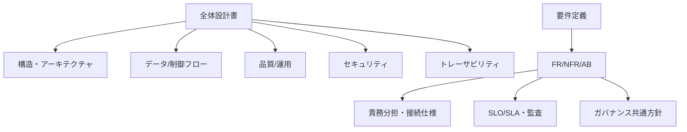
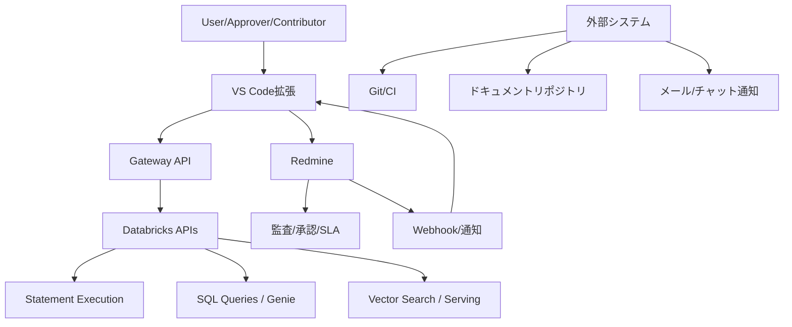
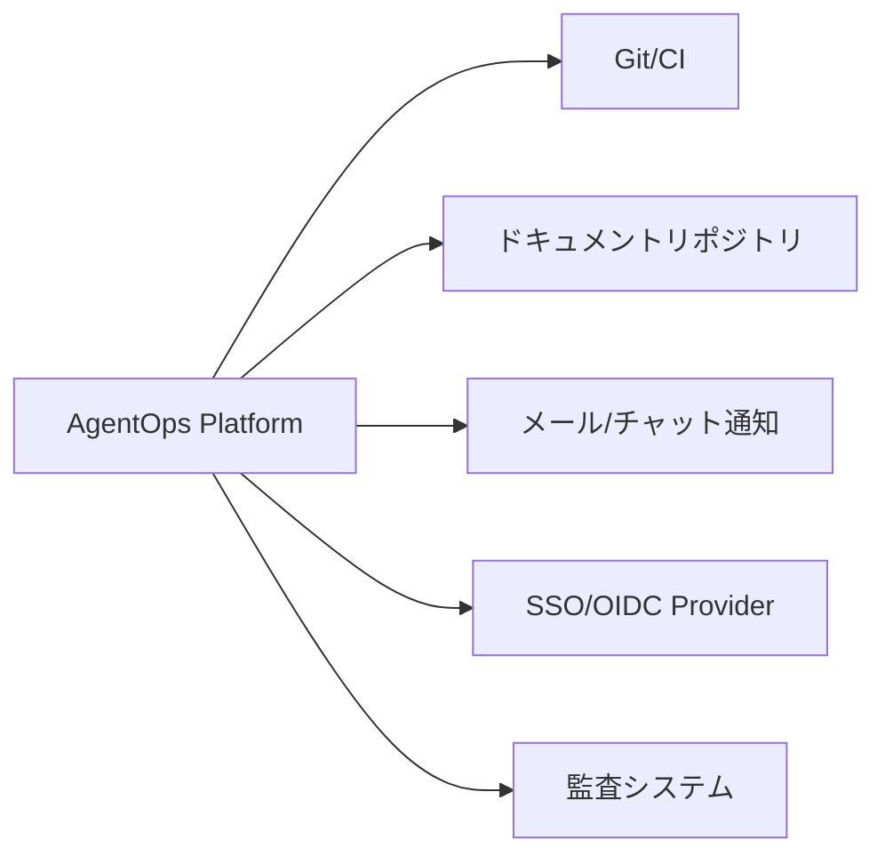
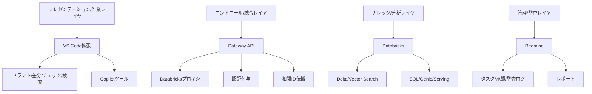
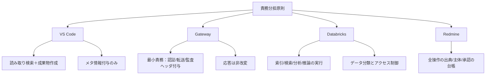

# 全体設計書: ソロプレナー／AIネイティブ企業基盤

---

## 📋 文書情報

| 項目       | 内容                                             |
| ---------- | ------------------------------------------------ |
| **文書名** | 全体設計書（ソロプレナー／AIネイティブ企業基盤） |
| **版数**   | 0.1（ドラフト）                                  |
| **作成日** | 2025-09-07                                       |
| **更新日** | 2025-09-07                                       |
| **作成者** | システム開発チーム                               |

### 📚 参照資料

| 資料名                                      | 版数  | 日付       |
| ------------------------------------------- | ----- | ---------- |
| docs/01000_企画/01100_企画書.md             | v1.1  | 2025-09-07 |
| docs/02000_要件定義/02100_要件定義書.md     | v0.10 | 2025-09-07 |
| docs/03000_設計/03100_VSCode拡張機能設計.md | v0.1  | 2025-09-07 |
| docs/03000_設計/03200_Databricks設計.md     | v0.1  | 2025-09-07 |
| docs/03000_設計/03300_Redmine設計.md        | v0.1  | 2025-09-07 |

---

## 🎯 1. 目的/スコープ

### 📖 設計目的

本書は、VS Code拡張・Databricks・Redmineを統合したAIネイティブ運営基盤の全体像を定義します。



### 🎯 設計スコープ

| 対象範囲           | 詳細                                    |
| ------------------ | --------------------------------------- |
| **アーキテクチャ** | アプリケーション・環境/ネットワーク構成 |
| **セキュリティ**   | 認証・認可・監査・可観測性              |
| **品質**           | 性能・運用・SLO/SLA定義                 |

| 範囲外       | 委譲先                    |
| ------------ | ------------------------- |
| **詳細実装** | 03100/03200/03300各設計書 |

---

## 🌐 2. システムコンテキスト

### 🏗️ システム俯瞰図



### 👥 主要アクター

| アクター           | 役割                 | 主な操作                                   |
| ------------------ | -------------------- | ------------------------------------------ |
| **経営者/承認者**  | 🎯 戦略決定・最終承認 | ビジョン設定、重要決定の承認               |
| **作業者**         | 💻 実務執行・レビュー | タスク実行、コード作成、レビュー           |
| **AIエージェント** | 🤖 自動実行・提案作成 | 情報収集、分析、提案作成                   |
| **システム管理者** | 🔧 運用・監査         | システム設定、監査、トラブルシューティング |

### 🔌 外部/周辺システム



---

## 🏛️ 3. 論理アーキテクチャ

### 📚 レイヤー構成



### 🎯 責務分担の原則



| コンポーネント | 主要責務                                        | 制約事項                           |
| -------------- | ----------------------------------------------- | ---------------------------------- |
| **VS Code**    | 📖 読み取り検索＋成果物作成、メタ情報付与        | データ源の改変は行わない（FR-026） |
| **Gateway**    | 🔄 認証/転送/監査ヘッダ付与                      | 応答は非改変（FR-041）             |
| **Databricks** | 🧠 索引/検索/分析/推論、データ分類・アクセス制御 | FR-009〜011, NFR-013               |
| **Redmine**    | 📋 全操作の出典/主体/承認の台帳                  | FR-003/015/017/020                 |

---

## 4. コンポーネント概要

### 4.1 VS Code拡張（要約）
- 機能: タスク連携、ドラフト/差分、品質チェック、Copilotツール検索
- 設定: `gateway.baseUrl`、`allowedTools[]`、`rateLimit`、`cache.ttlSec`、`masking.*`（詳細は03100）
- 監査: すべての操作に `X-Correlation-Id` を付与（NFR-010）

### 4.2 Gateway API（社内）
- 役割: Databricks APIへの1:1プロキシ（FR-039〜041）
- 代表エンドポイント: `/kb/search`, `/kb/sql-query`, `/kb/genie`, `/kb/serve`
- ポリシー: 認証付与、リクエスト/レスポンス透過、PIIマスキングフラグ伝播（FR-032）

### 4.3 Databricks
- データ: `kb.documents` / `kb.chunks` / `kb.queries_log`（Delta）
- 検索: Vector Search インデックス `vx_documents_v1`
- 実行: Statement Execution（ハイブリッド, EXTERNAL_LINKS）, SQL Queries, Genie, Serving

### 4.4 Redmine
- 項目: `Correlation-Id`, `Actor`, `Sources`, `Risk Level`, `Data Class`（必須）
- ワークフロー: `New → In Review → Waiting Approval → Approved → Done → Archived / Rework`（FR-002/007）

---

## 5. インテグレーション

### 5.1 API/イベント
- VS Code → Gateway: REST（Bearer, PKCE/OIDC）, `X-Correlation-Id`必須
- VS Code → Redmine: REST（API Key/OIDC委任）、添付/コメント/メタ登録
- Redmine → VS Code: Webhook（`issue_updated`）
- Gateway → Databricks: REST（サービスプリンシパル/短期トークン）

### 5.2 データ/制御フロー（例: 知識検索）
1) ユーザーが検索を実行→確認ダイアログ（FR-028）
2) 拡張がGatewayへ検索依頼（相関ID付き）
3) GatewayがStatement Execution/Vector Searchを実行（FR-033/036）
4) 結果を拡張に返却→PIIマスキング表示（FR-032）
5) 引用を含むドラフトを作成→Redmineに出典/相関IDを登録（FR-020/015）

### 5.3 受入・承認フロー（例: 変更提案）
1) 差分/PR作成→`Story/Change`にリンク
2) チェックリスト充足→`Waiting Approval`へ遷移（FR-002）
3) 承認後に`Done`、差戻しは`Rework`（AB-01/04/06）

---

## 6. データモデル概観

- 論理モデル（抜粋）
  - ドキュメント（文書/コード/ノートブック）—1..N→ チャンク（テキスト/埋め込み）
  - クエリログ（時刻、主体、相関ID、結果件数、PIIマスク有無）
  - Redmineチケット（課題/決定）—1..N→ 成果物リンク/ログ

データ分類: `Public/Internal/Secret/PII`（NFR-013）。保全期間: 1〜3年（NFR-014）。

---

## 7. セキュリティ/ガバナンス

- 認証: SSO/OIDC（VS Code: PKCE/デバイスコード、Gateway/Databricks: サービスプリンシパル）（NFR-007）
- 認可: RBAC/ABAC（役割＋`project`/`data_class`/`risk_level`）（NFR-006, FR-016）
- 通信: TLS 1.2+、WAF/IP制限（NFR-016/017）
- 監査: すべての操作に主体/出典/相関ID/時刻/成果物リンク（FR-015/020, NFR-010）
- プライバシ: PIIはハッシュ化保存、画面表示前マスキング（NFR-023, FR-032）

---

## 8. 可観測性/監査/運用

- ログ/メトリクス/トレースの集中管理、相関IDによるE2E追跡（NFR-010/019）
- アラート: SLA違反、承認滞留、高リスク未承認、レート超過
- 監査レポート: 期間/案件別PDF/CSV（FR-017）
- 自己回復: リトライ/再実行/バックオフ（NFR-020）

---

## 9. 性能/SLO・容量計画

- SLO: LM Tools経由 p95≤5s、同時接続100（NFR-021, AB-13）
- Redmine応答 p95≤1.5s、検索 p95≤3s、監査レポート≤5分（NFR-003/004/005）
- レート制御（Token Bucket）/クエリキャッシュ（TTL可変）（FR-030/031）

---

## 10. 環境/ネットワーク/デプロイ

- 環境: `dev` / `stg` / `prod` 分離、構成はIaCで管理（NFR-011/018）
- ネットワーク: Private Link/VPCE、Workspace IP許可リスト、WAF
- 機密: シークレットはVault/Secret Scope管理、最小権限
- バックアップ/DR: DB/ファイルのスナップショット、RPO≤24h/RTO≤4h（Redmine設計参照）

---

## 11. テスト/検証と受け入れ

- テスト階層: ユニット（設定/ポリシー/マスキング）、統合（Gatewayモック）、E2E（UC-01〜04）
- 受け入れ基準: AB-01〜15に準拠。代表例
  - AB-01: HITLにより重要操作は承認なしに実行不可（FR-007, Redmine WF）
  - AB-02: AI実行イベントがRedmineに100%記録（FR-003/008）
  - AB-07/08/09/10/11/12/13: VS Code×Databricks×Gatewayの検索/引用/ツール/制限が動作

---

## 12. 移行/展開計画（ハイレベル）

1) 設定/フィールド定義・SSO連携・ネットワーク許可
2) インジェスト/索引化の初期ロード、ベンチマーク
3) パイロット（1プロジェクト/10ユーザー/2週間）→ フィードバック反映
4) 段階展開（部門毎）、SLA/ダッシュボード運用開始

---

## 13. リスク/未決事項

- OIDCプロバイダ/クレーム設計（役割/ABAC属性）
- 許可ツール一覧と配布ポリシー（VS Code拡張）
- 埋め込みモデル選定と更新ポリシー（Databricks）
- 監査PDFレイアウト/電子署名要件
- データ保全期間の最終値（1〜3年）

---

## 14. トレーサビリティ

- 企画書→要件→設計の対応
  - 企画§2 概要→ 本書§3/4、各詳細設計
  - 要件FR-001〜041 → 本書§4/5/6/7/8/9/10 と 03100/03200/03300
  - 要件NFR-006〜023 → 本書§7/8/9/10/11
  - 受入AB-01〜15 → 本書§11

---

## 付録A: 用語

- 相関ID: E2E追跡のためのUUID v4（例: `c55a2dfe-0a9c-4b1c-9e8e-0a6b9f7d2a41`）
- ハイブリッドモード: Statement Executionで`wait_timeout`超過時に非同期継続する運用
- EXTERNAL_LINKS: 25MiB超結果の外部リンク取得方式（Authorizationヘッダ送信禁止）

## 付録B: 代表設定（例）

```json
{
  "agentops.gateway.baseUrl": "https://gateway.example.local",
  "agentops.allowedTools": ["kb.search","kb.sqlQuery","kb.genie","kb.serve"],
  "agentops.rateLimit": {"rpm": 30},
  "agentops.cache": {"ttlSec": 300},
  "agentops.masking": {"enabled": true}
}
```

