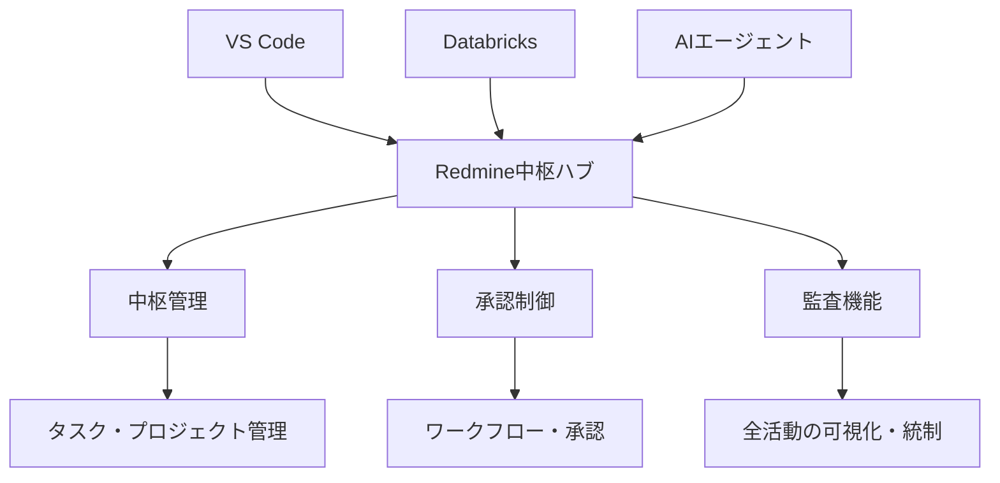

# Redmine 設計書

---

## 📋 文書情報

| 項目       | 内容                                                 |
| ---------- | ---------------------------------------------------- |
| **文書名** | Redmine 設計書（ソロプレナー／AIネイティブ企業基盤） |
| **版数**   | 0.1（ドラフト）                                      |
| **作成日** | 2025-09-07                                           |
| **更新日** | 2025-09-07                                           |
| **作成者** | システム開発チーム                                   |

### 📚 参照資料

- 📋 企画書: 01100_企画書.md（v1.1）
- 📊 要件定義: 02100_要件定義書.md（v0.10）

---

## 🎯 1. 目的/スコープ

### 📖 設計目的

Redmineを中枢管理/承認/監査ハブとして構成し、VS Code/Databricks/AIエージェントの全活動を可視化・統制します。



### ✅ 対応要件

| 要件分類       | 対応要件ID               | 概要                                     |
| -------------- | ------------------------ | ---------------------------------------- |
| **中枢管理**   | FR-001〜004              | タスク・ワークフロー・履歴・API連携      |
| **監査・承認** | FR-015〜020              | 監査証跡・ポリシー・外部連携・メタデータ |
| **非機能**     | NFR-006/007/010〜019/023 | セキュリティ・監査・運用・データ管理     |

---

## 2. プロジェクト/トラッカー/ワークフロー

- プロジェクト構成
  - `OPS`（運用/全社横断）、`PRD`（製品別）、`DOCS`（ドキュメント）
- トラッカー
  - `Task`, `Bug`, `Story`, `Change`, `Decision`（意思決定記録）
- ステータス例
  - `New` → `In Review` → `Waiting Approval` → `Approved` → `Done` → `Archived`
  - 差戻し: `Rework`（チェックリスト必須, FR-002）
- ワークフロー
  - 重要操作は`Waiting Approval`で承認者ロール必須（FR-002/007）

---

### 2.1 ワークフロー（テキスト図）

`New` → `In Review` → `Waiting Approval` → {`Approved` → `Done`} / {`Rework` → `In Review`} → `Archived`

チェックリスト（例）: 影響範囲, 出典添付, リスク評価, ロールバック手順（FR-002）

---

## 3. 役割/権限（RBAC/ABAC）

- 役割
  - `Admin`（設定/監査/権限）、`Approver`（承認）、`Contributor`（実行）、`Agent`（自動実行）
- 権限方針
  - 最小権限（NFR-006）、AIエージェントは限定プロジェクト/操作に制限
  - ABAC属性: `project`, `data_class`, `risk_level` により承認必須範囲を制御（FR-016）

---

### 3.1 権限マトリクス（抜粋）

- Admin: 設定/フィールド/ロール/監査エクスポート/ユーザー管理
- Approver: ステータス遷移（Waiting→Approved/Reject）, 監査閲覧
- Contributor: 作成/更新/コメント/添付、自己課題のステータス変更
- Agent: 作成/コメント/添付（承認前の変更不可）、閲覧制限あり

---

## 4. カスタムフィールド/テンプレート

- チケットフィールド（FR-001/015/020）
  - `Correlation-Id`（テキスト, 必須）
  - `Actor`（User/Agent）
  - `Sources`（複数URL）
  - `Risk Level`（Low/Med/High）
  - `Data Class`（Public/Internal/Secret/PII）
- テンプレート
  - `Story Template`（受入条件/出典欄を標準化）
  - `Change Template`（影響範囲/ロールバック欄）

---

## 5. 連携/イベント

- REST API
  - VS Code拡張から実行ログ/添付/メタデータ登録（FR-018/019/020）
- Webhook
  - `issue_updated`: VS Code側ビュー更新、CIトリガ
- AIイベント集約
  - `Decision`トラッカーでAIの提案/判断/承認履歴を時系列保存（FR-003/015）

---

### 5.1 Webhook/REST 仕様（抜粋）

- 送信Webhook: `issue_updated`, `issue_created`（共有シークレットで署名）
- 受信REST例

```http
POST /issues/123/notes
X-Api-Key: <redmine-key>
Content-Type: application/json

{"notes":"Run checks passed.","private_notes":false}
```

---

## 6. 監査/レポート

- 操作主体（人/AI）、根拠資料、承認者、成果物リンクを自動ひも付け（FR-015）
- 監査証跡エクスポート: PDF/CSV（FR-017）
- 相関IDでVS Code/Gateway/Databricksのログと突合（NFR-010）

---

## 7. セキュリティ/SSO

- 認証: OIDC/SSO（NFR-007）
- 通信: TLS1.2+（NFR-016）
- 境界: WAF/IP許可リスト（NFR-017）
- データ: ログのPIIはハッシュ化保存（NFR-023）、分類/保全期間1〜3年（NFR-013/014）

---

## 8. 可観測性/運用

- メトリクス: チケット作成/承認SLA、差戻し率、監査漏れゼロ
- アラート: SLA違反/承認滞留/高リスク未承認
- 構成管理: IaC/設定のバージョン管理とドキュメント（NFR-011/018）

---

### 8.1 SLA/ダッシュボード（例）

- 承認SLA: p95 ≤ 24h、滞留閾値=48h アラート
- 差戻し率: 月次≤15%
- 監査漏れ: 0件（必須フィールド未入力時は遷移不可）

---

## 9. 受け入れ基準（設計反映）

- AB-01/02/04/05/06/14/15 に対応するフィールド/ワークフロー/エクスポート/SSO設定
- すべてのAI行動がRedmineで追跡可能（FR-003/008/015/020）

---

## 10. 未決事項/リスク

- カスタムフィールド/テンプレートの最終定義
- SSO基盤の属性マッピング（役割/ABAC属性）
- 監査PDFのレイアウト/署名要件

---

## 11. トレーサビリティ（抜粋）

- FR-001/002/003/004/015/016/017/018/019/020 → §2〜§6
- NFR-006/007/010/011/013/014/016/017/018/019/023 → §3, §6〜§8

---

## 付録A: プラグイン/設定（推奨）

- Checklist系、Redmine Agile（任意）、OIDC SSOプラグイン
- 必須バリデーション: `Correlation-Id`、`Actor`、`Data Class`、`Risk Level`

## 付録B: バックアップ/DR

- DB/ファイルストアのスナップショット、復旧RPO≤24h/RTO≤4h 目安

## 付録C: 移行計画（簡略）

- スキーマ/フィールド定義 → テンプレ作成 → パイロット（1プロジェクト）→ 全社展開
